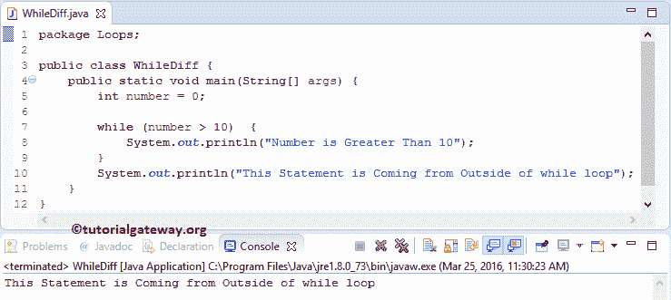

# Java 中 While 和 Do While 的区别

> 原文：<https://www.tutorialgateway.org/difference-between-while-and-do-while-in-java/>

用实例说明 Java 编程语言中的 While 和 Do While 有什么区别？

## Java 中 While 和 Do While 的区别

虽然 Java 中的`do-while`循环和`while`循环看起来很相似，但是它们的执行顺序不同。

*   在 [Java While](https://www.tutorialgateway.org/java-while-loop/) 中，条件在循环开始时进行测试，如果条件为 True，则只执行该循环中的语句。因此，只有当条件为真时，`while`循环才会执行代码块。
*   在 Java Do While 中，条件是在循环结束时测试的。因此，即使条件失败，Do While 也会至少执行一次代码块中的语句。

也许你是糊涂了，我想你看到例子会更好理解。让我们使用 [Java](https://www.tutorialgateway.org/java-tutorial/) While 和`do-while`循环来编写相同的程序，以了解执行的顺序。

### Java `while`循环示例

在这个 Java 程序中，我们声明了整数变量 Number，并为其赋值零。接下来，我们将检查 Number(值= 0)是否大于 10，以故意不满足条件。`while`循环外还有一个 System.out.println 语句，该语句将在`while`循环后执行。

```
package Loops;

public class WhileLoop {

	public static void main(String[] args) {
		int number = 0;

		while (number > 10)  {
			System.out.println("Number is Greater Than 10");
		}
		System.out.println("This Statement is Coming from Outside of while loop");
	}
}
```



### Java `do-while`循环示例

在这个[程序](https://www.tutorialgateway.org/learn-java-programs/)中，我们将使用 [Do while](https://www.tutorialgateway.org/java-do-while-loop/) 来写同样的例子

```
package Loops;

public class DoWhileDiff {

	public static void main(String[] args) {
		int number = 0;

		do {
			System.out.println("Number is Greater Than 10");
		}while (number > 10);
		System.out.println("This Statement is Coming from Outside of do while loop");
	}
}
```

```
Number is Greater Than 10
This Statement is Coming from Outside of do while loop
```

尽管条件失败，但循环中的语句执行一次。因为`do-while`循环条件是在语句执行后测试的。我们希望你明白其中的区别。