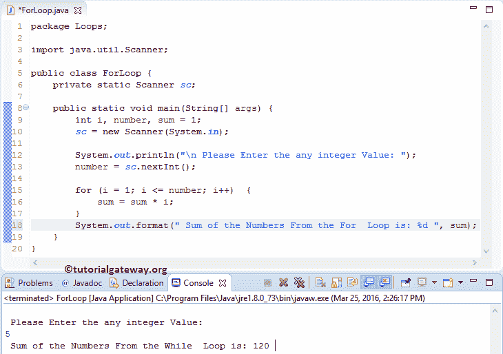

# Java`for`循环

> 原文:[https://www.tutorialgateway.org/java-for-loop/](https://www.tutorialgateway.org/java-for-loop/)

Java`for`循环用于将一个语句块重复给定的次数，直到给定的条件为 False。它是任何编程语言中使用最多的语言之一。让我们看看 Java 编程中`for`循环的语法:

## Java`for`循环语法

Java 编程语言中`for`循环的语法如下:

```
for (initialization; test condition; increment/decrement operator)  {
       Statement 1
       Statement 2
       ………
       Statement n
}
```

如果观察上面的语法，在 Java`for`循环中，有三个表达式用分号(；)以及这些表达式的执行如下:

*   初始化:Java`for`循环从初始化语句开始。因此，首先初始化计数器变量(示例计数器= 1 或 i = 1)。初始化部分在开始时只执行一次。
*   测试条件:计数器变量值将根据测试条件进行测试。如果结果为真，Javac 编译器将在`for`循环或循环体中执行语句。如果条件为假，则`for`循环将终止。
*   递增和递减运算符:该表达式将在每次迭代结束后运行。根据我们的要求，这个操作符有助于增加或减少 Java`for`循环的计数器变量。请参考 Java 文章中的递增和递减运算符来理解运算符。

## Java`for`循环初始化

Java`for`循环可以灵活地从声明中省略一个或多个部分。虽然我们可以从声明中跳过一个或多个部分，但我们必须将分号(；)到位；否则，它将引发编译错误。

初始化计数器变量可以在 Java`for`循环中跳过，如下所示:

```
int i = 1;

for( ; i <= 20; i++)
```

如果你观察上面的代码片段，计数器变量之前声明过。像初始化条件一样，我们也可以跳过 Java`for`循环的增量部分。

```
int i = 1;

for( ; i <= 10; )  {
    //statements     
    i++;
}
```

如果观察以上 [Java](https://www.tutorialgateway.org/java-tutorial/) 的代码片段，增量部分在正文中声明。它还允许我们用逗号分隔一次初始化多个计数器变量:

```
for(i = 1,j = 10; i < j; i++)
```

Java`for`循环还允许使用多个条件。我们必须使用逻辑运算符来分隔这两个条件，而不是使用逗号。

```
for(i=1,j=20; i <= 10 && j >= 20; i++) {
   //statements
   j++;
}
```

像测试条件一样，Java`for`循环允许我们使用多个增量运算符，如下所示。

```
for(i = 1, j = 1; i <= 10 && j <= 10; i++, j++)
```

无限`for`循环

```
for( ; ; )
```

初始化时，递增和递减运算符部分使用逗号分隔多个声明。要在 java`for`循环中分离测试条件，必须使用逻辑运算符来连接条件

### 一个`for`循环的流程图

下面的截图将展示 Java 编程语言中`for`循环的流程图。


Java`for`循环的执行过程是:

1.  初始化:我们在这里初始化计数器变量。
2.  测试条件:它将根据计数器变量检查条件。如果条件为真，编译器将执行其中的语句。如果条件为假，则它将退出。
3.  迭代完成后，它将执行 Java`for`循环内部的[递增和递减运算符](https://www.tutorialgateway.org/increment-and-decrement-operators-in-java/)来递增或递减该值。
4.  在值增加后，它将再次检查表达式。只要条件为真，其中的语句就会执行。

## Java For Loop 示例

[程序](https://www.tutorialgateway.org/learn-java-programs/)中的`for`循环允许用户输入任意整数值。然后它将计算自然数的总和，直到用户输入的数字。

```
package Loops;

import java.util.Scanner;

public class ForLoop {
	private static Scanner sc;

	public static void main(String[] args) {
		int i, number, sum = 1;
		sc = new Scanner(System.in);	

		System.out.println("\n Please Enter the any integer Value: ");
		number = sc.nextInt();

		for (i = 1; i <= number; i++)  {
			sum = sum * i;
		}
		System.out.format(" Sum of the Numbers From the For Loop is: %d ", sum);
	}
}
```



在这个 Java`for`循环程序中，第一个语句将要求用户输入任何低于 10 的整数值。接下来，我们将用户输入的值分配给整数变量(数字)

下一行，我们使用了`for`循环，其中的条件将确保 I 的值小于或等于用户指定的数字。

```
for(i = 1; i <= number; i++)  {
	sum = sum * i;
}
```

在这个 Java`for`循环示例中，用户输入的值:Number = 5，我们初始化了 sum = 0

第一次迭代

其中，我们将 I 值初始化为 1。请记住，初始化只发生一次。接下来，编译器将检查表达式(i <= number)，该表达式为真。因此，其中的语句或代码块将会执行。

总和=总和* i

总和= 1 * 1 ==> 1

接下来，I 值将增加 1 (i++)。请参考 Java 文章中的[递增和递减运算符来理解这个++符号。](https://www.tutorialgateway.org/increment-and-decrement-operators-in-java/)

第二次迭代

在第一次迭代中，I 的值随着 i = 2 而改变。接下来，Javac 将评估条件(i <= number)，这是真的。因此，它里面的语句将执行。

总和= 1 * 2 = 2

接下来，数字将增加 1 (number ++)。

第三次迭代

在第二次迭代中，I 和 sum 的值都发生了变化，i = 3，sum = 2。接下来，Javac 编译器将检查条件(i <= number)，该条件为真。

总和= 2 * 3 = 6

第四次迭代

在第三次迭代中，i = 4 和 sum = 6 的值。接下来，Javac 将检查条件(i <= number)，该条件为真。因此，它里面的语句将执行。

总和= 6 * 4 = 24

第五次迭代

在循环 java 的第四次迭代中，i = 5 和 sum = 24 的值。

总和= 24 * 5 = 120

I = 6。因此，代码中存在的条件(6 <= 5)计算结果为假。

最后一条 System.out.format 语句将输出给定数字中的位数。