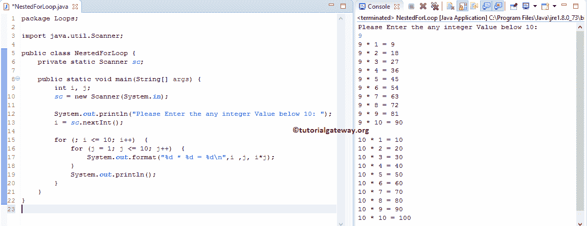

# Java 中的嵌套`for`循环

> 原文：<https://www.tutorialgateway.org/nested-for-loop-in-java/>

在 Java 编程中，将`for`循环放在另一个`for`循环中称为嵌套`for`循环。当您处理多层数据时，请使用这个 Java 嵌套`for`循环来提取分层数据，但是使用时请小心。

例如，当您使用一维数组时，您可以使用 Java `for`循环从开始到数组结束进行迭代。但是，要使用二维数组或多维数组，您必须在 Java 中使用这个嵌套`for`循环。在我们进入这个例子之前，让我们看看 Java 嵌套`for`循环的语法。

## Java 语法中的嵌套`for`循环

Java 编程语言中嵌套`for`循环的语法如下:

```java
for (initialization; test condition; increment/decrement operator)  { //First For Loop
     for (initialization; test condition; increment/decrement operator)  { // Second For Loop
         //Second For Loop Statements
         Statement 1
         Statement 2
         ………
         Statement n
     }
     //First For Loop Statements
     Statement 1 
      ………
     Statement n
}
```

如果您观察上面的 Java 嵌套`for`循环语法，我们将`for`循环放在另一个`for`循环中。

我们已经在上一篇文章中解释了`for`循环语法。所以，请参考 Java [For Loop](https://www.tutorialgateway.org/java-for-loop/) 一文了解循环功能。让我解释一下这个 Java 嵌套`for`循环语法的细节

第一步:首先，编译器将检查第一个`for`循环中的条件。

*   如果条件为真，则将执行`for`循环中的语句。这意味着编译器将进入第二个`for`循环:转到步骤 2。
*   如果条件为假，则编译器将退出`for`循环。

第二步:Java 编译器将检查第二个`for`循环或嵌套`for`循环中的条件。

*   如果条件为真，将执行第二个`for`循环中的语句。这意味着，它将从语句 1 执行到语句 n
*   如果条件为假，编译器将从第二个`for`循环退出。

步骤 3:一旦从第二个`for`循环退出，编译器将检查`for`循环内部的条件(重复步骤 1)。

## Java 编程中的嵌套`for`循环

这个嵌套`for`循环 [Java 程序](https://www.tutorialgateway.org/learn-java-programs/)允许用户输入任意整数值。然后它会打印用户指定数字到 10 的乘法表。为此，我们将把一个`for`循环嵌套在另一个`for`循环中。这在 java 编程中也称为嵌套`for`循环。

```java
// Nested For Loop in Java Programming example
package Loops;

import java.util.Scanner;

public class NestedForLoop {
	private static Scanner sc;

	public static void main(String[] args) {
		int i, j;
		sc = new Scanner(System.in);	

		System.out.println("Please Enter the any integer Value below 10: ");
		i = sc.nextInt();

		for (; i <= 10; i++)  {
			for (j = 1; j <= 10; j++)  {
				System.out.format("%d * %d = %d\n",i ,j, i*j);
			}
			System.out.println();
		}
	}
}
```



在这个 Java 嵌套`for`循环示例中，以下语句要求您输入任何小于 10 的整数值。接下来，我们将用户输入的值赋给整型变量(I)

```java
System.out.println("Please Enter the any integer Value below 10: ");
i = sc.nextInt();
```

下一行，我们使用了 Java 嵌套`for`循环，第一个`for`循环中的条件将确保用户指定的值 I 小于或等于 10。

```java
for (; i <= 10; i++)  {
	for (j = 1; j <= 10; j++)  {
		System.out.format("%d * %d = %d\n",i ,j, i*j);
	}
	System.out.println();
}
```

从上面的截图中，您可以观察到用户输入的值 i: = 9。这意味着，这个 Java 嵌套`for`循环程序打印了 9 和 10 的乘法表。

第一次循环第一次迭代

在第一个`for`循环中，我初始化为值 9，然后它将检查我是否小于或等于 10。该条件为真，因此它将进入第二个循环。

第二次循环第一次迭代

这就是 Java 中的嵌套`for`循环。在第二个`for`循环中，j 被初始化为值 1。接下来，它将检查 j 是否小于或等于 10。这个条件为真，所以 Javac 编译器将在第二个`for`循环中执行语句。

i * j ==> 9 * 1 = 9

接下来，j 值将增加 1 (j++)。请参考 Java 文章中的[递增和递减运算符来理解这个++符号。](https://www.tutorialgateway.org/increment-and-decrement-operators-in-java/)

第二次循环第二次迭代

这里，j 加 1。所以，J =2。编译器将检查 j 是否小于或等于 10。此条件为真，因此编译器将在第二个`for`循环中执行语句。

i * j ==> 9 * 2 = 18

接下来，j 值将增加 1 (j++)。

这个过程将重复进行，直到 j 达到 11。一旦第二个`for`循环内的条件失败，编译器将从第二个`for`循环退出，我将递增 1 (i++)。接下来，

第一次循环第二次迭代

这里，I 加 1，所以，i =10。编译器将检查 I 是否小于或等于 10。该条件为真，因此编译器将进入第二个循环

第二次循环第一次迭代

在第二个`for`循环中，j 被初始化为值 1，然后它将检查 j 是否小于或等于 10。这个条件是真的。因此，编译器将在第二个`for`循环中执行语句。

i * j ==> 10 * 1 = 10

接下来，j 值将增加 1 (j++)。

第二次循环第二次迭代 java 中嵌套循环

这里，J 加 1，所以 J =2。编译器将检查 j 是否小于或等于 10。此条件为真，因此编译器将在第二个`for`循环中执行语句。

i * j ==> 10 * 2 = 20

接下来，j 值将增加 1 (j++)。

这个过程将重复进行，直到 j 达到 11。一旦第二个`for`循环内的条件失败，编译器将从第二个`for`循环退出，我将递增 1 (i++)。接下来，

第一次循环第三次迭代:

这里，i = 11，条件为 False。`for`循环被终止，不需要检查第二个循环，即在 java 中嵌套`for`循环。