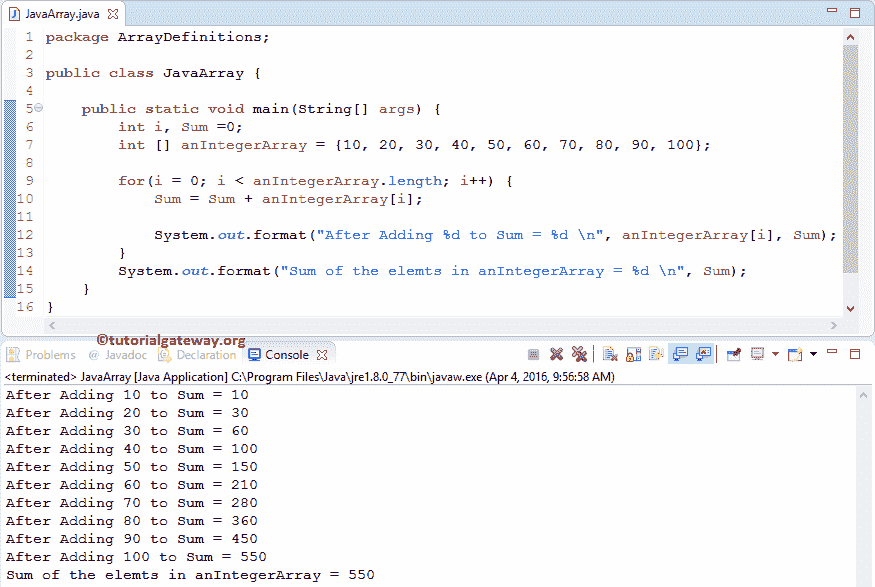

# Java 数组

> 原文：<https://www.tutorialgateway.org/java-array/>

如何声明 Java 数组、创建它、初始化和访问数组元素？。Java 中的 Array 是一个容器对象，它保存类似类型元素的集合(类型可以是整型、浮点型、长型等)。).这意味着我们不能存储多个数据类型值。

Java 数组场景:在我们之前的文章中，我们看到了变量声明、初始化，它们非常适合初始化一些变量。如果我们想存储 100 份员工工资呢？创建 100 个变量并赋值值得吗？如果是 150 个员联合怎么样？。

为了处理这种情况，Java 编程语言引入了数组的概念。

## Java 数组介绍

例如，Java 中的整数数组将存储所有的整数元素。如果您试图插入一个浮点或字符值，那么它将抛出一个错误。

Java 数组的长度决定了我们何时创建它。一旦创建，长度是固定的。在 Java 编程中，我们有 3 种类型的数组

1.  一维数组
2.  [二维](https://www.tutorialgateway.org/two-dimensional-array-in-java/)
3.  [多维](https://www.tutorialgateway.org/multi-dimensional-array-in-java/)
    *   立体的
    *   四维等

### Java 数组声明或语法

下面的代码片段将向您展示 Java 数组声明的最基本方式:

```
Data_Type[] Array_Name;
```

*   Data_type:它将决定数组将接受的元素类型。例如，如果我们想要存储整数值，数据类型将被声明为一个整数，为了存储浮点值，数据类型是浮点的
*   Array_Name:这是您想要给出的名称。例如，学生、年龄、分数、emp

同样，您可以在 Java 中声明其余类型的数组，如下所示:

```
int [] anIntegerArray; 
byte[] anByteArray; 
short[] anShortArray; 
long[] anLongArray; 
float[] anFloatArray; 
double[] anDoubleArray; 
boolean[] anBooleanArray;
char[] anCharArray; 
String[] anStringArray;
```

### 创建一个 Java 数组

为了在 Java 中创建一个数组，我们必须使用 New 运算符

```
Data_Type[] Array_Name = new Array_Name[Array_Size];
```

数组大小:数组可以容纳或存储的元素数量。例如，Array_Size =10，那么它将保存 10 个值。

如果你已经用 java 初始化了一个数组

```
int [] anIntegerArray; // Declaration

// Crating it
anIntegerArray = new int[10];
```

例如，int[]Student _ Marks = new int[10]；

1.  我们使用 int 作为数据类型来声明数组。所以，上面那个只接受整数。如果我们试图添加浮点值，那么它会抛出一个错误。
2.  学生 _ 年龄是名字
3.  数组的大小是十。这意味着 Student_Marks 将只接受十个整数值。
    *   如果我们试图存储十个以上，那么它会抛出一个错误。
    *   我们可以储存不到 10 个。例如，如果我们存储三个整数值，那么剩下的两个值将被初始化为默认值(即 0)。

### Java 数组初始化

在 Java 编程语言中，有多种方法可以初始化数组

#### 第一种方法

在 Java 编程中声明和创建数组。

int[]Student _ Marks = new int[3]；

以更传统的方式初始化元素

```
Student_Marks[0] = 15; // Initializing First elements at position 0
 Student_Marks[1] = 45; // Initializing elements at position 1
Student_Marks[2] = 65; // First elements at position 2
```

#### 用 Java 创建数组的第二种方法

在这种方法中，我们只在声明时初始化数组

小行星:15，25，35，45，55

这里，我们没有提到尺寸。然而，Javac 足够智能，可以通过检查元素的数量来确定大小。

#### 第三种方法

虽然这种方法没有任何错误，但这不是在 [Java 编程](https://www.tutorialgateway.org/java-tutorial/)中初始化的首选方式。

int Employees[ ] = {1，2，3，4，5}

#### 第四种方法

以上 3 种方法都是将少量项目存储到数组中的好方法。如果我们想要存储 50、100 或更多的值，该怎么办。用上面提到的任何一种方法把它们全部加起来都是一种折磨。为了解决这个问题，我们可以使用循环概念来存储数据:

```
int i, Employees[100];

for (i =0; i < 100 ; i++)
 {
   Employees[i] = i * 2;
 }
```

提示:为了存储元素，我们可以使用 [For loop](https://www.tutorialgateway.org/java-for-loop/) 、 [While Loop](https://www.tutorialgateway.org/java-while-loop/) 和 [Do While Loop](https://www.tutorialgateway.org/java-do-while-loop/)

#### 用 Java 创建数组的第五种方法

int[]半衰期=新 int[5]；
天线数组[0]= 10；
天线数组[1]= 20；
天线数组[2]= 30；

这里我们声明了一个大小为 5 的整数数组，但是我们只给它分配了三个值。在这种情况下，剩余的值分配给默认值(本例中为 0)。

上面一个将是:

安定器数组[0]= 10
安定器数组[1]= 20[1]安定器数组[2]= 30
安定器数组[3]= 0
安定器数组[4] = 0

### 访问 Java 数组元素

在 Java 中，我们使用索引位置来访问数组的项目。使用索引，我们可以访问或修改/更改项目。索引值从 0 开始，到 n-1 结束，其中 n 是大小或长度。

例如，如果它存储十个元素，索引从 0 开始，到 9 结束。要访问或修改第一个值，请使用数组名[0]，要访问或更改第十个值，请使用数组名[10]。让我们看看这个例子，以更好地了解如何访问 Java 数组元素:

```
package ArrayDefinitions;

public class ArrayTest {

	public static void main(String[] args) {
		int[] anIntegerArray = {15, 25, 35, 45, 55, 65};

		System.out.println(anIntegerArray[0]);
		System.out.println(anIntegerArray[1]);
		System.out.println(anIntegerArray[2]);
		System.out.println(anIntegerArray[3]);
		System.out.println(anIntegerArray[4]);
		System.out.println(anIntegerArray[5]);
	}
}
```

```
15
25
35
45
55
65
```

## Java 数组示例

在这个 Java 程序中，我们将声明一个大小为十的整数数组。然后我们将这十个值相加并显示输出。

```
package ArrayDefinitions;

public class JavaArray {

	public static void main(String[] args) {
		int i, Sum =0;
		int [] anIntegerArray = {10, 20, 30, 40, 50, 60, 70, 80, 90, 100};

		for(i = 0; i < anIntegerArray.length; i++) {
			Sum = Sum + anIntegerArray[i];

			System.out.format("Addition of %d to Sum = %d \n", anIntegerArray[i], Sum);
		}
		System.out.format("Sum of the elemts in anIntegerArray = %d \n", Sum);
	}
}
```



在这个 Java 数组示例程序中，我们用 10 个元素声明了一个一维数组[]并声明我要迭代这些元素，

```
int [] anIntegerArray = {10, 20, 30, 40, 50, 60, 70, 80, 90, 100};
```

[`for`循环](https://www.tutorialgateway.org/java-for-loop/)迭代整数数组[4]中的每个单元格。`for`循环内的条件(i <为整数数组长度)将确保 Jcompiler 不超过数组限制。

*   Sum = Sum+an integer array[I]；语句用于将整数数组中的每个元素添加到 Sum 变量中。
*   System.out.format 语句显示每次迭代后的 Sum 值。
*   长度找到它的长度

Java 数组第一次迭代:I 的值将为 0，条件(i < 10)为真。因此，它将开始执行循环中的语句。

联集=联集+非共面数组[i]

= & gt；总和+非均匀数组[0]

总和= 0 + 10 = 10

I 的值将增加 1

第二次迭代:I 的值为 1，条件(1 < 10)为真。

总和=总和+非均匀数组[1]
总和= 10 + 20 = 30

第三次迭代:增量后，i = 2，条件(2 < 10)为真。

总和+=非对称数组[2]
= > 30 + 30 = 60

第四次迭代:I 的值为 3，条件(3 < 5)为真。

总和= 60 + 40 = 100

第五次迭代:i = 4，条件(4 < 10)为真。

总和= 100 + 50 = 150

第六次迭代:I 为 5，条件(5 < 10)为真。

总和= 150 + 60 = 210

第七次迭代:增量后，i = 6，条件(6 < 10)为真。

总数= 210 +单数组[6]= 210+70 = 280

第八次迭代:i = 7，条件(7 < 10)为真。

总数= 280 +单数组[7]= 280+80 = 360

9 <sup>次</sup>迭代:I 为 8，条件(8 < 10)为真。

总和= 360 +非均匀分配数组[8]= 360+90 = 450

10 <sup>次</sup>迭代:I 为 9，条件(9 < 10)为真。

总和=总和+非均匀数组[9]
总和= 450 + 100 = 550

11 <sup>次</sup>迭代:I 的值为 10，条件(10 < 10)为假。因此，它将从`for`循环中退出。

最后，我们使用 System.out.format 语句来显示总和