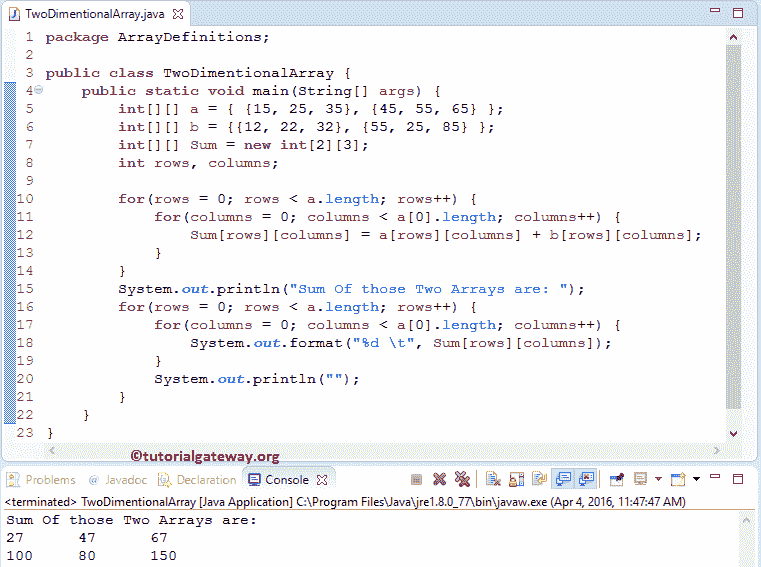

# Java 中的二维数组

> 原文：<https://www.tutorialgateway.org/two-dimensional-array-in-java/>

Java 编程语言中的二维数组只不过是数组的数组。在 Java 二维数组中，数据存储在行和列中，我们可以使用行索引和列索引来访问记录(就像一个 Excel 文件)。

如果数据是线性的，我们可以使用一维数组。然而，要处理多级数据，我们必须使用多维数组。Java 中的二维数组是多维数组最简单的形式。

## Java 中的二维数组声明

下面的代码片段显示了 Java 编程语言中的二维数组声明:

```
Data_Type[][] Array_Name;
```

*   Data_type:它决定它将接受的元素类型。例如，如果我们想要存储整数值，那么数据类型将被声明为 int。如果我们想存储浮点值，那么数据类型将是浮点的。
*   Array_Name:这是给这个 Java 二维数组取的名字。例如，汽车、学生、年龄、分数、部门、员工等。

同样，可以声明二维数组的剩余类型:

```
int [][] anIntegerArray; // declaring an two dimensional array of Integers
byte[][] anByteArray; // declaring an two dimensional array of Bytes
short[][] anShortArray; // declaring an two dimensional array of Shorts
long[][] anLongArray; // declaring an two dimensional array of Longs
float[][] anFloatArray; // declaring an two dimensional array of Floats
double[][] anDoubleArray; // declaring an two dimensional array of Doubles
boolean[][] anBooleanArray; // declaring an two dimensional array of Booleans
char[][] anCharArray; // declaring an two dimensional array of Chars
String[][] anStringArray; // declaring an two dimensional array of Strings
```

## 用 Java 创建二维数组

为了在 Java 中创建一个二维数组，我们必须使用如下所示的 New 运算符:

```
Data_Type[][] Array_Name = new int[Row_Size][Column_Size];
```

如果我们观察上面的二维数组代码片段，

*   Row_Size:一个数组可以存储的行数。例如，Row_Size = 5，那么数组将有五行。
*   列大小:数组可以存储的列元素的数量。例如，Column_Size = 6，则数组将有 6 列。

如果已经用 Java 初始化了一个二维数组，那么

```
double [][] anStudentArray; // Declaration of Two dimensional array in java 

// Crating an Java two dimensional Array
anStudentArray = new int[5][3];
```

例如，

double [][] Employees =新 double[5][3]；

1.  这里，我们使用 double 作为数据类型，在 Java 中声明了一个二维数组。这意味着，上面的数组将只接受双精度值，如果您试图添加浮点值，那么它将抛出一个错误。
2.  雇员是二维数组的名称
3.  数组的行大小是 5，这意味着雇员数组将只接受 5 个双精度值作为行。
    *   如果我们试图存储 5 个以上的值，那么它将抛出一个错误。
    *   我们可以储存不到 5 个。例如，如果我们存储 2 个整数值，那么剩下的 2 个值将被初始化为默认值(即 0)。
4.  数组的列大小是 3。这意味着雇员数组将只接受 3 个整数值作为列。
    *   如果我们试图存储 3 个以上，那么它将抛出一个错误。
    *   我们能储存的不到 3 个。例如，如果我们存储 1 个整数值，那么剩下的 2 个值将被初始化为默认值(即 0)。

## Java 中二维数组的初始化

我们可以用多种方式初始化 Java 二维数组。请参考 [Java 编程](https://www.tutorialgateway.org/java-tutorial/)中的[数组](https://www.tutorialgateway.org/java-array/)和[多维数组](https://www.tutorialgateway.org/multi-dimensional-array-in-java/)。

### 二维数组优先法

用 Java 声明和创建二维数组

int[][]Student _ Marks = new int[2][3]；

更传统地初始化数组元素。

```
Student_Marks[0][0] = 15; // Initializing Array elements at position [0][0]
Student_Marks[1][1] = 45; // Initializing Array elements at position [1][1]
Student_Marks[2][1] = 65; // Initializing Array elements at position [2][1]
```

### Java 二维数组第二种方法

声明和创建二维数组的第二种方法

int[][]Student _ Marks = new int[2][]；

这里，我们没有提到列的大小。然而，Jcompiler 足够智能，可以通过检查列内的元素数量来计算大小。

### Java 二维数组第三种方法

int[][] Employees = { {10，20，30}，{15，25，35}，{22，44，66}，{33，55，77 } }；

这里，我们没有提到行大小和列大小。但是，编译器足够智能，可以通过检查行和列内的元素数量来计算大小。

### 第四种方法

以上 3 种方法都是很好的方法，在 Java 中将少量元素存储到二维数组中，如果我们想要存储 100 行或 50 列的值呢？使用上面提到的任何一种方法添加所有这些将是一场噩梦。为了解决这个问题，我们可以在这里使用[嵌套循环](https://www.tutorialgateway.org/nested-for-loop-in-java/)的概念:

```
int rows, columns;
int[][] Employees = new int[100][50];

for (rows = 0; rows < 100 ; rows++) {
	for (columns = 0; columns < 50; columns++) {
		Employees[rows][columns] = rows + columns;
	}
}
```

提示:为了在 Java 二维数组中存储元素，我们可以使用 [`for`循环](https://www.tutorialgateway.org/java-for-loop/)、 [`while`循环](https://www.tutorialgateway.org/java-while-loop/)和 [`do-while`循环](https://www.tutorialgateway.org/java-do-while-loop/)

### Java 中二维数组的第五种方法

int[]反相数组=新的 int[5][3]；
天线数组[0][0]= 10；
天线数组[0][1]= 20；
面阵[0][2]= 30；

这里我们声明了一个大小为 5 行* 3 列的 Java 二维数组，但是我们只为一行赋值。在这种情况下，剩余的值分配给默认值(本例中为 0)。

## 访问 Java 二维数组元素

在 Java 编程中，我们可以使用索引位置来访问二维数组元素。使用索引，我们可以访问或改变/改变二维数组中的每个元素。

Java 二维数组的索引值从 0 开始，到 n-1 结束，其中 n 是行或列的大小。例如，如果一个 int[][] Array_name = new int[6][4]将存储 6 个行元素和 4 个列元素。

要访问或更改 1 <sup>st</sup> 值，请使用 Array_name[0][0]，要访问或更改 2 <sup>nd</sup> 行 3 <sup>rd</sup> 列值，请使用 Array_name[1][2]，要访问 6 <sup>th</sup> 行 4 <sup>th</sup> 列，请使用 Array_name[5][3]。为了更好地理解，让我们看看二维数组的例子:

```
package ArrayDefinitions;

public class AccessTwoDimentionalArray {
	public static void main(String[] args) {
		int[][] StudentArray = { {12, 22, 33},{45, 65, 95},{442, 444, 446},{785, 786, 787}};

		System.out.println("Element at StudentArray[0][0] = " + StudentArray[0][0]);
		System.out.println("Element at StudentArray[0][1] = " + StudentArray[0][1]);
		System.out.println("Element at StudentArray[0][2] = " + StudentArray[0][2]);
		System.out.println("Element at StudentArray[1][0] = " + StudentArray[1][0]);
		System.out.println("Element at StudentArray[1][1] = " + StudentArray[1][1]);
		System.out.println("Element at StudentArray[1][2] = " + StudentArray[1][2]);
		System.out.println("Element at StudentArray[2][0] = " + StudentArray[2][0]);
		System.out.println("Element at StudentArray[2][1] = " + StudentArray[2][1]);
		System.out.println("Element at StudentArray[2][2] = " + StudentArray[2][2]);
	}
}
```

Java 2D 数组输出

```
Element at StudentArray[0][0] = 12
Element at StudentArray[0][1] = 22
Element at StudentArray[0][2] = 33
Element at StudentArray[1][0] = 45
Element at StudentArray[1][1] = 65
Element at StudentArray[1][2] = 95
Element at StudentArray[2][0] = 442
Element at StudentArray[2][1] = 444
Element at StudentArray[2][2] = 446
```

为了处理大量的行和列，我们必须使用[进行循环](https://www.tutorialgateway.org/java-for-loop/)。让我们使用`for`循环访问上面的数组 StudentArray[4][3]。

```
int rows, columns;

for (rows = 0; rows < 4; rows++) {
     for (columns = 0; columns < 3; columns++) {
	System.out.format("%d", StudentArray[rows][columns]);
     }
}
```

## Java 二维数组示例

在这个 Java 二维数组程序中，我们将声明 2 个二维数组。

接下来，我们用一些值初始化它们。然后我们再声明一个二维数组来存储这两个数组的和。

```
// Two Dimensional Array in Java Example 
package ArrayDefinitions;

public class TwoDimentionalArray {
	public static void main(String[] args) {
		int[][] a = { {15, 25, 35}, {45, 55, 65} };
		int[][] b = {{12, 22, 32}, {55, 25, 85} };
		int[][] Sum = new int[2][3];
		int rows, columns;

		for(rows = 0; rows < a.length; rows++) {
			for(columns = 0; columns < a[0].length; columns++) {
				Sum[rows][columns] = a[rows][columns] + b[rows][columns];  
			}			
		}
		System.out.println("Sum Of those Two Arrays are: ");
		for(rows = 0; rows < a.length; rows++) {
			for(columns = 0; columns < a[0].length; columns++) {
				System.out.format("%d \t", Sum[rows][columns]);
			}
			System.out.println("");
		}
	}
}
```



在这个二维数组程序中，首先，我们声明了 2 个大小为[2]，[3]的二维数组 a，b，并用一些随机值初始化。我们还声明了一个大小为[2]，[3]的空数组

```
int[][] a = { {15, 25, 35}, {45, 55, 65} };
int[][] b = {{12, 22, 32}, {55, 25, 85} };
int[][] Sum = new int[2][3];
```

在[下方的`for`循环](https://www.tutorialgateway.org/java-for-loop/)将有助于迭代 a 和 b 数组中的每个单元格。`for`循环(行<长度)内的条件将确保 Jcompiler 不超过数组行限制。此外，(行< a[0]。长度)将确保编译器不会超过数组列限制。

提示:a.length 是求行的长度(第一维)，a[0]。长度就是求列的长度(第二维)。

```
for(rows = 0; rows < a.length; rows++) {
	for(columns = 0; columns < a[0].length; columns++) {
		Sum[rows][columns] = a[rows][columns] + b[rows][columns];  
	}			
}
```

让我们看看 Java 二维数组程序的迭代执行

行首迭代

该行的值将为 0，条件(行< 2)为真。因此，它将进入第二个`for`循环。

列第一次迭代

列的值将为 0，条件(列< 3)为真。因此，它将开始执行循环中的语句，直到条件失败。

*   sum[row][columns]= a[row][columns]+b[row][columns]；
*   sum[0][0]= a[0][0]+b[0][0]；
*   sum[0][0]= 15+12；
*   sum[0][0]= 27；

列的值增加 1

列第二次迭代

列的值为 1，条件(列< 3)为真。因为我们没有退出内部循环(列循环)，所以行值仍然是 0。

*   sum[0][1]= a[0][1]+b[0][1]；
*   sum[0][1]= 25+22 = 47；

列的值增加 1

第 3 列<sup>第 3 次</sup>迭代

列的值为 2，条件(列< 3)为真。因为我们没有退出内部循环，所以行值将为 0。

*   sum[0][2]= a[0][2]+b[0][2]；
*   sum[0][2]= 35+32 = 67；

增量后，列的值将为 3，条件(列< 3)将失败。所以它会从循环中退出。

现在，行的值将增加 1，并开始第二行迭代。

第二行第二次迭代

该行的值为 1，条件(行< 2)为真。因此，它将进入第二个`for`循环。

列第一次迭代

该列的值为 0，条件(列< 3)为真。因此，它将开始执行循环中的语句，直到条件失败。

*   sum[row][columns]= a[row][columns]+b[row][columns]；
*   sum[1][0]= a[1][0]+b[1][0]；
*   sum[1][0]= 45+55；
*   sum[1][0]= 100；

列的值增加 1

列第二次迭代

列的值为 1，条件(列< 3)为真。因为我们没有退出列循环，所以行值将为 1

*   sum[1][1]= a[1][1]+b[1][1]；
*   sum[1][1]= 55+25；
*   sum[1][1]= 80；

列的值增加 1

第 3 列<sup>第 3 次</sup>迭代

列的值为 2，条件(列< 3)为真。因为我们没有从内部循环(列循环)退出，所以行值将是 1。

*   sum[1][2]= a[1][2]+b[1][2]= 65+85；
*   sum[1][2]= 150；

增量后，列的值将为 3，条件(列< 3)将失败。所以它会从循环中退出。现在行的值将增加 1。意思是行数= 2。条件(行< 2)将失败。所以，它将从循环中退出。

下一个循环将遍历，正如我们上面解释的。但是，它不会求和，而是使用 system.out.format 语句用逗号分隔一个接一个地显示值。

```
for(rows = 0; rows < a.length; rows++) {
	for(columns = 0; columns < a[0].length; columns++) {
		System.out.format("%d \t", Sum[rows][columns]);
	}
	System.out.println("");
}
```

Java 二维数组(Sum 数组)的最终输出是:

Sum[2][3] = { {27，47，67}，{100，80，150 } }；