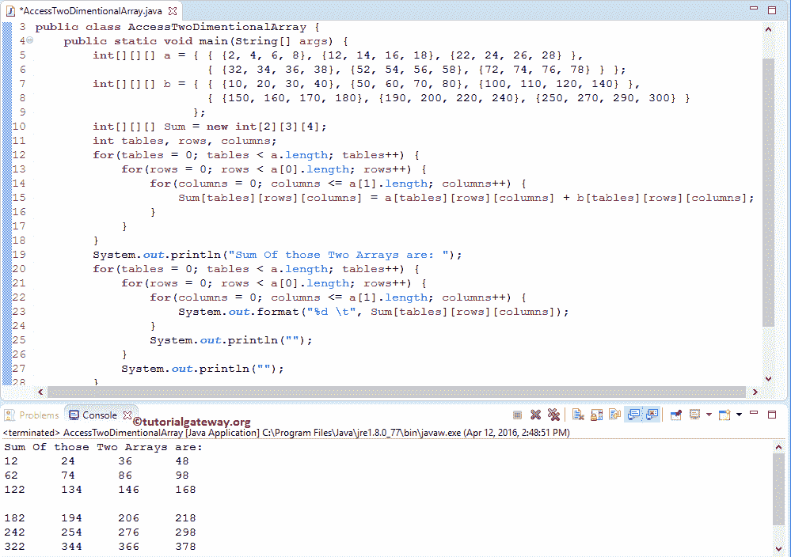

# Java 中的多维数组

> 原文：<https://www.tutorialgateway.org/multi-dimensional-array-in-java/>

Java 中的多维数组只不过是数组的数组(不止一维)。在前一篇文章中，我们讨论了 2D 数组，这是 Java 多维数组的最简单形式。在 Java 编程中，我们可以通过放置 n 个括号[ ]来声明 n 维或多维数组，其中 n 是维数。例如，

int[2][3][4] StudentArray = 3D Array

int[2][2][3][4] StudentArray = 4D Array

在本文中，我们将展示如何在 Java 中声明、初始化多维数组。为了更好地理解 Java 多维数组，我们使用了三维数组。此外，你可以尝试使用相同的技术四维数组。

## Java 中多维数组的声明

它展示了 Java 编程中多维数组的声明

```
Data_Type[][][] Array_Name;
```

同样，我们可以在 Java 中声明另一种类型的多维数组:

```
int [][][] anIntegerArray;
byte[][][] anByteArray;
short[][][] anShortArray;
long[][][] anLongArray;
float[][][] anFloatArray;
double[][][] anDoubleArray;
boolean[][][] anBooleanArray; 
char[][][] anCharArray;
String[][][] anStringArray;
```

### 用 Java 创建多维数组

为了在 Java 中创建多维数组，我们必须使用 New 运算符

```
Data_Type[][][] Array_Name = new int[Tables][Row_Size][Column_Size];
```

如果您观察这个 Java 多维数组的上述代码片段，

*   表:它可以接受的表的总数。2D 数组总是一个有行和列的表。相比之下，Java 中的多维数组不止是一个有行和列的表。
*   行大小:行元素的数量。例如，Row_Size = 5，则三维数组包含五行。
*   Column_Size:它可以存储的列元素。Column_Size = 6，则三维数组包含 6 列。

如果你已经初始化了一个 Java 多维数组，那么

```
double [][][] anStudentArray; // Declaration of Multidimensional array in java 

// Crating an Java Multi dimensional Array
anStudentArray = new int[2][5][3];
```

例如，

int[][][]Employees = new int[2][5][3]；

1.  这里，我们使用 int 作为数据类型来声明一个数组。这意味着上面的一个将只接受双精度值，如果你试图添加浮点或双精度值，它将抛出一个错误。
2.  员工是 Java 多维数组的名称
3.  表的数量= 2。因此，这个多维数组最多可以容纳 2 级数据(行和列)。
4.  行大小为 5，这意味着员工将只接受 5 个整数值作为行。
    *   如果我们试图存储五个以上的值，那么它将抛出一个错误。
    *   我们可以储存不到 5 个。例如，如果我们存储三个整数值，那么剩下的两个值将被初始化为默认值(即 0)。
5.  并且列大小为三；这意味着员工将只接受三个整数值。
    *   如果我们试图存储三个以上，那么它将抛出一个错误。
    *   我们能储存的不到 3 个。例如，如果我们存储一个整数值，那么剩下的两个值将被初始化为默认值(即 0)。
6.  最后，雇员最多可以持有 24 个整数值(2 * 4 * 3 = 24)。

### Java 中多维数组的初始化

我们可以用多种方式初始化 Java 多维数组

**第一次进场**

声明和创建一个 Java 多维数组

int[][][]Student _ Marks = new int[3][5][4]；

以更传统的方式初始化元素

```
Student_Marks[0][0][0] = 15; // Initializing elements at position [0][0][0]
Student_Marks[1][1][0] = 45; // Initializing elements at position [1][1][0]
Student_Marks[2][0][1] = 65; // Initializing elements at position [2][0][1]
```

**第二次进场**

```
int[][][] StudentArray = { { {10, 20, 30}, {50, 60, 70}, {80, 90, 100}, {110, 120, 130} },
                           { {15, 25, 35}, {22, 44, 66}, {33, 55, 77}, {78, 57, 76} }
                         };
```

这里，我们没有提到数据级别、行大小和列大小。但是，编译器足够智能，可以通过检查行和列内的元素数量来计算大小。请参考[数组](https://www.tutorialgateway.org/java-array/)和[二维](https://www.tutorialgateway.org/two-dimensional-array-in-java/)文章。

**第三种方法**

以上两种方式都很好地将少量元素存储到 3d 或 4d 中。如果我们想在 [Java](https://www.tutorialgateway.org/java-tutorial/) 中存储 100 行或者 50 列的值呢。如前所述，使用任何一种方法添加所有这些将是一场噩梦。为了解决这个问题，我们可以在这里使用 Java 中的[嵌套`for`循环](https://www.tutorialgateway.org/nested-for-loop-in-java/)概念:

```
int tables, rows, columns;		
for(tables = 0; tables < 2; tables++) {
	for(rows = 0; rows < 3; rows++) {
		for(columns = 0; columns < 4; columns++) {
			StudentArray[tables][rows][columns] = tables + rows + columns; 
		}
	}			
}
```

提示:要在多维数组中存储/加载元素，可以使用[进行循环](https://www.tutorialgateway.org/java-for-loop/)、[进行循环](https://www.tutorialgateway.org/java-while-loop/)和[进行循环](https://www.tutorialgateway.org/java-do-while-loop/)

进一步接近

int[][][]Employees = new int[2][5][3]；
员工[0][0][0] = 102 人；
员工[0][0][1] = 202 人；
员工[0][0][2] = 305 人；

这里，我们声明了一个大小为 2 级* 5 行* 3 列的三维数组，但是我们只为一行赋值。在这种情况下，剩余的值将是默认值(本例中为 0)。

### 访问多维数组元素

在 Java 中，我们可以使用索引位置来访问多维数组项。使用索引，我们可以访问或改变/改变多维数组中的每个元素。

Java 中多维数组的索引值从 0 开始。它以 n-1 结束，其中 n 是表、行或列的大小。例如，int[][][]mula RR = new int[2][6][4]允许最多存储两级数据(行和列)、6 行元素和 4 列元素。若要访问或更改第一个值，请使用 multiarr[0][0][0]，若要访问或更改第一级的第二行第三列，请使用 multiarr[0][1][2]。要获得第二级的第 6 行第 4 列，请使用 mular[1][5][3]。

```
package ArrayDefinitions;

public class AccessMultiDimentionalArray {
	public static void main(String[] args) {
		int[][][] StudentArray = { { {10, 20, 30}, {50, 60, 70}, {80, 90, 100}, {110, 120, 130} },
                                   { {15, 25, 35}, {22, 44, 66}, {33, 55, 77}, {78, 57, 76} }
                                  };
		System.out.println("Element at StudentArray[0][0][0] = " + StudentArray[0][0][0]);
		System.out.println("Element at StudentArray[0][0][1] = " + StudentArray[0][0][1]);
		System.out.println("Element at StudentArray[0][0][2] = " + StudentArray[0][0][2]);
		System.out.println("Element at StudentArray[0][1][0] = " + StudentArray[0][1][0]);
		System.out.println("Element at StudentArray[0][1][1] = " + StudentArray[0][1][1]);
		System.out.println("Element at StudentArray[0][1][2] = " + StudentArray[0][1][2]);
		System.out.println("Element at StudentArray[0][2][0] = " + StudentArray[0][2][0]);
		System.out.println("Element at StudentArray[0][2][1] = " + StudentArray[0][2][1]);
		System.out.println("Element at StudentArray[0][2][2] = " + StudentArray[0][2][2]);
		System.out.println("Element at StudentArray[0][3][0] = " + StudentArray[0][3][0]);
		System.out.println("Element at StudentArray[0][3][1] = " + StudentArray[0][3][1]);
		System.out.println("Element at StudentArray[0][3][2] = " + StudentArray[0][3][2]);

		//Accessing Second Table Rows & Columns
		System.out.println("=============");
		System.out.println("Element at StudentArray[1][0][0] = " + StudentArray[1][0][0]);
		System.out.println("Element at StudentArray[1][0][1] = " + StudentArray[1][0][1]);
		System.out.println("Element at StudentArray[1][0][2] = " + StudentArray[1][0][2]);
		System.out.println("Element at StudentArray[1][1][0] = " + StudentArray[1][1][0]);
		System.out.println("Element at StudentArray[1][1][1] = " + StudentArray[1][1][1]);
		System.out.println("Element at StudentArray[1][1][2] = " + StudentArray[1][1][2]);
		System.out.println("Element at StudentArray[1][2][0] = " + StudentArray[1][2][0]);
		System.out.println("Element at StudentArray[1][2][1] = " + StudentArray[1][2][1]);
		System.out.println("Element at StudentArray[1][2][2] = " + StudentArray[1][2][2]);
		System.out.println("Element at StudentArray[1][3][0] = " + StudentArray[1][3][0]);
		System.out.println("Element at StudentArray[1][3][1] = " + StudentArray[1][3][1]);
		System.out.println("Element at StudentArray[1][3][2] = " + StudentArray[1][3][2]);
	}
}
```

Java 多维数组输出

```
Element at StudentArray[0][0][0] = 10
Element at StudentArray[0][0][1] = 20
Element at StudentArray[0][0][2] = 30
Element at StudentArray[0][1][0] = 50
Element at StudentArray[0][1][1] = 60
Element at StudentArray[0][1][2] = 70
Element at StudentArray[0][2][0] = 80
Element at StudentArray[0][2][1] = 90
Element at StudentArray[0][2][2] = 100
Element at StudentArray[0][3][0] = 110
Element at StudentArray[0][3][1] = 120
Element at StudentArray[0][3][2] = 130
=============
Element at StudentArray[1][0][0] = 15
Element at StudentArray[1][0][1] = 25
Element at StudentArray[1][0][2] = 35
Element at StudentArray[1][1][0] = 22
Element at StudentArray[1][1][1] = 44
Element at StudentArray[1][1][2] = 66
Element at StudentArray[1][2][0] = 33
Element at StudentArray[1][2][1] = 55
Element at StudentArray[1][2][2] = 77
Element at StudentArray[1][3][0] = 78
Element at StudentArray[1][3][1] = 57
Element at StudentArray[1][3][2] = 76
```

为了处理大量的行和列，我们必须使用[进行循环](https://www.tutorialgateway.org/java-for-loop/)。让我们使用`for`循环访问上面的数组 StudentArray[2][4][3]。

```
int tables, rows, columns;

for (tables = 0; tables < 2; tables++) {
     for (rows = 0; rows < 4; rows++) {
          for (columns = 0; columns < 3; columns++) {
	       System.out.format("%d", StudentArray[tables][rows][columns]);
          }
     }
}
```

## Java 示例中的多维数组

在这个程序中，我们将声明 2 个多维数组，并用一些值初始化它们。然后我们再声明一个多维数组来保存总和。

```
// Multi Dimensional Array in Java Example 
package ArrayDefinitions;

public class AccessTwoDimentionalArray {
	public static void main(String[] args) {
		int[][][] a = { { {2, 4, 6, 8}, {12, 14, 16, 18}, {22, 24, 26, 28} }, 
                        { {32, 34, 36, 38}, {52, 54, 56, 58}, {72, 74, 76, 78} } };
		int[][][] b = { { {10, 20, 30, 40}, {50, 60, 70, 80}, {100, 110, 120, 140} }, 
                        { {150, 160, 170, 180}, {190, 200, 220, 240}, {250, 270, 290, 300} }
                      };
		int[][][] Sum = new int[2][3][4];
		int tables, rows, columns;		
		for(tables = 0; tables < a.length; tables++) {
			for(rows = 0; rows < a[0].length; rows++) {
				for(columns = 0; columns <= a[1].length; columns++) {
					Sum[tables][rows][columns] = a[tables][rows][columns] + b[tables][rows][columns]; 
				}
			}			
		}
		System.out.println("Sum Of those Two Arrays are: ");
		for(tables = 0; tables < a.length; tables++) {
			for(rows = 0; rows < a[0].length; rows++) {
				for(columns = 0; columns <= a[1].length; columns++) {
					System.out.format("%d \t", Sum[tables][rows][columns]);
				}
				System.out.println("");
			}
			System.out.println("");
		}
	}
}
```



在这个 Java 多维数组的例子中，首先，我们声明了两个大小为[2]，[3]的三维数组 a，b，并用一些随机值初始化。我们还声明了一个大小为[2]，[3]的空数组

在[以下的`for`循环](https://www.tutorialgateway.org/java-for-loop/)将有助于迭代 a 和 b 中出现的每个单元格。`for`循环(行< a[0])中的条件。长度)将保证编译器，不超过数组行限制和(列< a[1]。长度)将确保编译器不会超过数组列限制。

提示:a.length 是求数据的级别(第一维度)，a[0]。长度用于计算行的长度(第二维)和 a[1]。长度用于查找列的长度(第三维)。

```
for(tables = 0; tables < a.length; tables++) {
	for(rows = 0; rows < a[0].length; rows++) {
		for(columns = 0; columns <= a[1].length; columns++) {
			Sum[tables][rows][columns] = a[tables][rows][columns] + b[tables][rows][columns]; 
		}
	}			
}
```

让我们看看 Java 多维数组程序的迭代方式

表格第一次迭代

表的值= 0，条件(表< 2)为真。因此，它将进入第二个循环(行迭代)。

**行第一次迭代**

行的值= 0，条件(行< 2)为真。因此，它进入第二个`for`循环。

**列第一次迭代**

列的值= 0，条件(列< 3)为真。因此，它将开始执行循环中的语句，直到条件失败。

*   sum[tables][row][columns]= a[tables][row][columns]+b[tables][row][columns]；
*   sum[0][0][0]= a[0][0][0]+b[0][0][0]= 2+10 = 12；

列的值将增加 1

**第二次迭代**

列的值= 1，条件(列< = 3)为真。因为我们没有退出内部循环(列循环)，所以行值仍然是 0

*   sum[0][0][1]= a[0][0][1]+b[0][0][1]= 4+20；
*   sum[0][0][1]= 24；

列增加 1

**3 <sup>次</sup>迭代**

列的值为 2，条件(列< = 3)为真。因为我们没有退出内部循环(列循环)，所以行值将为 0

*   sum[0][0][2]= a[0][0][2]+b[0][0][2]= 6+30；
*   sum[0][0][2]= 36；

列增加 1

**第四次迭代**

列的值= 3，条件(列< = 3)为真。因为我们没有退出内部循环(列循环)，所以行值将为 0

sum[0][0][3]= a[0][0][2]+b[0][0][2]= 8+40；

sum[0][0][3]= 48；

从第四次迭代开始，列的值变为 4，条件(列< = 3)将失败。所以它会从循环中退出。现在，行的值将增加 1，并开始第二次行迭代

**Java 多维数组–行第二次迭代**

行的值将为 1，条件(行< 2)为真。因此，它将进入第二个`for`循环

**列第一次迭代**

列的值= 0，条件(列< = 3)为真。因此，它将开始执行循环中的语句，直到条件失败。

*   sum[0][1][0]= a[0][1][0]+b[0][1][0]；
*   sum[0][1][0]= 12+50 = 62；

列增加 1

**第二次迭代**

列的值= 1，条件(列< = 3)为真。

*   sum[0][1][1]= a[0][1][1]+b[0][1][1]= 14+60；
*   sum[0][1][1]= 74；

列的值将增加 1

**3 <sup>次</sup>迭代**

列的值= 2，条件(列< = 3)为真。

*   sum[0][1][2]= a[0][1][2]+b[0][1][2]= 16+70；
*   sum[0][1][2]= 86；

**第四次迭代**

列的值= 3，条件(列< = 3)为真。

*   sum[0][1][3]= a[0][1][2]+b[0][1][2]= 18+80；
*   sum[0][1][3]= 98；

增量后，列的值将为 4，条件(列< = 3)将失败。因此它将从“列为”循环中退出。接下来，行的值将增加 1。意思是行数= 2。条件(行< 2)将失败。因此，它将退出行循环。

现在，表的值将增加 1。意思是表= 1，条件(表< 2)为真。因此，它将开始执行表第二次迭代。再重复一次以上过程，得到剩余的结果。

接下来将遍历 Java 多维数组中的循环，正如我们上面解释的那样。但是，它不会求和，而是使用 system.out.format 语句将值一个接一个地用制表符分隔显示。