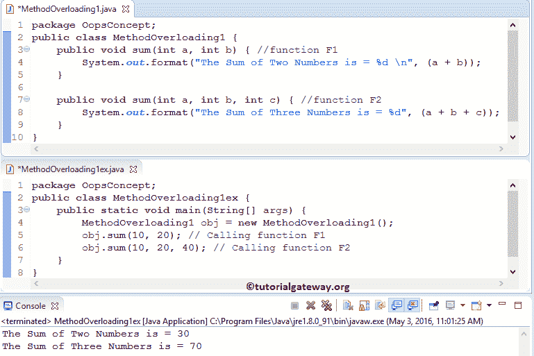
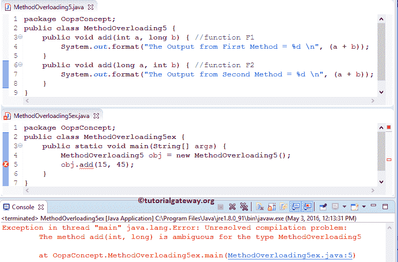
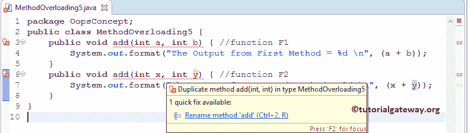
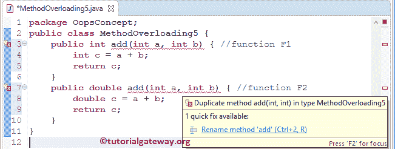

# Java 中的方法重载

> 原文：<https://www.tutorialgateway.org/method-overloading-in-java/>

Java 编程语言中的方法重载只不过是在一个类中定义两个或多个同名的方法。Java 允许我们为多个方法定义分配相同的名称，只要它们持有一组唯一的参数或参数，并且被称为 Java 方法重载。这种唯一性有助于编译器区分两种方法。因此，它可以根据参数调用适当的方法。

我们已经看到了许多 Java 方法重载技术，但是您可能没有注意到。例如，数组。我们在上一篇文章中解释的`sort()`函数或 System.out.println 方法，它接受多种数据类型作为参数。Java 方法重载可以通过以下方式实现

*   更改参数数量。请参考示例 1。
*   它们应该是至少一个参数的数据类型的变化。请参考示例 2、3 和 4。

Javac 不认为以下定义是 Java 方法重载，也许它会抛出一个错误:

*   更改参数名称。请参考示例 6。
*   更改方法的返回类型。请参考示例 7。

## Java 方法重载示例 1

在这个程序中，我们将展示如何在 Java 中通过改变参数的数量来执行方法重载。为此，首先，我们创建了一个类，在该类中，我们定义了两个同名的函数，但是我们更改了参数的数量。

```
package OopsConcept;
public class MethodOverloading1 {
	public void sum(int a, int b) { //function F1
		System.out.format("The Sum of Two Numbers is = %d \n", (a + b));
	}

	public void sum(int a, int b, int c) { //function F2
		System.out.format("The Sum of Three Numbers is = %d", (a + b + c));
	}
}
```

在这个 Java 方法重载的主体中，我们创建了上述类的对象/实例，并调用了 MethodOverloading1 中的函数

```
package OopsConcept;
public class MethodOverloading1ex {
	public static void main(String[] args) {
		MethodOverloading1 obj = new MethodOverloading1();
		obj.sum(10, 20); // Calling function F1
		obj.sum(10, 20, 40); // Calling function F2
	}
}
```



在这个 Java 方法重载程序中，下面的语句允许我们创建 MethodOverloading1 类的一个实例

```
MethodOverloading1 obj = new MethodOverloading1();
```

由于我们向 sum 传递了两个参数，编译器将调用第一个参数:public void sum(int a，int b)

```
obj.sum(10, 20); // Calling function F1
```

下一行，我们传递了三个参数。所以编译器会调用第二个:public void sum(int a，int b，int c)

```
obj.sum(10, 20, 40); // Calling function F2
```

## Java 示例 2 中的方法重载

在这个程序中，我们将展示如何在 Java 中通过改变参数的数据类型来执行方法重载。为此，首先，我们创建了一个类，在该类中，我们定义了三个同名的函数，但是我们更改了这两个参数的数据类型。

```
package OopsConcept;
public class MethodOverloading2 {
	public void add(int a, int b) { //function F1
		System.out.format("The Sum of Two Integer Values = %d \n", (a + b));
	}	
	public void add(float a, float b) { //function F2
		System.out.format("The Sum of Two Float Values = %.4f \n", (a + b));
	}
	public void add(String str1, String str2) { //function F3
		System.out.println("The Sum of Three Numbers is = " + (str1 + str2));
	}
}
```

在 Java 方法重载的主程序中，我们正在创建上述类的对象/实例。它允许我们调用 MethodOverloading2 内部的函数。

```
package OopsConcept;
public class MethodOverloading2ex {
	public static void main(String[] args) {
		MethodOverloading2 obj = new MethodOverloading2();
		obj.add(10, 20); // Calling function F1
		obj.add(20.34f, 40.92f); // Calling function F2
		obj.add("Tutorial ", "Gateway"); // Calling function F3
	}
}
```

```
The Sum of Two Integer Values = 30
The Sum of Two Float Values = 61.2600
The Sum of Three Numbers is = Tutorial Gateway
```

Java 方法重载中的第一条语句允许我们创建 MethodOverloading2 类的实例

由于我们向 add 传递了两个整数值，编译器将调用第一个:public void add(int a，int b)

```
obj.add(10, 20); // Calling function F1
```

下一行，我们将两个浮点值传递给 add。所以编译器会调用第二个:public void add(float a，float b)

```
obj.add(20.34f, 40.92f); // Calling function F2
```

在 Java 方法重载示例的下一行，我们向 add 传递了两个字符串。这里，编译器将调用第三个:公共 void add(String str1，String str2)来执行字符串连接

```
obj.add("Tutorial ", "Gateway"); // Calling function F3
```

## Java 示例 3 中的方法重载

在前面的 Java 方法重载示例中，我们更改了所有可用参数的数据类型。在这个程序中，我们将展示当我们改变单个参数的数据类型时会发生什么？当我们改变论点的顺序时会发生什么？。

为了做到这一点，首先，我们创建了一个 [Java](https://www.tutorialgateway.org/java-tutorial/) 类，在这个类中，我们定义了三个同名的函数。但是，我们更改了单个参数的数据类型和参数的顺序。

```
package OopsConcept;
public class MethodOverloading3 {
	public void add(int a, int b) { //function F1
		System.out.format("The Sum of Two Integer Values = %d \n", (a + b));
	}	
	public void add(int a, float b) { //function F3
		System.out.format("The Sum of Int & Float Values = %.4f \n", (a + b));
	}
	public void add(float a, int b) { //function F3
		System.out.format("The Sum of Float & Int Values = %.4f \n", (a + b));
	}
}
```

在 Java 方法重载 main 的例子中，我们正在创建上述类的对象/实例。它允许我们调用 MethodOverloading3 内部的函数

```
package OopsConcept;
public class MethodOverloading3ex {
	public static void main(String[] args) {
		MethodOverloading3 obj = new MethodOverloading3();
		obj.add(10, 20); // Calling function F1
		obj.add(30, 40.92f); // Calling function F2
		obj.add(60.98f, 20); // Calling function F3
	}
}
```

```
The Sum of Two Integer Values = 30
The Sum of Int & Float Values = 70.9200
The Sum of Float & Int Values = 80.9800
```

在这个 Java 方法重载的例子中，第一条语句允许我们创建 MethodOverloading3 类的一个实例

由于我们向 add 传递了两个整数值，编译器将调用 add(int a，int b)

```
obj.add(10, 20); // Calling function F1
```

下一行，我们将一个整数值和一个浮点值传递给 add。所以编译器会调用 add(int a，float b)

```
obj.add(30, 40.92f); // Calling function F2
```

下一行，我们将一个浮点值和一个整数值传递给 add。所以编译器会调用第三个 add( float a，int b)

```
obj.add(60.98f, 20); // Calling function F3
```

## Java 示例 4 中的方法重载

在这个 [Java 程序](https://www.tutorialgateway.org/learn-java-programs/)中，我们将展示 Java 如何在方法重载时隐式地进行类型转换。为此，首先，我们创建了一个类，在该类中，我们定义了两个同名的函数。但是，我们更改了第二个函数参数的数据类型。

请记住，我们在第二个参数中使用了三个参数，以便于理解，如果您想要两个参数，请坚持使用两个。

```
package OopsConcept;
public class MethodOverloading4 {
	public void add(int a, int b) { //function F1
		System.out.format("The Sum of Two Integer Values = %d \n", (a + b));
	}	
	public void add(int a, long b, long c) { //function F2
		System.out.format("The Sum of Int & Long Values = %d \n", (a + b + c));
	}
}
```

在这个 Java 方法重载的主要部分中，我们正在创建上述类的对象/实例。它允许我们调用 MethodOverloading4 中的函数

```
package OopsConcept;
public class MethodOverloading4ex {
	public static void main(String[] args) {
		MethodOverloading4 obj = new MethodOverloading4();
		obj.add(15, 45); // Calling function F1
		obj.add(30, 90, 220); // Calling function F2
	}
}
```

```
The Sum of Two Integer Values = 60
The Sum of Int & Long Values = 340
```

java 中方法重载中的以下语句允许我们创建 MethodOverloading4 类的实例

```
MethodOverloading4 obj = new MethodOverloading4();
```

由于我们向 add 传递了两个整数值，编译器将调用第一个:dd(int a，int b)

```
obj.add(15, 45); // Calling function F1
```

下一行，我们将一个整数值和两个长数值传递给 add。所以编译器会调用第二个:public void add(int a，long b，long c)。这里，该函数将隐式地将整数值转换为 long，并执行加法运算。

```
obj.add(30, 90, 220); // Calling function F2
```

## 方法重载示例 5

在这个程序中，我们将展示当我们交换参数的数据类型时会发生什么？。对于这个 Java 方法重载的例子，首先，我们创建了一个类。在类中，我们定义了两个同名的函数，但是我们交换了参数的数据类型。

```
package OopsConcept;
public class MethodOverloading5 {
	public void add(int a, long b) { //function F1
		System.out.format("The Output from First Method = %d \n", (a + b));
	}	
	public void add(long a, int b) { //function F2
		System.out.format("The Output from Second Method = %d \n", (a + b));
	}
}
```

在 java 方法重载的主体中，我们创建了上述类的对象/实例。它允许我们调用 MethodOverloading5 内部的函数。

```
package OopsConcept;
public class MethodOverloading5ex {
	public static void main(String[] args) {
		MethodOverloading5 obj = new MethodOverloading5();
		obj.add(15, 45); 
	}
}
```



在这个例子中，下面的语句允许我们创建一个 MethodOverloading5 类的实例。

```
MethodOverloading5 obj = new MethodOverloading5();
```

在这里，编译器不会理解它必须调用其中的哪一个。因为第一个:public void add(int a，long b)和第二个函数:public void add(int a，long b)都是真的。这就是为什么它会抛出一个错误，指出该方法是模棱两可的。

```
obj.add(15, 45);
```

## 方法重载示例 6

在这个 Java 方法重载程序中，我们将展示当我们改变参数名时会发生什么？。为了做到这一点，首先，我们创建了一个类，并且在该类中，我们定义了两个具有相同名称、相同参数的函数。但是，我们将参数名从 a 改为 x，从 b 改为 y。

```
package OopsConcept;
public class MethodOverloading5 {
	public void add(int a, int b) { //function F1
		System.out.format("The Output from First Method = %d \n", (a + b));
	}	
	public void add(int x, int y) { //function F2
		System.out.format("The Output from Second Method = %d \n", (a + b));
	}
}
```

声明这不是方法重载，不能鼓励。



在这个[程序](https://www.tutorialgateway.org/learn-java-programs/)中，我们将展示当我们在 Java 中改变方法重载的返回类型时会发生什么。

为了做到这一点，首先，我们创建了一个类，在该类中，我们定义了两个具有相同名称、相同参数的方法，但是我们将返回类型更改为 double。

```
package OopsConcept;
public class MethodOverloading5 {
	public int add(int a, int b) { //function F1
		int c = a + b;
		return c;
	}	
	public double add(int a, int b) { //function F2
		double c = a + b;
		return c;
	}
}
```

它声明这不是超载，不能鼓励。

