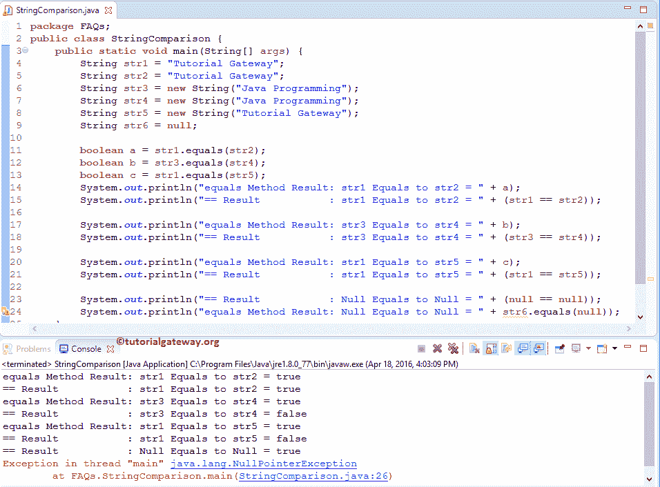

# Java 中的字符串比较

> 原文：<https://www.tutorialgateway.org/string-comparison-in-java/>

Java 中的字符串比较是面试中最常见的问题之一。Java 字符串比较可能会扭曲，因为 Java 等于方法和==运算符之间的差异。

在本文中，我们将展示如何在 Java 编程语言中执行字符串比较。在我们进入 Java 字符串比较的实际例子之前，让我们看看主要的区别:

*   使用 equals 方法的 Java 字符串比较将字符串数据与用户指定的对象数据进行比较，以检查它们是否都表示相同的字符序列。简而言之，它将比较字符串值。根据结果，Java 将返回布尔真或假。
*   ==运算符将一个字符串的对象引用与另一个字符串进行比较，并返回结果。

## 如何在 Java 中执行字符串比较

在这个 Java 程序中，我们将执行 Java 字符串比较。这里，我们将使用 equals 方法和==运算符来比较两个字符串。

```
package FAQs;

public class StringComparison {
	public static void main(String[] args) {
		String str1 = "Tutorial Gateway";
		String str2 = "Tutorial Gateway";
		String str3 = new String("Java Programming");
		String str4 = new String("Java Programming");
		String str5 = new String("Tutorial Gateway");
		String str6 = null;

		boolean a = str1.equals(str2);
		boolean b = str3.equals(str4);
		boolean c = str1.equals(str5);

		System.out.println("equals Method Result: str1 Equals to str2 = " + a);
		System.out.println("== Result           : str1 Equals to str2 = " + (str1 == str2));

		System.out.println("equals Method Result: str3 Equals to str4 = " + b);
		System.out.println("== Result           : str3 Equals to str4 = " + (str3 == str4));

		System.out.println("equals Method Result: str1 Equals to str5 = " + c);
		System.out.println("== Result           : str1 Equals to str5 = " + (str1 == str5));

		System.out.println("== Result           : Null Equals to Null = " + (null == null));
		System.out.println("equals Method Result: Null Equals to Null = " + str6.equals(null));
	}
}

```



在这个 Java 比较示例中，我们声明了三个字符串对象 str3、str4、str5，并使用下面的语句分配了相应的值。

下面的语句将调用 [Java equals Method](https://www.tutorialgateway.org/java-equals-method/) 方法来比较 str1 和 str2。从上面的 Java 字符串比较截图中，观察到它正在返回 True，因为它是一个对象。

```
boolean a = str1.equals(str2);
```

在这个 Java 字符串比较示例中，它将比较字符串 str1 和 str2。从上面的截图来看，它正在返回 True，因为它们都引用了内存中的同一个对象。

```
System.out.println("== Result           : str1 Equals to str2 = " + (str1 == str2));
```

以下语句将字符串对象 str3 与另一个对象 str4 进行比较。从上面的截图中，观察到

*   第一条语句返回 True，因为 str3 和 str4 中的值是相同的。
*   第二个语句返回 False。虽然值相同==运算符返回 False，因为 str3 正在缓存中创建新对象，而 str4 正在缓存中创建新对象。这意味着 str3 和 str4 的对象引用不同。所以，它返回假。

```
boolean b = str3.equals(str4);
System.out.println("== Result           : str3 Equals to str4 = " + (str3 == str4));
```

在这个 Java 字符串比较示例中，下面的语句将文字 str1 与对象 str5 进行比较。

*   第一条语句返回 True，因为 str1 和 str5 中的值是相同的。
*   第二个 [Java](https://www.tutorialgateway.org/java-tutorial/) 语句返回 False。虽然值相同==运算符返回 False，因为 str1 正在内存中创建一个对象，而 str5 正在缓存中创建一个新对象。这意味着 str1 和 str5 的对象引用不同。所以，它返回假。

```
boolean b = str1.equals(str5);
System.out.println("== Result           : str1 Equals to str5 = " + (str1 == str5));
```

在最后的 [Java 程序](https://www.tutorialgateway.org/learn-java-programs/)行中，我们正在比较空值，使用这个==运算符。如果我们使用[等于方法](https://www.tutorialgateway.org/java-equals-method/)来比较空值，它会抛出一个错误。