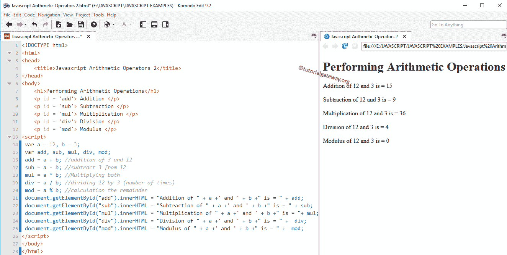

# JavaScript 算术运算符

> 原文：<https://www.tutorialgateway.org/javascript-arithmetic-operators/>

JavaScript 算术运算符包括加法、减法、乘法、除法和模数等运算符。所有这些运算符都是二元运算符，这意味着它们对两个操作数进行运算。下表显示了带有示例的 JavaScript 算术运算符。

| 经营者 | 操作 | 例子 |
| + | 添加 | 10 + 2 = 12 |
| – | 减法 | 10 – 2 = 8 |
| * | 增加 | 10 * 2 = 20 |
| / | 分开 | 10 / 2 = 5 |
| % | 模数–它返回除法后的余数 | 10 % 2 = 0(此处余数为零)。如果是 10 % 3，那么就是 1。 |

## JavaScript 算术运算符示例

对于这个 JavaScript 算术运算符的例子，我们使用了两个变量 a 和 b，它们的值是 12 和 3。我们将使用这两个变量来执行各种 JavaScript 算术运算。

```js
<!DOCTYPE html>
<html>
<head>
    <title>JavascriptArithmeticOperators </title>
</head>
<body>
    <h1>Performing Arithmetic Operations </h1>
<script>
   var a = 12, b = 3;
   var addition, subtraction, multiplication, division, modulus;

   addition = a + b; //addition of 3 and 12
   subtraction = a - b; //subtract 3 from 12
   multiplication = a * b; //Multiplying both
   division = a / b; //dividing 12 by 3 (number of times)
   modulus = a % b; //calculation the remainder

   document.write("Addition of " +a +' and ' +b +" is = " + addition + "<br />");
   document.write("Subtraction of " +a +' and ' +b +" is = " + subtraction + "<br />");
   document.write("Multiplication of " +a +' and ' +b +" is = " + multiplication + "<br />");
   document.write("Division of " +a +' and ' +b +" is = " + division + "<br />");
   document.write("Modulus of " +a +' and ' +b +" is = " + modulus + "<br />");
</script>
</body>
</html>
```

```js
Performing Arithmetic Operations
Addition of 12 and 3 is = 15
Subtraction of 12 and 3 is = 9
Multiplication of 12 and 3 is = 36
Division of 12 and 3 is = 4
Modulus of 12 and 3 is = 0
```

## JavaScript 算术运算示例 2

同样对于这个 [JavaScript](https://www.tutorialgateway.org/javascript/) 的例子，我们使用了两个变量 a 和 b，它们的值是 12 和 3。在这里，我们将使用这些变量向您展示如何在段落中显示 JavaScript 算术运算符输出。

```js
<!DOCTYPE html>
<html>
<head>
    <title>JavascriptArithmeticOperators 2</title>
</head>
<body>
    <h1>Performing Arithmetic Operations </h1>
    <p id = 'add'> Addition </p>
    <p id = 'sub'> Subtraction </p>
    <p id = 'mul'> Multiplication </p>
    <p id = 'div'> Division </p>
    <p id = 'mod'> Modulus </p>
<script>
   var a = 12, b = 3;
   var add, sub, mul, div, mod;

   add = a+b; //addition of 3 and 12
   sub = a-b; //subtract 3 from 12
   mul = a*b; //Multiplying both
   div = a/b; //dividing 12 by 3 (number of times)
   mod = a%b; //calculation the remainder

   document.getElementById("add").innerHTML = "Addition of " +a +' and ' +b +" is = " + add;
   document.getElementById("sub").innerHTML = "Subtraction of " +a +' and ' +b +" is = " + sub;
   document.getElementById("mul").innerHTML = "Multiplication of " +a +' and ' +b +" is = "+ mul;
   document.getElementById("div").innerHTML = "Division of " +a +' and ' +b +" is = " +  div;
   document.getElementById("mod").innerHTML = "Modulus of " +a +' and ' +b +" is = " +  mod;
</script>
</body>
</html>
```

