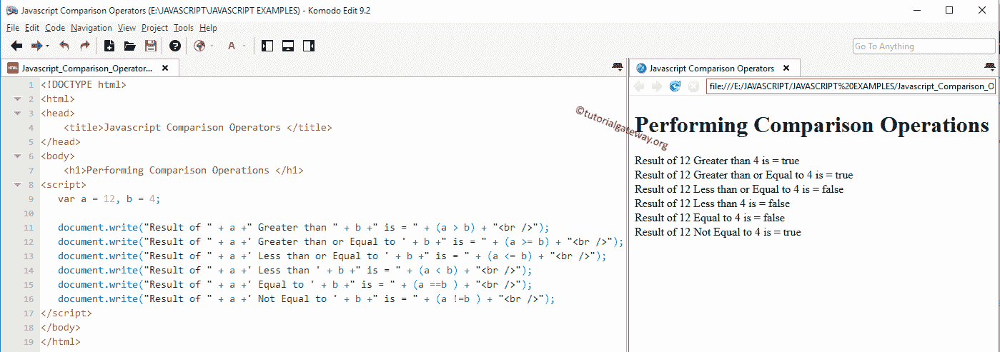

# JavaScript 比较运算符

> 原文：<https://www.tutorialgateway.org/javascript-comparison-operators/>

JavaScript 比较运算符主要用于`if`语句或循环中。例如，JavaScript Comparison 运算符通常用于检查两个变量之间的关系。如果关系为真，则返回布尔值“真”，或者如果关系为假，则返回布尔值“假”。

下表显示了所有带有示例的 JavaScript 关系运算符。

| JavaScript 比较运算符 | 使用 | 描述 | 例子 |
| > | a > b | a 大于 b | 7 > 3 返回真 |
| < | a < b | a 小于 b | 7 < 3 返回假 |
| >= | a >= b | a 大于或等于 b | 7 >= 3 返回真 |
| <= | a <= b | a 小于或等于 b | 7 <= 3 返回假 |
| == | a == b | a 等于 b | 7 == "7 "返回真 |
| === | a === 7 | a 正好等于 b | 7 === "7 "返回假 |
| ！= | a！= b | a 不等于 b | 7 != 3 返回真 |
| ！== | a！== b | a 不等于 b 及其类型 | 7 !== 3 返回真 |

## JavaScript 比较运算符示例

这个例子帮助你实际理解 JavaScript 比较运算符。在这个例子中，我们使用了两个变量 a 和 b，它们的值分别是 9 和 4。接下来，我们将使用这两个变量来执行各种 JavaScript 关系操作。

```js
<!DOCTYPE html>
<html>
<head>
    <title>JavaScript ComparisonOperators </title>
</head>
<body>
    <h1>Performing Comparison Operations </h1>
<script>
   var a = 12, b = 4;

   document.write("Result of " + a +" Greater than " + b +" is = " + (a > b) + "<br />");
   document.write("Result of " + a +' Greater than or Equal to ' + b +" is = " + (a >= b) + "<br />");
   document.write("Result of " + a +' Less than or Equal to ' + b +" is = " + (a <= b) + "<br />");
   document.write("Result of " + a +' Less than ' + b +" is = " + (a < b) + "<br />");
   document.write("Result of " + a +' Equal to ' + b +" is = " + (a ==b ) + "<br />");
   document.write("Result of " + a +' Not Equal to ' + b +" is = " + (a !=b ) + "<br />");   
</script>
</body>
</html>
```



在这个 JavaScript 比较运算符示例中，我们分配了 2 个整数值 a、b，并使用下面的语句分配了数值 9 和 4。

```js
 var a = 12, b = 4;
```

在下一行中，我们对照我们拥有的每个比较运算符来检查这些值。

## 使用 If 条件的 JavaScript 比较运算符

这个例子帮助你理解在`if-else`语句中如何使用 JavaScript 比较运算符。对于这个 [JavaScript](https://www.tutorialgateway.org/javascript/) 的例子，我们使用了两个变量 x 和 y，它们的值分别是 10 和 25。我们将使用=`=`运算符来检查变量 x 是否等于 y。

```js
<!DOCTYPE html>
<html>
<head>
    <title>Javascript ComparisonOperators 2</title>
</head>
<body>
    <h1> Comparison Operations </h1>
    <p id = 'result'> Addition </p>
<script>
   var x = 12, y = 24;

   if (x === y)
   {
    document.getElementById("result").innerHTML = x +' is Equal to ' + y;
   }
   else
   {
    document.getElementById("result").innerHTML = x +' is Not Equal to ' + y;
   } 
</script>
</body>
</html>
```

```js
Comparison Operations

12 is Not Equal to 24
```

在这个 JavaScript 关系运算符示例中，我们分配了 2 个整数值 x，y，并使用下面的语句分配了值 10 和 25。

```js
var x = 12, y = 24;
```

如果条件

如果 x 正好等于 y，那么将执行第一条语句(If 块中的语句)

```js
document.getElementById("result").innerHTML = x +' is Equal to ' + y;
```

如果 x 不等于 y，那么将执行第二条语句(Else 块内部的语句)。

```js
document.getElementById("result").innerHTML = x +' is Not Equal to ' + y;
```

这里 x 值(12)显然不等于 25，因此，第二条语句将显示在段落中

## ==，===和之间的区别！=, !==

这个 JavaScript 比较运算符示例帮助您理解=`=`运算符、=`=`运算符和！`=`运算符，！=`=`运算符。

*   ==检查左侧的值是否等于右侧的值
*   ===检查左侧的值和数据类型是否等于右侧的值和数据类型
*   在 JavaScript 比较运算符中，！=检查左侧的值是否不等于右侧的值
*   ！==检查左侧的值和数据类型是否不等于右侧的值和数据类型

```js
<!DOCTYPE html>
<html>
<head>
    <title>Javascript ComparisonOperators </title>
</head>
<body>
    <h1> Comparison Operations </h1>
<script>
    document.write("Equal to: " + (12 == "12"));
    document.write("  <br /> Exactly Equal to: " + (12 === "12"));

    document.write(" <br /> Not Equal to: " + (12 != "12"));
    document.write(" <br /> Exactly Not Equal to: " + (12 !== "12"));  

</script>
</body>
</html>
```

```js
Comparison Operations

Equal to: true
Exactly Equal to: false
Not Equal to: false
Exactly Not Equal to: true
```