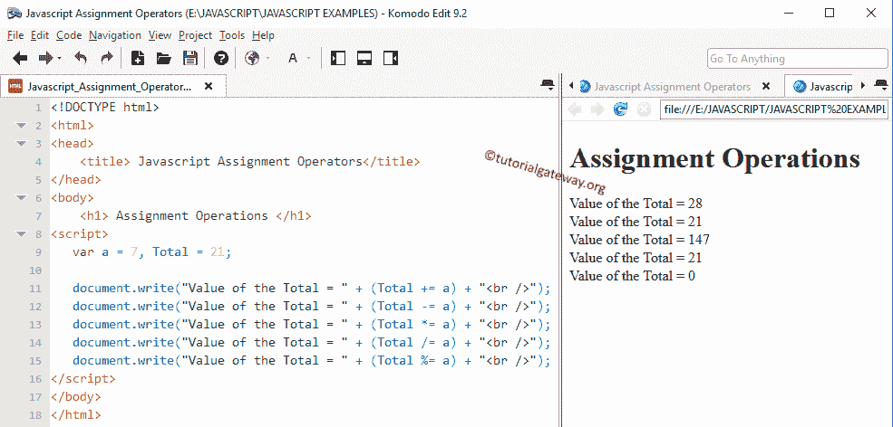

# JavaScript 赋值运算符

> 原文:[https://www . tutorialgateway . org/JavaScript-赋值-运算符/](https://www.tutorialgateway.org/javascript-assignment-operators/)

JavaScript 赋值运算符用于为声明的变量赋值。Equals (=)运算符是最常用的 JavaScript 赋值运算符。例如:

```
var i = 10;
```

下表显示了所有的 JavaScript 赋值运算符。

| JavaScript 赋值运算符 | 例子 | 说明 |
| = | x = 15 | 值 15 分配给 x |
| += | x += 15 | 这与 x = x + 15 相同 |
| -= | x -= 15 | 这与 x = x–15 相同 |
| *= | x *= 15 | 这与 x = x * 15 相同 |
| /= | x /= 15 | 这与 x = x / 15 相同 |
| %= | x %= 15 | 这与 x = x % 15 相同 |

## JavaScript 赋值运算符示例

在这个例子中，我们使用了两个整数变量 a，Total，它们的值是 7 和 21。我们将使用这两个变量向您展示 JS 中所有赋值运算符的工作功能

```
<!DOCTYPE html>
<html>
<head>
    <title> Javascript AssignmentOperators</title>
</head>
<body>
    <h1> Assignment Operations </h1>
<script>
   var a = 7, Total = 21;

   document.write("Value of the Total = " + (Total += a) + "<br />");
   document.write("Value of the Total = " + (Total -= a) + "<br />");
   document.write("Value of the Total = " + (Total *= a) + "<br />");   
   document.write("Value of the Total = " + (Total /= a) + "<br />");
   document.write("Value of the Total = " + (Total %= a) + "<br />");
</script>
</body>
</html>
```



在这个 JavaScript 赋值运算符程序中，我们声明了 2 个整数值 a、Total，并分别赋值 7 和 21。下面的语句将对 a 和 Total 执行赋值操作，然后将输出写入相应的浏览器。

让我们看看 JS 赋值运算符的功能

```
document.write("Value of the Total = " + (Total += a) + "<br />");
```

总计

总计=总计+ a = 21 + 7 = 28

```
document.write("Value of the Total = " + (Total -= a) + "<br />");
```

总计

总计=总计–a = 28–7 = 21

```
document.write("Value of the Total = " + (Total *= a) + "<br />");
```

总计*=平均值

总计=总计* a = 21 * 7 = 147

```
document.write("Value of the Total = " + (Total /= a) + "<br />");
```

总计/

总计=总计/ a = 147 / 7 = 21

```
document.write("Value of the Total = " + (Total %= a) + "<br />")
```

总计%= a 表示

总计=总计+a = 21% 7 = 0(21/7 的余数为= 0)

## JavaScript 赋值运算符示例 2

同样对于这个 [JavaScript](https://www.tutorialgateway.org/javascript/) 的例子，我们使用了两个整数变量 a，Total，它们的值是 7 和 21。我们将使用这些变量向您展示如何在段落中显示 JavaScript 赋值运算符输出。

```
<!DOCTYPE html>
<html>
<head>
    <title> JavaScript AssignmentOperators 2</title>
</head>
<body>
    <h1> Assignment Operations </h1>
    <p id = 'add'> Plus Equal to </p>
    <p id = 'sub'> Subtraction Equal to </p>
    <p id = 'mul'> Multiplication Equal to </p>
    <p id = 'div'> Division Equal to </p>
    <p id = 'mod'> Modulus Equal to </p>
<script>
   var a = 3, Total = 12;

   document.getElementById("add").innerHTML = "Value of the Total = " + (Total += a);
   document.getElementById("sub").innerHTML = "Value of the Total = " + (Total -= a);
   document.getElementById("mul").innerHTML = "Value of the Total = " + (Total *= a);
   document.getElementById("div").innerHTML = "Value of the Total = " + (Total /= a);
   document.getElementById("mod").innerHTML = "Value of the Total = " + (Total %= a);

</script>
</body>
</html>
```

```
Assignment Operations

Value of the Total = 15

Value of the Total = 12

Value of the Total = 36

Value of the Total = 12

Value of the Total = 0
```