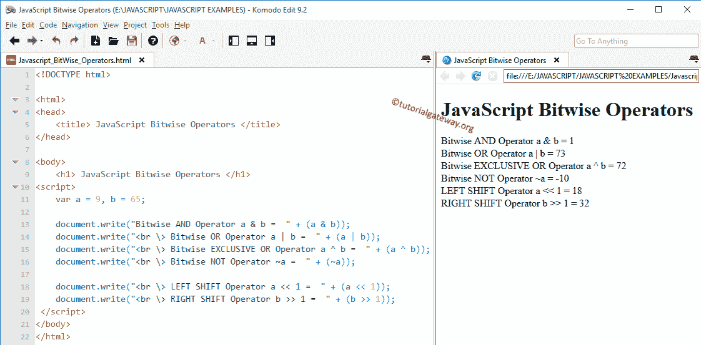

# JavaScript 逐位运算符

> 原文：<https://www.tutorialgateway.org/javascript-bitwise-operators/>

JavaScript 逐位运算符执行位操作。所有转换成二进制值的十进制值(位序列，即 0100、1100、1000、1001 等。).接下来，JavaScript 按位运算符将处理这些位，例如将它们从左向右移动或将位值从 0 转换为 1 等。

下表显示了不同的 JavaScript 按位运算符及其含义。例如，考虑 x = 6 和 y = 8，它们的二进制形式的值是:x = 0110 和 y = 1000

| JavaScript 逐位运算符 | 意义 | 例子 |
| & | 按位“与” | X & Y = 0000 |
| &#124; | 按位“或” | X &#124; Y = 1110 |
| ^ | 异或 | X ^ Y = 1110 |
| ~ | 补充 | ~X = 00001001 (Not 运算符将所有 0 转换为 1。) |
| << | 左移位 | X << 1 = 00001100(位将向左移动 1 步。如果我们使用 2 或 3，那么它们会相应地移动) |
| >> | 右移 | Y >> 1 = 00000100 |

让我们看看 JavaScript 逐位运算符背后的真值表

| x | y | x & y | X &#124; y | x ^ y |
| Zero | Zero | Zero | Zero | Zero |
| Zero | one | Zero | one | one |
| one | Zero | Zero | one | one |
| one | one | one | one | Zero |

## JavaScript 逐位运算符示例

让我们看一个更好理解的例子。对于这个 JavaScript 示例，我们使用了两个变量 a 和 b，它们的值分别是 9 和 65。我们将使用这两个变量向您展示各种 JavaScript 位操作

```
<!DOCTYPE html>

<html>
<head>
    <title> JavaScriptBitwiseOperators </title>
</head>

<body>
    <h1> JavaScriptBitwiseOperators </h1>
<script>
    var a = 9, b = 65;

    document.write("Bitwise AND Operator a & b =  " + (a&b));
    document.write("<br \> Bitwise OR Operator a | b =  " + (a|b));
    document.write("<br \> Bitwise EXCLUSIVE OR Operator a^b =  " + (a^b));
    document.write("<br \> Bitwise NOT Operator ~a =  " + (~a));

    document.write("<br \> LEFT SHIFT Operator a << 1 =  " + (a << 1));
    document.write("<br \> RIGHT SHIFT Operator b >> 1 =  " + (b >> 1));
 </script>
</body>
</html>
```



在这个 JavaScript 逐位运算符程序中，我们声明了 2 个整数 a 和 b，并分配了值 9 和 65。9 = 0001001 和 65 = 1000001 的二进制形式。

文档写语句将对 a 和 b 执行按位运算，然后显示输出。让我们看看 JavaScript 的计算

“与”运算= a&b

0001001 & 1000001 = 0000001 = 1

或运算= a || b

0001001 || 1000001 = 1001001 = 73

异或运算= a^b

0001001 ^ 1000001 = 1001000 = 72

左移操作:左移一个位置等于数字乘以 2。意思是，

a << 1 = (9 * 2) = 18

如果我们说，a<<2，然后乘以 4，以此类推

运筹学

右移操作= T2 1

1000001 >> 1 = 0100000 = 32