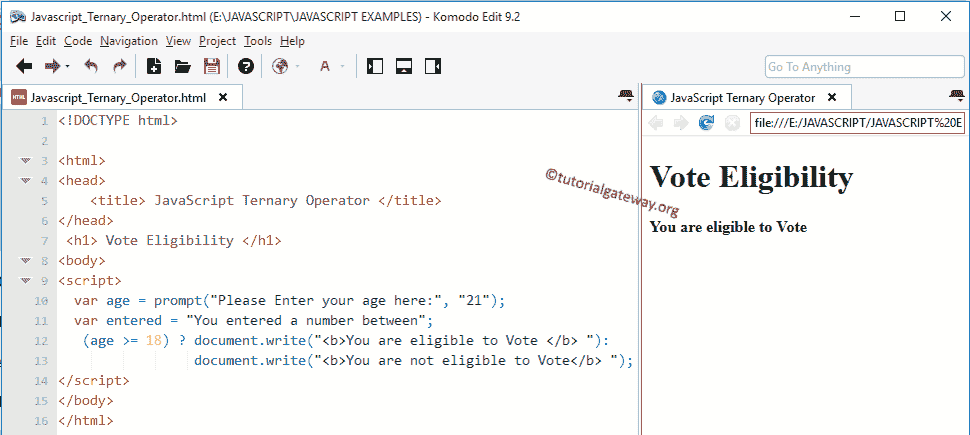
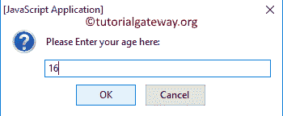

# JavaScript 三元运算符

> 原文:[https://www . tutorialgateway . org/JavaScript-三元运算符/](https://www.tutorialgateway.org/javascript-ternary-operator/)

JavaScript 三元运算符也称为条件运算符。JavaScript 三元运算符返回的语句取决于表达式结果。在决策过程中使用了 JavaScript 条件运算符。JavaScript 条件运算符的语法是

```
Test_expression ? statement1: statement2
```

如果给定的测试表达式为真，则返回 statement1。如果测试表达式为假，则返回 statement2。

## JavaScript 三元运算符示例

在本例中，我们将使用三元运算符来查找该人是否有资格投票。

JavaScript 三元示例中的第一条语句要求用户输入他/她的年龄。如果用户忘记输入，该程序将考虑默认值，即 21。接下来，条件三元运算符计算表达式。如果用户输入的年龄为 18 岁或以上，它将显示？符号。

当用户输入低于 18 时，条件将失败。因此，JavaScript 条件式将执行第二条语句(显示在:符号之后)。

```
<!DOCTYPE html>

<html>
<head>
    <title> JavaScriptTernaryOperator </title>
</head>

<body>
<script>
  var age = prompt("Please Enter your age here:", "21");
  (age >= 18) ? document.write("<b>You are eligible to Vote </b> "):
                document.write("<b>You are not eligible to Vote</b> ");
</script>
</body>
</html>
```

当您打开浏览器时，下面显示的提示框将会打开。我们保留默认值 21，然后单击确定。在这里，条件为真，所以它打印下面的输出。



让我们用不同的价值去尝试。从下面 [JavaScript](https://www.tutorialgateway.org/javascript/) 截图中，可以观察到我们正在进入 16 岁作为年龄



让我们输出

```
Vote Eligibility

You are not eligible to Vote
```