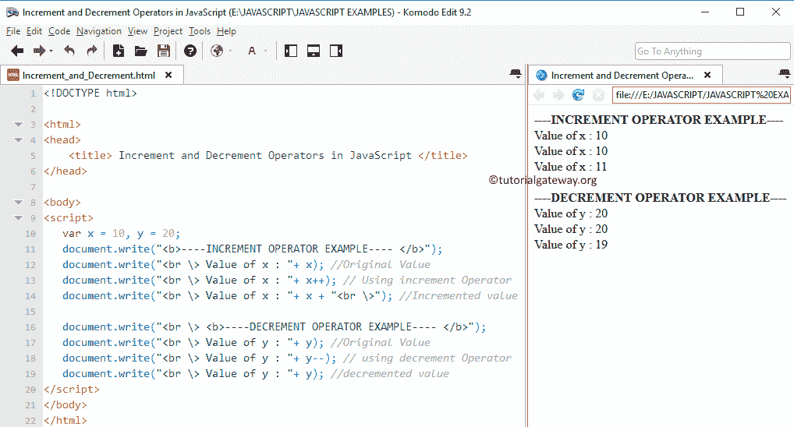

# JavaScript 中的递增和递减运算符

> 原文：<https://www.tutorialgateway.org/increment-and-decrement-operators-in-javascript/>

JavaScript 递增和递减运算符可用于将值增加或减少 1。例如，增量运算符++用于将现有变量值增加 1 (x = x + 1)。减量运算符––用于将现有值减 1(x = x–1)。

JavaScript 中递增和递减运算符的语法如下

*   增量运算符:++x 或 x++
*   递减运算符:–x 或 x–

## JavaScript 示例中的递增和递减运算符

在这个例子中，我们向您展示了 JavaScript 编程语言中递增和递减运算符的工作功能。

```js
<!DOCTYPE html>

<html>
<head>
    <title> Increment and Decrement Operators in JavaScript </title>
</head>

<body>
<script>
   var x = 10, y = 20;
   document.write("<b>----INCREMENT OPERATOR EXAMPLE---- </b>");
   document.write("<br \> Value of x : "+ x); //Original Value
   document.write("<br \> Value of x : "+ x++); // Using increment Operator
   document.write("<br \> Value of x : "+ x + "<br \>"); //Incremented value

   document.write("<br \> <b>----DECREMENT OPERATOR EXAMPLE---- </b>");
   document.write("<br \> Value of y : "+ y); //Original Value
   document.write("<br \> Value of y : "+ y--); // using decrement Operator
   document.write("<br \> Value of y : "+ y); //decremented value   
</script>
</body>
</html>
```



在第 13 行，我们使用了增量运算符。所以首先返回 X 的值(即 10)，然后 X 的值增加 1。

第 14 行:我们再次调用了 X 值，它显示的是 11，因为该值已经更新了。减量运算符也是如此。

## JavaScript 前缀和后缀

如果您观察上述语法，我们可以在操作数之前或之后分配 JavaScript 递增和递减运算符。当++或——用在像:+++x、–x 这样的操作数之前时，我们称之为前缀，如果++或——用在像:x++或 x 这样的操作数之后，我们称之为后缀。

让我们探索一下 JavaScript 前缀和后缀

1.  +++I(预增量):它甚至在将 I 的值赋给变量 I 之前就将 I 的值递增。
2.  i++(后递增):运算符首先返回变量值(即 I 值)，然后只有 I 值将递增 1。
3.  –I(预递减):它甚至在将 I 的值赋给变量 I 之前就递减 I 的值
4.  I –(后递减):JavaScript 运算符首先返回变量值(即 I 值)，然后只有 I 值递减 1。

### JavaScript 前缀和后缀示例

这个例子将向你展示，如何在 JavaScript 中使用 JavaScript 递增和递减运算符作为前缀和后缀

```js
<!DOCTYPE html>
<html>
<head>
    <title> javascript prefix and Postfix </title>
</head>
<body>
<script>
   var x = 10, y = 20, a = 5, b= 4;
   document.write("<b>----PRE INCREMENT OPERATOR EXAMPLE---- </b>");
   document.write("<br \> Value of X : " + x); //Original Value
   document.write("<br \> Value of X : "+ (++x)); // Using increment Operator
   document.write("<br \> Value of X Incremented: " + x + "<br \>"); //Incremented value

   document.write("<br \> <b>----POST INCREMENT OPERATOR EXAMPLE---- </b>");
   document.write("<br \> Value of Y : "+ y); //Original Value
   document.write("<br \> Value of Y : "+ y++); // Using increment Operator
   document.write("<br \> Value of Y Incremented: "+ y + "<br \>"); //Incremented value

   document.write("<br \> <b>----PRE DECREMENT OPERATOR EXAMPLE---- </b>");
   document.write("<br \> Value of A : "+ a); //Original Value
   document.write("<br \> Value of A : "+ --a); // using decrement Operator
   document.write("<br \> Value of A Decremented: "+ a + "<br \>"); //decremented value

   document.write("<br \> <b>----POST DECREMENT OPERATOR EXAMPLE---- </b>");
   document.write("<br \> Value of B : "+ b); //Original Value
   document.write("<br \> Value of B : "+ b--); // using decrement Operator
   document.write("<br \> Value of B Decremented: "+ b + "<br \>"); //decremented value 
</script>
</body>
</html>
```

```js
----PRE INCREMENT OPERATOR EXAMPLE----
Value of X : 10
Value of X : 11
Value of X Incremented: 11

----POST INCREMENT OPERATOR EXAMPLE----
Value of Y : 20
Value of Y : 20
Value of Y Incremented: 21

----PRE DECREMENT OPERATOR EXAMPLE----
Value of A : 5
Value of A : 4
Value of A Decremented: 4

----POST DECREMENT OPERATOR EXAMPLE----
Value of B : 4
Value of B : 4
Value of B Decremented: 3
```

JavaScript 编程中的递增和递减运算符，用于`for`循环、`while`循环和`do-while`循环。尝试学习 JavaScript 前缀和后缀的概念，这样您就可以理解`for`循环、`while`循环和 do-`while`循环语法是否简单