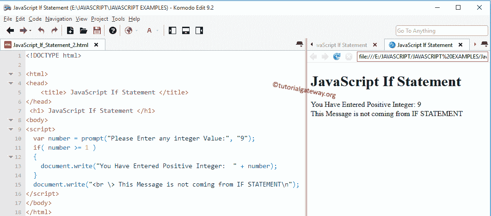

# JavaScript If 语句

> 原文:[https://www.tutorialgateway.org/javascript-if-statement/](https://www.tutorialgateway.org/javascript-if-statement/)

在实时编程中，JavaScript If 语句是最有价值的决策语句之一。如果语句允许编译器首先测试条件，根据结果，它将执行代码块。如果测试条件为真，那么只有 If 语句执行一段代码。

## 如果语句语法

如果语句有一个简单的结构:

```
if (test condition)
{

  Statement1;
  Statement2;
  ………….
  ………….
  StatementN;
}
```

从上面的 JS 代码来看，当 If 中的测试条件为真时，语句 1，2，3，…。，n 将执行。如果条件为假，所有这些行将跳过。

## JavaScript If 语句示例

这个程序将使用 JavaScript if 语句检查正数

```
<!DOCTYPE html>

<html>
<head>
    <title> Example </title>
</head>
 <h1> JavaScriptIfStatement </h1>
<body>
<script>
  var number = prompt("Please Enter any integer Value:", "9");
  if( number >= 1 )
  {
    document.write("You Have Entered Positive Integer");
  }
</script>
</body>
</html>
```

对于单行来说， [JavaScript](https://www.tutorialgateway.org/javascript/) 中不需要花括号，但是对于多段或者一段代码来说，是强制的。在 JavaScript If 语句后面使用花括号总是一种好的做法。

当您打开浏览器时，提示框将以默认值打开。我们保留默认值 9，并单击确定。

```
Example

You Have Entered Positive Integer: 9
```

如果看上面的 If 条件，数值变量中存储的值大于零。这就是它在花括号({ })中显示代码的原因。

从上面的例子来看，如果条件失败了会发生什么？(数量< 1)。

它不打印任何内容，因为在 if 条件之后我们没有任何内容可以打印。希望你糊涂了。为了更好的理解，让我们看看 If 块的流程图。

### JavaScript If 语句示例 2

```
<!DOCTYPE html>

<html>
<head>
    <title> JavaScriptIfStatement </title>
</head>
 <h1> JavaScriptIfStatement </h1>
<body>
<script>
  var number = prompt("Please Enter any integer Value:", "9");
  if( number >= 1 )
  {
    document.write("You Have Entered Positive Integer:  " + number);
  }
  document.write("<br \> This Message is not coming from IF STATEMENT\n");
</script>
</body>
</html>
```

这里我们也把数字默认为 9



如果您可以从上面的输出中观察到，因为 9 大于 1，所以它同时显示了文档写入行。让我们尝试提示框中的负值，故意使条件失败。

```
-33
```

If 表达式失败，因为-33 小于 1，并且它不显示 JS If 条件块中的任何内容。因此，它只显示块外的代码。

```
JavaScript If Statement

This Message is not coming from IF STATEMENT
```