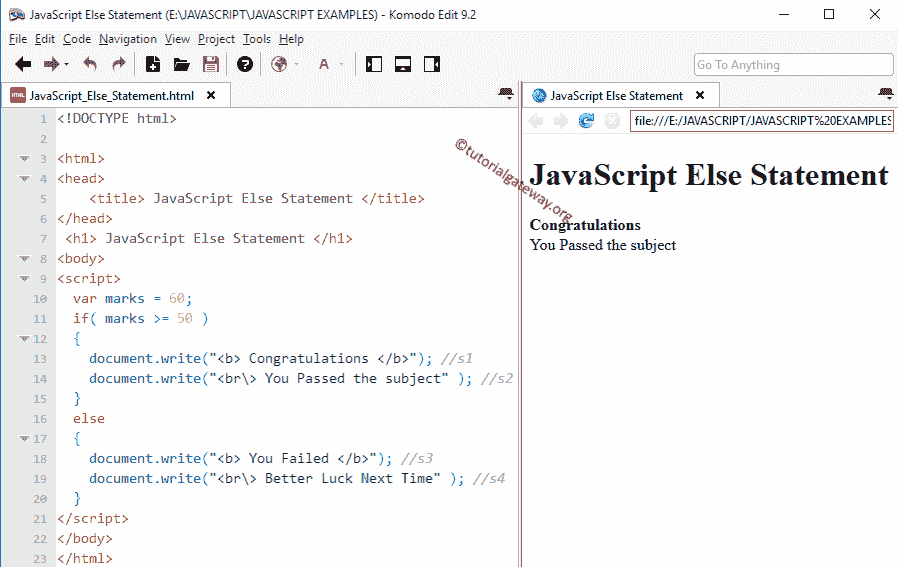

# JavaScript `if-else`语句

> 原文：<https://www.tutorialgateway.org/javascript-if-else-statement/>

JavaScript `if-else`语句是我们之前已经解释过的 If 的扩展。并且它只在给定表达式计算为真时执行代码。如果条件为假，它将不会在块内运行任何代码。

在现实世界中，当条件失败时，执行一些东西是很好的。为此，我们必须使用这个 JavaScript `if-else`语句。这里，当条件失败时，Else 将执行语句。JavaScript `if-else`语句的语法如下:

```
if (Test condition)
{
  //If the condition is TRUE then these will be executed
  True statements;
}

else
{
  //If the condition is FALSE then these will be executed
  False statements;
}
```

如果上述结构中的测试条件为真，将执行 true 语句。如果为假，将执行假代码。

## JavaScript `if-else`语句示例

在这个 JavaScript `if-else`语句示例程序中，我们将放置四个不同的语句。如果条件为真，我们将显示两条线。如果条件为假， [JavaScript](https://www.tutorialgateway.org/javascript/) 会再显示两个。请参考 [JS If 条件](https://www.tutorialgateway.org/javascript-if-statement/)一文。

```
<!DOCTYPE html>

<html>
<head>
    <title> JavaScriptElseStatement </title>
</head>
 <h1> JavaScriptElseStatement </h1>
<body>
<script>
  var marks = 60;
  if( marks >= 50 )
  {
    document.write("<b> Congratulations </b>"); //s1
    document.write("<br\> You Passed the subject" ); //s2
  }
  else
  {
    document.write("<b> You Failed </b>"); //s3
    document.write("<br\> Better Luck Next Time" ); //s4
  }
</script>
</body>
</html>
```

输出 1:这里标记为 60，条件为真，这就是为什么`if`语句中的语句显示为浏览器输出



输出 2:在这里，我们将标记变量改为 30。这意味着条件为假，这就是为什么 Else 块中的代码显示为输出

```
JavaScriptElseStatement

You Failed
Better Luck Next Time
```