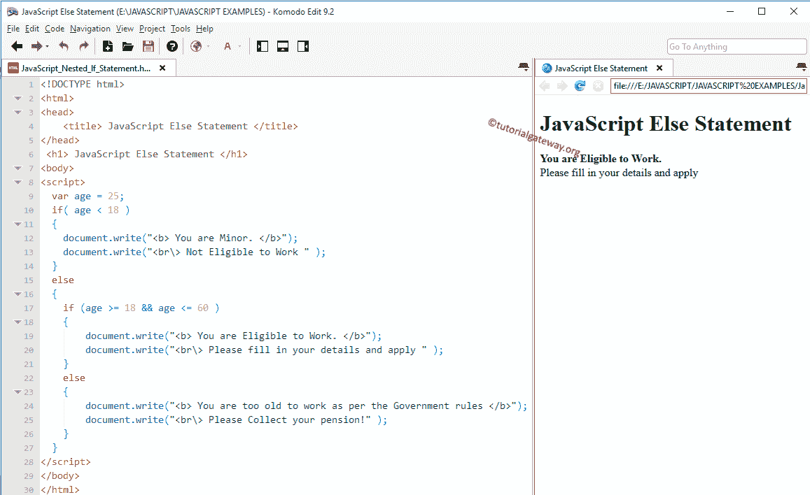

# 嵌套的如果

> 原文：<https://www.tutorialgateway.org/javascript-nested-if/>

将`if`语句嵌入另一个称为 JavaScript 嵌套`if`语句的`if`语句中。JavaScript Else 语句允许我们根据表达式结果(真、假)打印不同的语句。有时，当条件为真时，我们必须进一步检查。在这种情况下，我们可以使用 JavaScript 嵌套`if`语句，但是使用时要小心。

例如，每个 18 岁或以上的人都有资格工作，否则他就没有资格。不过，公司不会给每个人一份工作。因此，我们使用另一个`if`语句，也称为 JavaScript 嵌套`if`语句来检查他们的学历或任何特定于公司的要求。

## JavaScript 嵌套`if`语法

JavaScript 编程语言中的嵌套`if`语法如下:

```
if ( test condition 1)
{

   //If the test condition 1 is TRUE then these it will check for test condition 2
   if ( test condition 2)
   {
    //If the test condition 2 is TRUE then these statements will be executed
    Test condition 2 True statements;
   }

   else
   {
    //If the c test condition 2 is FALSE then these statements will be executed
    Test condition 2 False statements;
   }

else
{
 //If the test condition 1 is FALSE then these statements will be executed
 Test condition 1 False statements;
}
```

### JavaScript 嵌套`if`的流程图

让我们看看 JavaScript 嵌套`if`流程图，以便更好地理解。


如果测试条件 1 为假，则将执行状态 ENT3。如果测试条件 1 为真，它将检查测试条件 2，如果为真，STATEMENT1 将执行其他 STATEMENT2。

## JavaScript 嵌套`if`示例

在这个 JavaScript 嵌套`if`示例程序中，我们将声明变量年龄并存储默认值。

如果年龄小于 18 岁，我们将打印两份报表。当条件失败时，我们将再检查一个条件(嵌套的)，如果成功了，我们就写一些东西。如果嵌套条件失败，我们打印一些其他的东西。请参考 [JavaScript](https://www.tutorialgateway.org/javascript/) 中的 [JavaScript Else 语句](https://www.tutorialgateway.org/javascript-if-else-statement/)和 [`if`语句](https://www.tutorialgateway.org/javascript-if-statement/)。

```
<!DOCTYPE html>
<html>
<head>
    <title> JavaScript Else Statement </title>
</head>
 <h1> JavaScript Else Statement </h1>
<body>
<script>
  var age = 15;
  if( age < 18 )
  {
    document.write("<b> You are Minor. </b>"); 
    document.write("<br\> Not Eligible to Work " ); 
  }
  else
  {
    if (age >= 18 && age <= 60 )
    {
        document.write("<b> You are Eligible to Work. </b>");
        document.write("<br\> Please fill in your details and apply " ); 
    }
    else
    {
        document.write("<b> You are too old to work as per the Government rules </b>");
        document.write("<br\> Please Collect your pension!" );    
    }
  }
</script>
</body>
</html>
```

在这个 JavaScript 嵌套`if`语句的例子中，如果这个人的年龄小于 18 岁，那么他就没有资格工作。如果人的年龄大于或等于 18 岁，则第一个条件失败，它将检查 else 语句。

在 Else 语句中，还有另一个称为嵌套`if`的 If 条件。

*   JS 嵌套`if`语句将检查该人的年龄是否大于或等于 18 岁且小于或等于 60 岁。如果条件为真，一个人可以申请这份工作。
*   如果条件为假，说明一个人太老了，不能按照政府的规定工作。

输出 1:在这里，年龄是 15 岁。第一个如果条件为真，这就是为什么如果语句中的语句显示为浏览器输出

```
JavaScript Else Statement

You are Minor.
Not Eligible to Work
```

第二个输出:我们将年龄改为 25 岁。第一个“如果”条件为“假”。嵌套`if`条件为真，这就是为什么嵌套`if`语句中的语句显示为浏览器输出



年龄= 61 岁。If 条件和嵌套`if`条件在此失败。因此，嵌套的 Else 语句中的语句显示为输出

```
JavaScript Else Statement

You are too old to work as per the Government rules
Please Collect your pension!
```