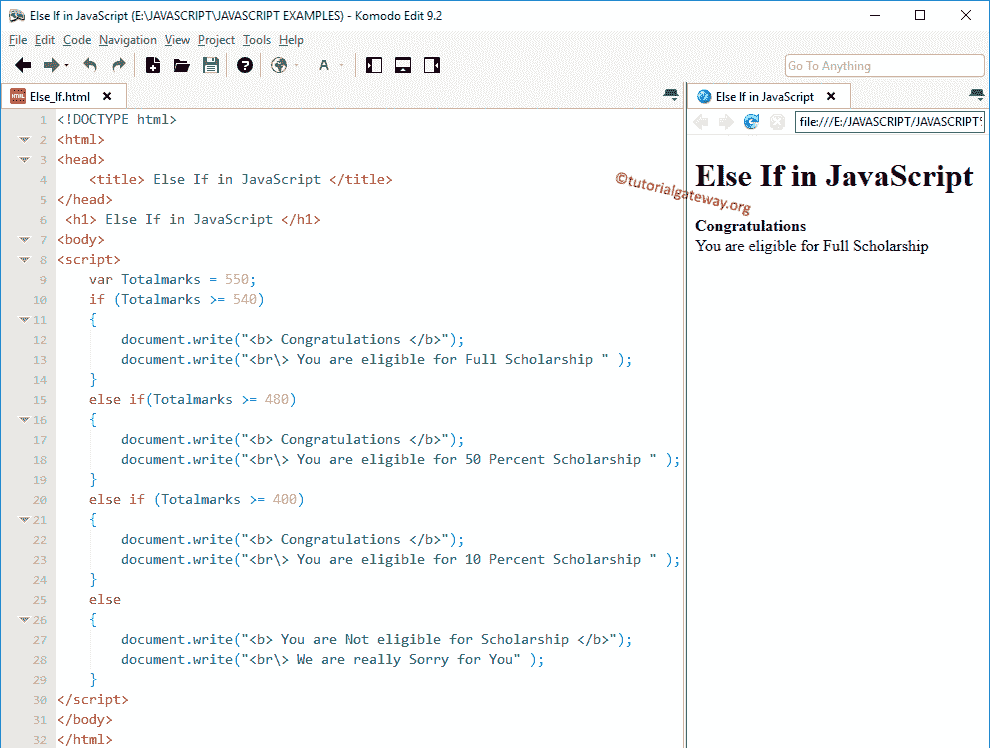

# 否则如果在 JavaScript 中

> 原文：<https://www.tutorialgateway.org/else-if-in-javascript/>

当我们必须检查几个条件时，JavaScript 中的 Else If 非常有用。我们也可以使用嵌套`if`来实现同样的效果。然而，随着条件数量的增加，代码的复杂性也会增加。Javascript 中 Else If 的语法如下:

```
if (condition1)
       statements 1
else if (condition2)
       statements 2
else if (condition3)
       statements 3
      ...........
else if (conditionn)
       statements n
else
      default statements
```

JavaScript`else if`语句通过顺序执行多个表达式来有效地处理它们。它将检查第一个条件。如果表达式的计算结果为真，那么它将执行该块中的代码行。如果表达式计算为假，那么它将检查下一个(否则如果条件)等等。

有些情况下条件 1、条件 2 为真，例如:x = 20，y = 10

条件 1:x > y//真

条件 2: x！= y//真

在这些情况下，将执行条件 1 下的代码。因为否则 if 条件只有在前一个 IF 或`else if`语句失败时才会执行。

## 否则如果在 JavaScript 示例中

在这个程序中，我们将使用 JavaScript`else if`语句来计算他是否有资格获得奖学金

```
<!DOCTYPE html>
<html>
<head>
    <title>ElseIfinJavaScript</title>
</head>
 <h1>ElseIfinJavaScript</h1>
<body>
<script>
    var Totalmarks = 380;
    if (Totalmarks >= 540)
    {
        document.write("<b> Congratulations </b>"); 
        document.write("<br\> You are eligible for Full Scholarship " ); 
    }
    else if(Totalmarks >= 480)
    {
        document.write("<b> Congratulations </b>"); 
        document.write("<br\> You are eligible for 50 Percent Scholarship " ); 
    }
    else if (Totalmarks >= 400)
    {
        document.write("<b> Congratulations </b>"); 
        document.write("<br\> You are eligible for 10 Percent Scholarship " ); 
    }
    else
    {
        document.write("<b> You are Not eligible for Scholarship </b>");
        document.write("<br\> We are really Sorry for You" );    
    }
</script>
</body>
</html>
```

输出 1:在这个 [JS](https://www.tutorialgateway.org/javascript/) 例子中，Totalmarks= 550。第一个 If 条件为真，这就是为什么`if`语句中的代码显示为浏览器输出



输出 2:为了演示 JavaScript`else if`语句，我们将 Totalmarks 更改为 500 表示第一个 if 条件为 FALSE。它将检查(总标记> = 480)，这是真的，因此它将显示该块内的行。虽然(总分> = 400)条件为真，但它不会检查该表达式。

```
Congratulations
You are eligible for 50 Percent Scholarship
```

否则如果在 JavaScript 输出 3 中:我们要将 Totalmarks 更改为 440 意味着第一个 If 条件，(Total marks= 480)为 FALSE。因此，它将检查 else if(Totalmarks>= 400)，这是真的，因此它将在这个块中打印代码。

```
Congratulations
You are eligible for 10 Percent Scholarship
```

输出 4:我们将把总标记改为 380 意味着所有的 IF 表达式都失败。因此，它将在 else 块中打印代码。

```
You are Not eligible for Scholarship
We are really Sorry for You
```