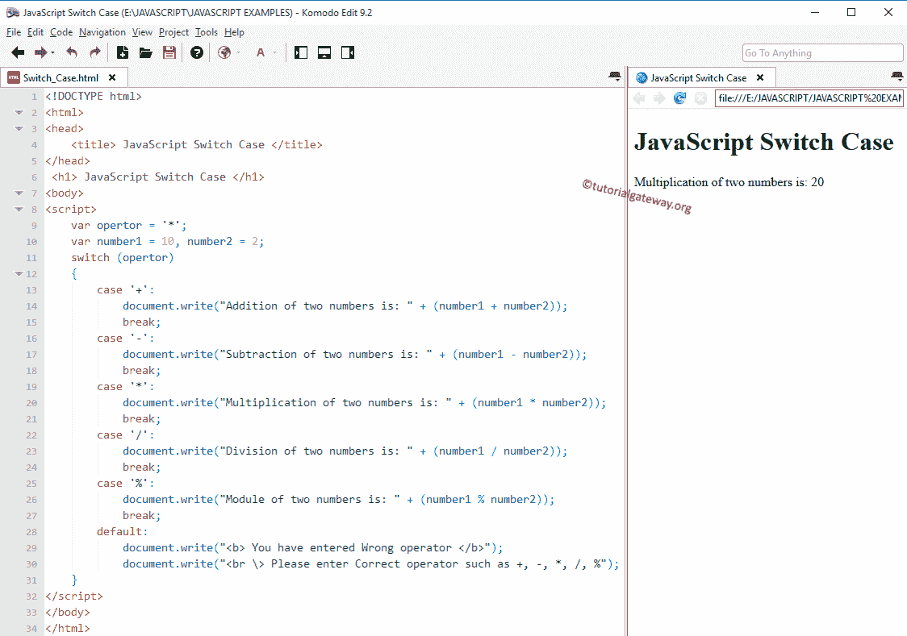

# JavaScript 开关大小写

> 原文:[https://www.tutorialgateway.org/javascript-switch-case/](https://www.tutorialgateway.org/javascript-switch-case/)

JavaScript 切换情况:JavaScript Else 语句允许我们在 TRUE 或 FALSE 之间进行选择。当有两个以上的选项时，我们使用 JavaScript 嵌套`if`语句。比如说，如果我们有十个选择呢？，如果我们使用嵌套`if`，编程逻辑将很难理解。这里，JavaScript switch 语句和 Else if 可以有效地处理这些类型的问题。

这个的工作功能几乎和 if 条件一样。如前所述，JavaScript 中的 Switch 语句可能有 n 种情况。因此，switch case 将表达式值与 case 语句中分配的值进行比较。

如果两个值(表达式和大小写值)都匹配，那么将执行该 case 语句中的代码块。为了更好地理解，让我们看看 Javascript 中 switch case 的语法

## JavaScript 开关大小写语法

它的语法如下:

```
Switch (expression) 
{
 Case Option 1:
    //Execute these statements when the expression result match Option 1
    break;
 Case Option 2:
    //Execute these statements when the expression result match Option 2
    break;
 Case Option 3:
    //Execute these statements when the expression result match Option 3
    break;
    ......
 Case Option N:
    //Execute when the result of expression match Option N
    break;
 Default:
    //Execute when the result of expression Not matching with any Option
    break;
}
```

表达式应该是整数或字符(我们可以把表达式写成 n/2。同样，但是结果应该是整数)。选项 1、选项 2……都是常数。它只接受整数或字符，而 Else if 块接受十进制值(2.3、3.5 等)。)也是。

JavaScript 切换案例允许我们添加一个默认案例。如果变量值与任何大小写块都不匹配，那么将执行默认值中的代码。`break`语句从它出来是有用的。否则，开关条件下的所有语句都将执行。每当遇到中断时，执行流就会直接从中出来。

## JavaScript 开关语句示例

这个程序允许我们使用[算术运算符](https://www.tutorialgateway.org/javascript-arithmetic-operators/ "ARITHMETIC OPERATORS IN C")使用开关盒进行算术运算。请参考 [JavaScript](https://www.tutorialgateway.org/javascript/) 中的 [JavaScript Else](https://www.tutorialgateway.org/javascript-if-else-statement) 、 [JavaScript 嵌套`if`](https://www.tutorialgateway.org/javascript-nested-if/) 、 [`break`语句](https://www.tutorialgateway.org/javascript-break-statement/)文章。

```
<!DOCTYPE html>
<html>
<head>
    <title> JavaScriptSwitchCase </title>
</head>
 <h1> JavaScriptSwitchCase </h1>
<body>
<script>
    var opertor = '*';
    var number1 = 10, number2 = 2;
    switch (opertor)
    {
        case '+':
            document.write("Addition of two numbers is: " + (number1 + number2));
            break;
        case '-':
            document.write("Subtraction of two numbers is: " + (number1 - number2));
            break;           
        case '*':
            document.write("Multiplication of two numbers is: " + (number1 * number2));
            break;
        case '/':
            document.write("Division of two numbers is: " + (number1 / number2));
            break;
        case '%':
            document.write("Module of two numbers is: " + (number1 % number2));
            break;
        default:
            document.write("<b> You have entered Wrong operator </b>");
            document.write("<br \> Please enter Correct operator such as +, -, *, /, %");
    }
</script>
</body>
</html>
```

输出 1:这里我们指定*作为操作变量。



JavaScript Switch Case 输出 2:让我们将运算符从有效更改为错误的运算符(var 运算符= '//'；)检查默认值

```
You have entered Wrong operator
Please enter Correct operator such as +, -, *, /, %
```