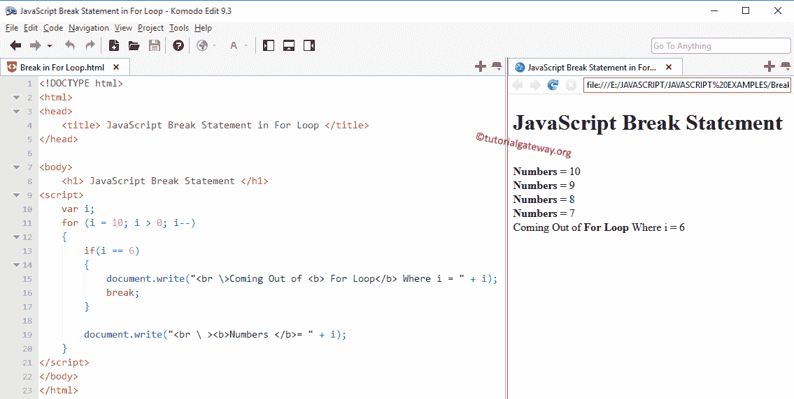

# JavaScript `break`语句

> 原文：<https://www.tutorialgateway.org/javascript-break-statement/>

JavaScript`break`语句是用来改变程序流程的一个重要关键字。循环用于执行特定的语句块 n 次，直到测试条件为假。在某些情况下，我们必须在不执行所有语句的情况下终止循环。在这些情况下，我们可以使用 JavaScript break and`continue`语句。

JavaScript`break`语句对于退出任何循环都非常有用，例如 For、While 和 Do While。在执行这些循环时，如果编译器发现其中有 JavaScript`break`语句，它将停止运行代码块并立即退出循环。

例如，我们在循环内部有五个语句，当某个条件为 True 时，我们希望退出循环；否则，它必须执行所有这些命令。在这些情况下，我们可以将 JavaScript`break`语句放在 If 条件中。如果条件为真，那么编译器将执行这个。这意味着 JavaScript`break`语句将从循环中完全退出控制器。否则，它将执行所有的行。

注意:JavaScript`break`语句是 Switch Case 中最重要的一个语句。如果不使用 Break，编译器将不会从 Switch Case 退出

## JavaScript `break`语句示例

JavaScript `break`语句的语法如下:

```
break;
```

我们想分享两个例子来显示`for`循环和`while`循环中 JavaScript`break`语句的工作功能

###`for`循环内部的 JavaScript `break`语句

在这个程序中，我们将使用`for`循环中的 JavaScript`break`语句退出循环迭代。

```
<!DOCTYPE html>
<html>
<head>
    <title> JavaScriptBreak Statement in For Loop </title>
</head>

<body>
    <h1> JavaScriptBreak Statement </h1>
<script>
    var i;
    for (i = 10; i > 0; i--)
    {
        if(i == 6)
        {
            document.write("<br \>Coming Out of <b> For Loop</b> Where i = " + i);
            break;
        }

        document.write("<br \ ><b>Numbers </b>= " + i); 
    } 
</script>
</body>
</html>
```



在`for`循环中，我们将 I 的值初始化为:i =10。并且，我们使用减量操作符将该值减 1。如果您发现有任何难以理解的 For，请访问我们的文章: [JavaScript For](https://www.tutorialgateway.org/javascript-for-loop/ "For Loop in C") 。

在 [JavaScript](https://www.tutorialgateway.org/javascript/)`for`循环中，我们放置 [JavaScript If 条件](https://www.tutorialgateway.org/javascript-if-statement/ "If Statement in C")来测试 I 是否等于 6。如果条件为假，那么它将跳过断点并输出该数字(在我们的例子中是 10，9，8，7)。

如果该条件为真，则将执行 JS 中断。接下来，迭代将在该数字处停止，而不打印其他行。

###`while`循环中的 JavaScript `break`语句

我们将在`while`循环中使用 JavaScript`break`语句退出循环迭代。

```
<!DOCTYPE html>
<html>
<head>
    <title> JavaScript For Loop </title>
</head>

<body>
    <h1> Example </h1>
<script>
    var i = 0;
    while (i <= 10)
    {
        document.write("<br \ ><b>The Value of the Variable </b>= " + i);
        i++;

        if(i == 4)
        {
            break;
        }
    }
    document.write("<br \>This statement is from Outside While Loop = " + i);
</script>
</body>
</html>
```

```
Example

The Value of the Variable = 0
The Value of the Variable = 1
The Value of the Variable = 2
The Value of the Variable = 3
This statement is from Outside While Loop = 4
```

我们在代码的开头将 I 的值初始化为:i = 0。在`while`循环中，我们检查 I 是否小于或等于 10。如果您发现有什么难以理解的 While，请访问我们的文章: [JavaScript While](https://www.tutorialgateway.org/javascript-while-loop/ "While Loop in C") 。

在 While 中，我们放置 if 条件来测试我是否等于 4。如果条件为假，那么它将跳过`break`语句并输出该数字(在我们的例子中是 0、1、2、3)。

如果该条件为真，将执行 JS`break`语句。接下来，迭代将在该数字处停止，而不打印另一个`printf()`函数。