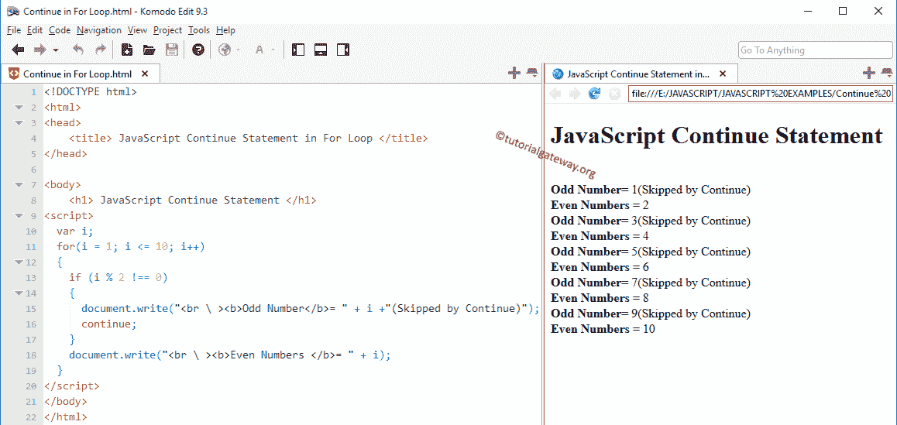

# JavaScript `continue`语句

> 原文：<https://www.tutorialgateway.org/javascript-continue-statement/>

JavaScript `continue`语句是另一个控制循环流的语句。在 For、While 和`do-while`循环中使用的 JavaScript `continue`语句。在执行这些循环时，如果编译器在其中找到了 JavaScript `continue`语句，它将停止当前迭代，并从头开始新的迭代。

JavaScript 继续示例:一个循环中有 10 条语句。当某个条件为真时，我们希望跳过执行最后五行(6 到 10 行)，否则它必须运行所有十行。在这些情况下，我们将条件放在第 5 条语句之后，然后是 JavaScript continue。如果条件为真，它将停止执行语句 6 至 10。否则，它将执行语句 1 到 10。

## JavaScript `continue`语句示例

在本文中，我们想分享两个例子来显示`for`循环和`while`循环中 JavaScript `continue`语句的工作功能。JavaScript `continue`语句的语法如下:

```js
continue;
```

### `for`循环中的 JavaScript `continue`语句

例如，在`for`循环中使用 JavaScript `continue`语句。该程序允许用户输入任何整数值。然后它将显示整数值内的偶数和奇数。

```js
<!DOCTYPE html>
<html>
<head>
    <title> JavaScriptContinue Statement in For Loop </title>
</head>

<body>
    <h1> JavaScriptContinue Statement </h1>
<script>
  var i;
  for(i = 1; i <= 10; i++)
  {
    if (i % 2 !== 0)
    {
      document.write("<br \ ><b>Odd Number</b>= " + i +"(Skipped by Continue)");
      continue;
    }
    document.write("<br \ ><b>Even Numbers </b>= " + i);
  }
</script>
</body>
</html>
```



*   这里我们不解释循环的。
*   在`for`循环中，我们放置了 If 条件来测试(i%2！= 0).如果该条件为真，将执行`continue`语句，迭代将在该数字处停止，而不打印其他代码行。
*   如果条件为假，它将跳过 JavaScript `continue`语句，并输出该数字(在我们的例子中是偶数)

### JavaScript 在`while`循环示例中继续

让我用 JavaScript `continue`语句在一个 [`while`循环](https://www.tutorialgateway.org/javascript-while-loop/)中举例说明。

```js
<!DOCTYPE html>
<html>
<head>
    <title> While Loop </title>
</head>

<body>
    <h1> Example </h1>
<script>
    var i = 0;
    while (i <= 10)
    {
        if (i == 5 || i == 9)
        {
            document.write("<br \ ><b>The Skipped Values </b>= " + i);
            i++;
            continue;
        }

        document.write("<br \ ><b>The Value of the Variable </b>= " + i);
        i++;
    }
</script>
</body>
</html>
```

```js
Example

The Value of the Variable = 0
The Value of the Variable = 1
The Value of the Variable = 2
The Value of the Variable = 3
The Value of the Variable = 4
The Skipped Values = 5
The Value of the Variable = 6
The Value of the Variable = 7
The Value of the Variable = 8
The Skipped Values = 9
The Value of the Variable = 10
```

在这个 JavaScript `continue`语句示例中，我们不打算解释 [While Loop](https://www.tutorialgateway.org/javascript-while-loop/) 。

在`while`循环中，我们放置了 [JavaScript If 条件](https://www.tutorialgateway.org/javascript-if-statement/)来测试 I 是等于 5 还是 9。如果这个条件为 True，那么 JS 继续执行，迭代将在这个数字处停止，不打印其他`printf()`函数:printf(“值为:%d”，I)；。

为了更好的理解，我们将下面的代码放在 [JavaScript](https://www.tutorialgateway.org/javascript/) If 条件中。因此，每当迭代中断时，该值就会从其中打印出来。

```js
document.write("<br \ ><b>The Skipped Values </b>= " + i);
```

如果条件为假，那么它将跳过这一个并输出那个数字(在我们的例子中是 0，1，2，3，4，6，7，8，10)