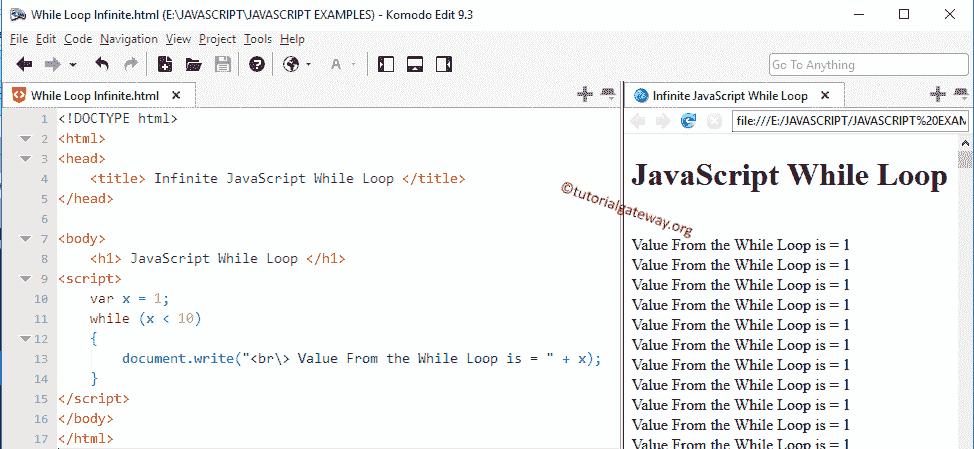

# 一边循环一边 JavaScript

> 原文:[https://www.tutorialgateway.org/javascript-while-loop/](https://www.tutorialgateway.org/javascript-while-loop/)

JavaScript While 循环用于重复一个语句块给定的次数，直到给定的条件为 False。JavaScript While 循环从条件开始，如果条件为真，它里面的语句就会执行。如果是假的，至少不会运行一次。这意味着，JavaScript while 循环可能执行零次或更多次。

## 循环语法

JavaScript While 循环的语法如下:

```
While( Condition )
 {
   statement 1;
   statement 2;
    ………….
 }
It is the statement Outside the While Loop
```

首先，编译器检查 JavaScript While 循环内部的条件。如果条件为真，则执行 while 循环块下的语句或语句组。如果它为 False，编译器将从其中出来，并在 while 循环之外执行其他语句。

对于 While 循环中的单个语句，不需要大括号。但是，如果我们为多个语句省略它们，它将只执行第一个语句。一定要用牙套。

### 循环流程图

JavaScript While 循环的流程图如下:


JavaScript While 循环将在循环开始时检查条件。

1.  如果条件为真，它将在 while 循环中执行代码。
2.  接下来，我们必须在其中使用增量和减量操作符来增加值
3.  在值增加后，它将再次检查表达式。只要条件为真，while 循环中的代码就会执行。
4.  如果为假，它将退出。

为了更好地理解，让我们看看 While 循环的例子

## JavaScript While 循环示例

在这个程序中，我们声明了一个数字变量并赋值 6。通过使用它，编译器将把这些值加到 10。

```
<!DOCTYPE html>
<html>
<head>
    <title> Example </title>
</head>

<body>
    <h1> Example </h1>
<script>
    var number = 6, total=0;
    while (number <= 10)
    {
        total = total + number;
        number++;
    }
    document.write("Total = ", total);  
</script>
</body>
</html>
```

分析

1.  在这个 JavaScript while Loop 示例中，首先，根据条件测试数字变量(6)中的值。
2.  如果条件结果为真，则该数字加到总数中。否则，它将退出 [JavaScript](https://www.tutorialgateway.org/javascript/) 循环
3.  在下一行中，我们使用++运算符来增加数值。递增后，重复该过程，直到条件结果为假。

这里，我们的数字= 6。意思是，总计= 6+7+8+9+10 = 40

```
Example

Total = 40
```

## 无限 JavaScript While 循环

如果您忘记在 while 循环中增加或减少值，那么它将执行无限次(也称为无限循环)。例如:

```
<!DOCTYPE html>
<html>
<head>
    <title> JavaScriptWhile Loop </title>
</head>

<body>
    <h1> JavaScriptWhile Loop </h1>
<script>
    var x = 1;
    while (x < 10)
    {
        document.write("<br\> Value From the While Loop is = " + x);
    }
</script>
</body>
</html>
```



这里 x 总是 1，x 总是小于 10。所以，它将继续执行无限次。现在，让我们将 while 循环中的递增运算符(x++)添加到上面的示例中。

```
<!DOCTYPE html>
<html>
<head>
    <title> JavaScriptWhile Loop </title>
</head>

<body>
    <h1> JavaScriptWhile Loop </h1>
<script>
    var x = 1;
    while (x < 10)
    {
        document.write("<br\> Value = " + x);
        x++;
    }
</script>
</body>
</html>
```

现在，当它达到 10 时，条件将失效。让我们看看输出

```
JavaScriptWhile Loop

Value = 1
Value = 2
Value = 3
Value = 4
Value = 5
Value = 6
Value = 7
Value = 8
Value = 9
```