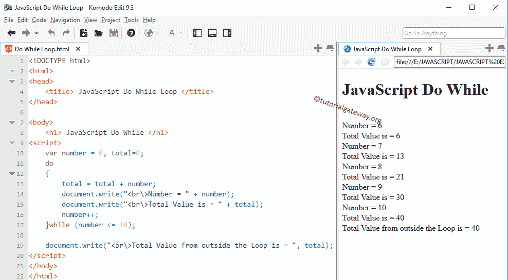

# 一边做一边

> 原文：<https://www.tutorialgateway.org/javascript-do-while/>

JavaScript Do While 将在循环结束时测试给定的条件。因此，即使给定的条件失败，JavaScript`do-while`循环也会至少执行一次代码块中的语句。

我们在前面的 Js 文章中讨论的`while`循环在进入代码块之前测试了条件。如果条件为真，则只执行该循环中的语句。否则，语句至少不会执行一次。

在某些情况下，需要先执行一些操作(执行一些语句)，然后检查条件。在这些情况下，我们可以使用 JavaScript`do-while`循环。

## JavaScript `do-while`循环语法

JavaScript 循环时执行的语法是

```
do
{
  statement 1;
  statement 2;
    ………….
  statement n;
}
While (condition);
```

首先，它将执行这个 JavaScript`do-while`循环中的语句。然后到达终点后，它会在这段时间内检查内部情况。如果条件为真，则它将重复该过程。如果条件失败，则迭代终止。

### JavaScript `do-while`循环流程图

JavaScript Do While 的流程图如下所示


一个 JavaScript 循环的流程图顺序是:

1.  首先，我们初始化变量。接下来，它将进入 JavaScript 中的`do-while`循环。
2.  它将在循环中执行这组语句。
3.  接下来，我们必须在循环内部使用 [JavaScript](https://www.tutorialgateway.org/javascript/) 递增和递减运算符来[递增和递减](https://www.tutorialgateway.org/increment-and-decrement-operators-in-javascript/)值。
4.  现在它将检查条件。如果条件为真，则 JavaScript`do-while`循环中的语句将再次执行。只要条件为真，它就会继续这个过程。
5.  如果条件为假，它将退出循环

## JavaScript `do-while`循环示例

这个程序帮助我们理解 JavaScript 编程语言中的边做边循环

1.  首先，我们声明了变量编号，并将其初始化为 6。并且，将总变量初始化为 0。
2.  接下来，在 Js`do-while`循环中，这个数字加到了总数中。
3.  在下一行中，我们使用++运算符来增加数值。
4.  在这一行之后，数字已经根据 while 条件进行了测试。如果条件结果为真，那么它将重复该过程。否则，它将退出循环
5.  在下一行中，我们使用了另一条语句来表明它来自 JavaScript`do-while`循环之外。

```
<!DOCTYPE html>
<html>
<head>
    <title> JavaScriptDo While Loop </title>
</head>

<body>
    <h1> JavaScriptDo While </h1>
<script>
    var number = 6, total=0;
    do
    {
        total = total + number;
        document.write("<br\>Number = " + number);
        document.write("<br\>Total Value is = " + total);
        number++;
    }while (number <= 10);

    document.write("<br\>Total Value from outside the Loop is = ", total);  
</script>
</body>
</html>
```



让我们输入一个大于 10 的值，看看会发生什么？。如果从上面的`do-while`循环截图中观察，我们输入了值 11，它仍然显示总数为 11。因为在执行该代码之后，它检查了 while 条件，并且失败了，所以它退出循环。

```
JavaScriptDo While

Number = 12
Total Value is = 12
Total Value from outside the Loop is = 12
```