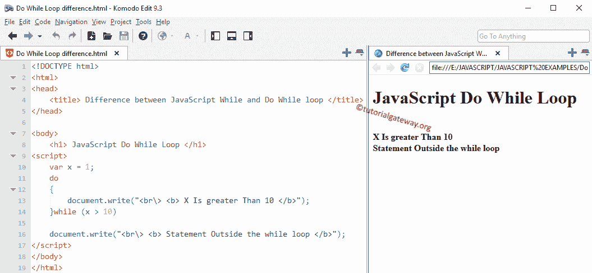

# JavaScript While 和`do-while`循环的区别

> 原文：<https://www.tutorialgateway.org/difference-between-javascript-while-and-do-while-loop/>

JavaScript While 和`do-while`循环的区别举例？。虽然`do-while`循环和`while`循环看起来相似，但它们的执行方式不同。

*   在`while`循环中，在循环开始时测试的条件，如果条件为真，循环中的语句将执行。这意味着只有当条件为真时，`while`循环才会执行代码块。
*   在循环结束时，边做边循环测试条件。因此，即使条件失败，Do While 也会至少执行一次代码块中的语句。

我想当你看到这个例子时，你会完全理解它。因此，让我们使用`while`循环和`do-while`循环编写相同的程序

## JavaScript`while`循环示例

在这个 JavaScript 程序中，我们声明一个整数，然后检查一是否大于十。如果条件为真，它必须显示输出为“X 大于 10”。 [`while`循环](https://www.tutorialgateway.org/javascript-while-loop/)外还有一条语句，会在`while`循环后运行。

```
<!DOCTYPE html>
<html>
<head>
    <title> Difference </title>
</head>

<body>
    <h1> JavaScript While Loop </h1>
<script>
    var x = 1;
    while (x > 10)
    {
        document.write("<br\> <b> X Is greater Than 10 </b>");
    }

    document.write("<br\> <b> Statement Outside the while loop </b>");
</script>
</body>
</html>
```

```
JavaScript While Loop 

Statement Outside the while loop
```

## JavaScript `do-while`循环示例

我们将使用 [Do While](https://www.tutorialgateway.org/javascript-do-while/) 编写相同的 JavaScript 示例

```
<!DOCTYPE html>
<html>
<head>
    <title> Difference </title>
</head>

<body>
    <h1> JavaScript Do While Loop </h1>
<script>
    var x = 1;
    do
    {
        document.write("<br\> <b> X Is greater Than 10 </b>");
    }while (x > 10);

    document.write("<br\> <b> Statement Outside the while loop </b>");
</script>
</body>
</html>

```



尽管`do-while`循环条件失败，但循环中的语句会执行一次。因为在语句执行之后，编译器测试了条件。