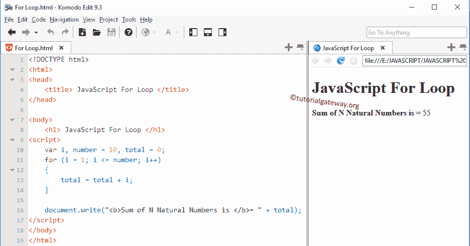

# 用于循环的 JavaScript

> 原文：<https://www.tutorialgateway.org/javascript-for-loop/>

JavaScript `for`循环用于将一个语句块重复给定的次数，直到给定的条件为假。JavaScript `for`循环是最常用的一种。让我们看看 JavaScript `for`循环的语法是:

```
for (initialization; test condition; increment/decrement operator)
 {
    //Statement 1
    //Statement 2
     ………
    //Statement n
 }
```

在 JavaScript `for`循环中，有三个表达式用分号(；)以及这些表达式的执行如下:

*   初始化:JavaScript `for`循环从初始化语句开始。因此，计数器变量的初始化首先完成(例如，计数器=1 或 i=1。).初始化部分在开始时只执行一次。
*   测试条件:计数器变量值将根据测试条件进行测试。如果条件为真，它将在`for`循环中执行语句。如果条件失败，JavaScript `for`循环将终止。
*   递增和递减运算符:该表达式将在每次迭代结束后执行。这个递增和递减运算符有助于根据我们的要求增加或减少计数器变量。

## 循环示例

这个 JavaScript For Loop 程序允许用户输入任何整数值。然后它将计算自然数的总和，直到用户输入的数字。

```
<!DOCTYPE html>
<html>
<head>
    <title> JavaScriptFor Loop </title>
</head>

<body>
    <h1> JavaScriptFor Loop </h1>
<script>
    var i, number = 10, total = 0;
    for (i = 1; i <= number; i++)
    {
        total = total + i;
    }

    document.write("<b>Sum of N Natural Numbers is </b>= " + total);  
</script>
</body>
</html>
```



分析

1.  在这个 JavaScript For Loop 示例中，首先，我们声明了数字变量，并赋值 10，总变量将初始化为 0。
2.  接下来，我们将检查计数器变量(I)是否小于或等于一个数字。
3.  如果条件结果为真，我把总数加起来。否则，它将退出。开始时，i =1，n =10，因此条件为真，直到 I 值增加到 11。
4.  在接下来的 [JavaScript](https://www.tutorialgateway.org/javascript/) 部分，我们使用++运算符来增加 I 值。在递增过程之后，它将重复该过程，直到条件结果为假(直到 I =11)。

## 对于循环特性

JavaScript 中的`for`循环可以灵活地从声明中省略一个或多个部分。虽然我们可以从中跳过一个或多个部分，但我们必须将分号(；)到位；否则，它将引发编译错误。

计数器变量的初始化可以在 JavaScript `for`循环中跳过

```
int i=1;

for( ;i<=10;i++)
```

这里，计数器变量在 JavaScript `for`循环之前声明。

像初始化一样，我们也可以跳过增量部分。因为在体内声明的递增部分。

```
int i=1;

for( ;i<=20; )
 {
   //statements     
   i++;
 }
```

JavaScript `for`循环允许我们用逗号分隔一次初始化多个计数器变量:

```
for(i=1,j=20; i<j; i++)
```

它还允许使用多个条件。我们不得不使用逻辑运算符来分隔这两个条件，而不是使用逗号

```
for(i=1,j=20; i<=10 && j>=20; i++)
 {
   //statements
   j++;
 }
```

像测试条件一样，JavaScript for loop 允许我们使用多个增量运算符，如下所示

```
for(i=1,j=1; i<=10 && j<=10; i++, j++)
```

注意:对于初始化、递增和递减运算符部分，我们可以使用逗号来分隔多个声明。要分离测试条件，必须使用[逻辑运算符](https://www.tutorialgateway.org/javascript-logical-operator/)来加入条件

## JavaScript 中的嵌套`for`循环

我们将把一个`for`循环嵌套在另一个循环中，在 JavaScript 中也称为嵌套`for`循环。

```
<!DOCTYPE html>
<html>
<head>
    <title> Nested in JavaScript </title>
</head>

<body>
    <h1> JavaScript Nested </h1>
<script>
    var i, j;
    for (i = 9; i <= 10; i++)
    {
        for (j = 1; j <= 10; j++)
        {
            document.write(i + "*" + j + "=: " + (i * j) + "<br \>"); 
        }
    }   
</script>
</body>
</html>
```

```
JavaScript Nested
9*1=: 9
9*2=: 18
9*3=: 27
9*4=: 36
9*5=: 45
9*6=: 54
9*7=: 63
9*8=: 72
9*9=: 81
9*10=: 90
10*1=: 10
10*2=: 20
10*3=: 30
10*4=: 40
10*5=: 50
10*6=: 60
10*7=: 70
10*8=: 80
10*9=: 90
10*10=: 100
```

这个程序为 JavaScript For Loop 示例打印了 9 和 10 的乘法表。在第一个`for`循环中，I 被初始化为值 9，然后它将检查 I 是否小于或等于 10。这个条件在我 11 岁之前都是真的。如果该条件为真，则进入第二个条件。否则，它将退出。

在第二个 JavaScript `for`循环中，j 被初始化为值 1。接下来，它将检查 I 是否小于或等于 10。这个条件在我 11 岁之前都是真的。

迭代 1: i = 9，条件为真。于是进入了第二个。j =1 且 j <=10 条件为真，因此打印循环内的语句

9 * 1 = 9

现在 j 的值将增加到 2

9 * 2 = 9

它将重复这个过程多达 10 次。

现在 j 的值是 11，条件失败，所以它将从第二个退出。它只会从内部或第二个循环中退出，而不会从整个循环中退出。

迭代 2: i = 10，条件为真，重复上述过程

迭代 3: i = 11，条件为 False。所以，对于循环终止，不需要检查第二个。