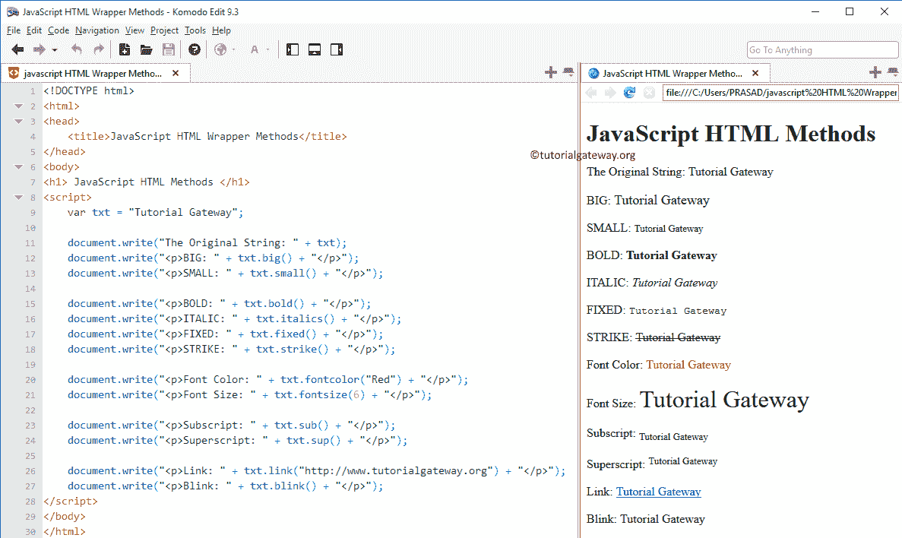

# 方法

> 原文:[https://www.tutorialgateway.org/javascript-html-methods/](https://www.tutorialgateway.org/javascript-html-methods/)

JavaScript HTML 方法将帮助您在字符串对象周围添加 HTML 标记。下表将向您显示可用的 JavaScript HTML 包装函数列表。

| 方法 | 描述 |
| 锚() | 在文本周围创建带有名称属性的 HTML 锚点 |
| 大() | 在文本周围创建一个 HTML <big>标签。这意味着这个 JavaScript HTML 方法将以大字体显示给定的文本</big> |
| 眨眼() | 在文本周围创建一个 HTML <blink>标签。它以闪烁方式显示给定的文本</blink> |
| 粗体() | 在文本周围创建一个 HTML **标签。它将以粗体显示给定的文本** |
| 固定() | 在文本周围创建一个 HTML `标签。它将帮助您以固定字体显示给定的文本` |
| 字体颜色（） | 这个 HTML 方法在文本周围创建一个带有颜色属性的 HTML <font>标签。这意味着，它将以指定的颜色显示给定的文本</font> |
| fontsize() | 在文本周围创建一个带有大小属性的 HTML <font>标签。这意味着，它将以指定的字体显示给定的文本</font> |
| 斜体() | 在文本周围创建一个 HTML <l>标签。这个 HTML 方法以斜体显示给定的文本</l> |
| 链接() | 这个 JavaScript HTML 方法在文本周围创建一个带有 href 属性的 HTML 锚点 |
| 小() | 在文本周围创建一个 HTML <small>标签。这意味着它将以小字体显示给定的文本</small> |
| 罢工() | 在文本周围创建一个 HTML ~~标签。这意味着它将显示带有删除线的给定文本~~ |
| sub() | 在文本周围创建一个 HTML <sub>标签。意味着它将以下标形式显示给定的文本</sub> |
| sup() | 在文本周围创建一个 HTML <sup>标签。意味着，它将以上标格式显示给定的文本</sup> |

注意:一些 JavaScript HTML 方法可能无法在您喜欢的浏览器中工作。所以，在使用这些 [JavaScript](https://www.tutorialgateway.org/javascript/) 非标准功能时请小心。

## 方法示例

这个例子将帮助你理解每一个 JavaScript HTML Wrapper 方法的功能。

```
<!DOCTYPE html>
<html>
<head>
    <title>JavaScript HTML Wrapper Methods</title>
</head>
<body>
<h1> JavaScript HTML Methods </h1>
<script>
    var txt = "Tutorial Gateway";

    document.write("The Original String: " + txt);
    document.write("<p>BIG: " + txt.big() + "</p>");
    document.write("<p>SMALL: " + txt.small() + "</p>");

    document.write("<p>BOLD: " + txt.bold() + "</p>");
    document.write("<p>ITALIC: " + txt.italics() + "</p>");

    document.write("<p>FIXED: " + txt.fixed() + "</p>");
    document.write("<p>STRIKE: " + txt.strike() + "</p>");

    document.write("<p>Font Color: " + txt.fontcolor("Red") + "</p>");
    document.write("<p>Font Size: " + txt.fontsize(6) + "</p>");

    document.write("<p>Subscript: " + txt.sub() + "</p>");
    document.write("<p>Superscript: " + txt.sup() + "</p>");

    document.write("<p>Link: " + txt.link("https://www.tutorialgateway.org") + "</p>");
    document.write("<p>Blink: " + txt.blink() + "</p>");
</script>
</body>
</html>
```

