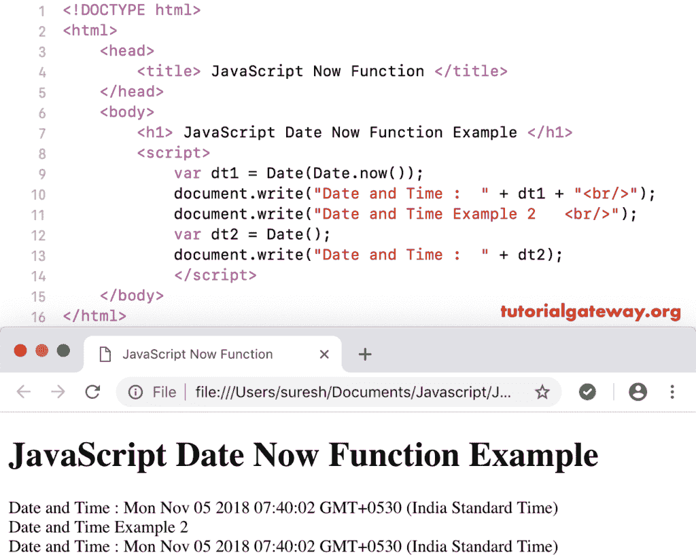

# Javascript 立即日期函数

> 原文：<https://www.tutorialgateway.org/javascript-date-now-function/>

JavaScript Now 函数是用于返回当前日期和时间的日期函数之一，单位为毫秒。本文向您展示了如何使用日期。现在举个例子。

## 现在日期示例

下面的例子帮助你理解 JavaScript now 函数。

```
<!DOCTYPE html>
<html>
<head>
    <title> JavaScript Now Function </title>
</head>
<body>
    <h1> Example </h1>
<script>
  var dt = Date.now();

  document.write("Date and Time in Milliseconds : " + dt);
</script>
</body>
</html>
```

如您所见，它以毫秒为单位返回当前日期和时间。

```
Example

Date and Time in Milliseconds: 1541383869864
```

在本例中，我们将它返回的毫秒数转换为正常的日期和时间。对于这个 [JavaScript](https://www.tutorialgateway.org/javascript/) 的例子，你必须使用 [Js 函数](https://www.tutorialgateway.org/javascript-date-function/)。

```
<!DOCTYPE html>
<html>
<head>
    <title> JavaScript Now Function </title>
</head>
<body>
    <h1> Example </h1>
<script>
  var dt = Date(Date.now());

  document.write("DateTime : " + dt);
</script>
</body>
</html>
```

```
Example

DateTime : Mon Nov 05 2018 07:39:09 GMT+0530 (Indian Standard Time)
```

### 现在日期函数示例 2

以下示例帮助您理解 now()和 Date()函数。如前所述，这两个函数返回相同的结果。

```
<!DOCTYPE html>
<html>
<head>
    <title> JavaScript Now Function </title>
</head>
<body>
    <h1> JavaScript Date Now Function Example </h1>
<script>
  var dt1 = Date(Date.now());    
  document.write("Date and Time :  " + dt1 + "<br/>");
  document.write("Date and Time Example 2   <br/>");
  var dt2 = Date();   
  document.write("Date and Time :  " + dt2);
</script>
</body>
</html>
```

