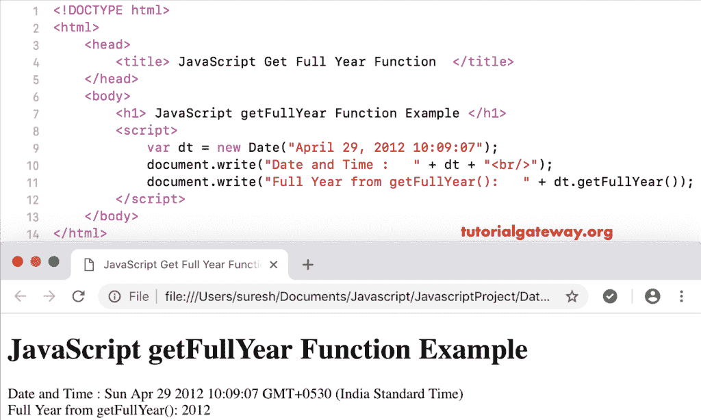

# `getFullYear()`函数

> 原文：<https://www.tutorialgateway.org/javascript-getfullyear-function/>

函数是日期函数之一，它从给定的日期返回整年。我们使用 JavaScript getFullYear 从当前日期和时间返回年份(yyyy)。

```
<!DOCTYPE html>
<html>
<head>
    <title> JavaScript Get Full Year Function </title>
</head>
<body>
    <h1> Example </h1>
<script>
  var dt = Date();  
  document.write("Date and Time : " + dt);
  document.write("Full Year : " + dt.getFullYear());
</script>
</body>
</html>
```

```
Example

Date and Time: Sat Nov 03 2018 18:04:36 GMT+0530 (Indian Standard Time)
Full Year : 2018
```

## 函数示例

在这个 JavaScript `getFullYear()`函数的例子中，我们从自定义日期中提取整年

```
<!DOCTYPE html>
<html>
<head>
    <title> JavaScript Get Full Year Function </title>
</head>
<body>
    <h1> JavaScript getFullYear Function Example </h1>
<script>
  var dt = Date("April 29, 2012 10:09:07");
  document.write("Date and Time : " + dt);
  document.write("Full Year from getFullYear(): " + dt.getFullYear());
</script>
</body>
</html>
```



在本例中，我们从自定义日期中提取年份，但没有年份。这个 [JavaScript](https://www.tutorialgateway.org/javascript/)`getFullYear()`函数示例将返回默认年份。

```
<!DOCTYPE html>
<html>
<head>
    <title> JavaScript Get Full Year Function </title>
</head>
<body>
    <h1> Example </h1>
<script>
  var dt = Date("June 29 10:09:07");
  document.write("Date and Time : " + dt);
  document.write("Full Year : " + dt.getFullYear());
</script>
</body>
</html>
```

```
Example

Date and Time: Fri Jun 29 2001 10:09:07 GMT+0530 (Indian Standard Time)
Full Year : 2001
```