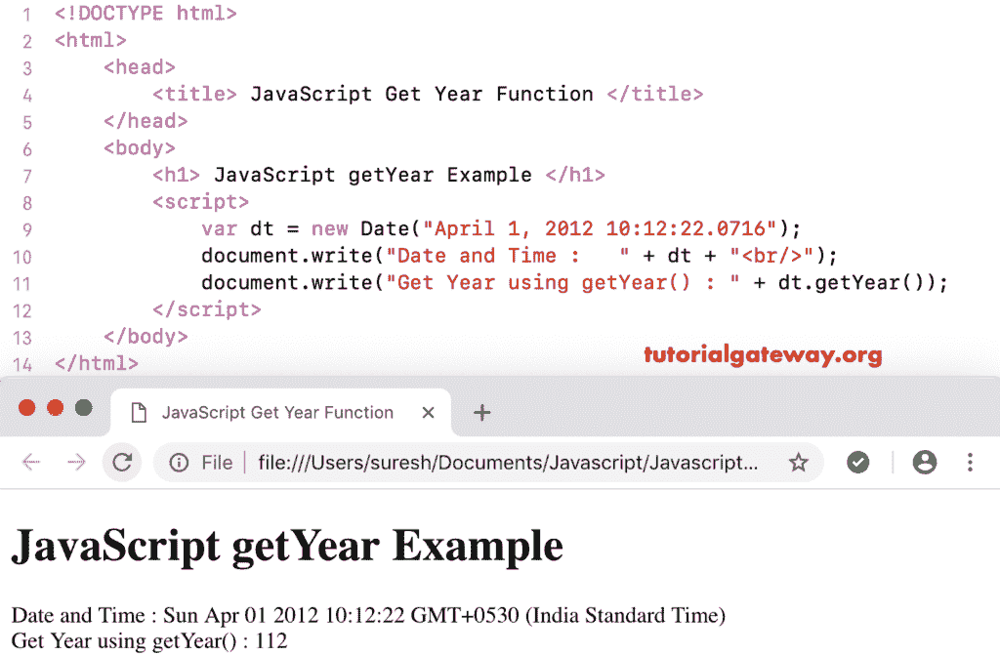

# JavaScript `getYear()`函数

> 原文：<https://www.tutorialgateway.org/javascript-getyear-function/>

getYear 是日期函数之一，它返回给定日期的当前年份减去 1900。JavaScript `getYear()`函数的语法是:

```
 Date.getYear()
```

## JavaScript `getYear()`函数示例

我们使用`getYear()`函数返回当前日期和时间中的年份(年份–1900)。

```
<!DOCTYPE html>
<html>
<head>
    <title> JavaScript Get Year Function </title>
</head>
<body>
    <h1> Example </h1>
<script>
  var dt = Date();  
  document.write("Date and Time : " + dt);
  document.write("Get Year : " + dt.getYear());
</script>
</body>
</html>
```

```
Example

Date and Time: Mon Nov 05 2018 11:32:15 GMT+0530 (Indian Standard Time)
Get Year : NaN
```

这个 [JavaScript](https://www.tutorialgateway.org/javascript/) 获取年份的例子从用户指定的自定义日期减去 1900 返回年份

```
<!DOCTYPE html>
<html>
<head>
    <title> JavaScript Get Year Function </title>
</head>
<body>
    <h1> JavaScript getYear Function Example </h1>
<script>
  var dt = Date("April 1, 2012 10:12:22.0716");
  document.write("Date and Time : " + dt);
  document.write("Get Year using getYear() : " + dt.getYear());
</script>
</body>
</html>
```



### JavaScript 获取年份示例 2

在这个`getYear()`函数示例中，我们从没有年份的日期中提取年份。或者，我们可以说，时不时地得到年。

```
<!DOCTYPE html>
<html>
<head>
    <title> JavaScript Get Year Function </title>
</head>
<body>
    <h1> Example </h1>
<script>
  var dt = Date("10:12:22.0716");
  document.write("Date and Time : " + dt);
  document.write("Year  : " + dt.getYear());
</script>
</body>
</html>
```

```
Example

Date and Time : Invalid Date
Year : NaN
```