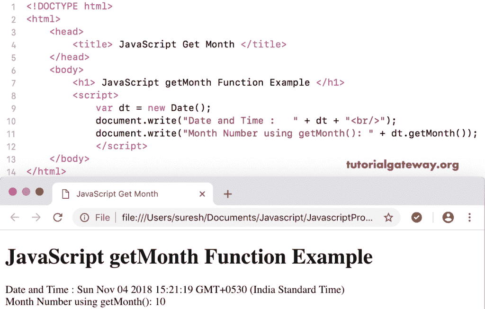

# JavaScript getMonth 函数

> 原文:[https://www . tutorialgateway . org/JavaScript-getmonth-function/](https://www.tutorialgateway.org/javascript-getmonth-function/)

JavaScript getMonth 函数是 Date 函数中的一个，它返回给定日期的月数。这个 getMonth 函数返回从 0(1 月)开始到 11(12 月)结束的月号。

## JavaScript getMonth 函数示例

我们使用 JavaScript get Month 来返回当前日期和时间中的月号(从 0 开始，到 11 结束)。

```
<!DOCTYPE html>
<html>
<head>
    <title> JavaScript Get Month Function </title>
</head>
<body>
    <h1> JavaScript getMonth Function Example </h1>
<script>
  var dt = Date();  
  document.write("Date and Time : " + dt);
  document.write("Month Number using getMonth(): " + dt.getMonth());
</script>
</body>
</html>
```



这个 JavaScript get Month 示例从自定义日期返回月号

```
<!DOCTYPE html>
<html>
<head>
    <title> JavaScript Get Month Function </title>
</head>
<body>
    <h1> Example </h1>
<script>
  var dt = Date("January 12, 2016 10:09:34");
  document.write("Date and Time : " + dt);
  document.write("Month Number : " + dt.getMonth());
</script>
</body>
</html>
```

```
Example

Date and Time: Tue Jan 12 2016 10:09:34 GMT+0530 (Indian Standard Time)
Month Number : 0
```

## 函数示例 2

在这个 [JavaScript](https://www.tutorialgateway.org/javascript/) 获取月份的例子中，我们从自定义年份中提取月份(我的意思是，没有月和日)。

```
<!DOCTYPE html>
<html>
<head>
    <title> JavaScript Get Month Function </title>
</head>
<body>
    <h1> Example </h1>
<script>
  var dt = Date("2016 10:09:34");
  document.write("DateTime : " + dt);
  document.write("Month Number : " + dt.getMonth());
</script>
</body>
</html>
```

```
Example

DateTime: Fri Jan 01 2016 10:09:34 GMT+0530 (Indian Standard Time)
Month Number : 0
```