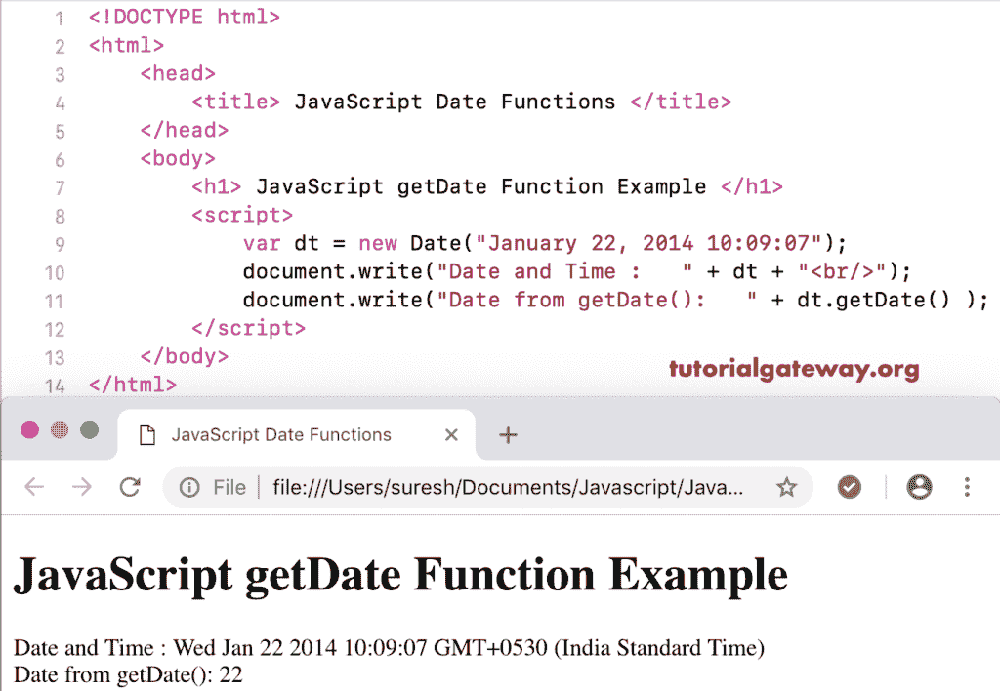

# JavaScript `getDate()`函数

> 原文：<https://www.tutorialgateway.org/javascript-getdate-function/>

函数是日期函数的一种，用于从给定的日期返回日期。在本文中，我们通过一个例子展示了如何在 JavaScript 编程中使用 Get Date。

## JavaScript 获取日期函数示例

以下示例帮助您理解 JavaScript 获取日期函数。这里，我们使用 getdate 从当前日期时间返回日期。

```js
<!DOCTYPE html>
<html>
<head>
    <title> JavaScript Functions </title>
</head>
<body>
    <h1> Example </h1>
<script>
  var dt = Date();  
  document.write("DateTime : " + dt);
  document.write("Date : " + dt.getDate());
</script>
</body>
</html>
```

```js
Example

DateTime: Sat Nov 03 2018 15:34:10 GMT+0530 (Indian Standard Time)
Date : 3
```

## 获取日期函数示例 2

在这个 [JavaScript](https://www.tutorialgateway.org/javascript/) 例子中，我们从自定义日期时间中提取日期数字。

```js
<!DOCTYPE html>
<html>
<head>
    <title> JavaScript Date Functions </title>
</head>
<body>
    <h1> JavaScript get Date Function Example </h1>
<script>
  var dt = Date("January 22, 2014 10:09:07");
  document.write("Date and Time : " + dt);
  document.write("Date from getDate(): " + dt.getDate());
</script>
</body>
</html>
```

