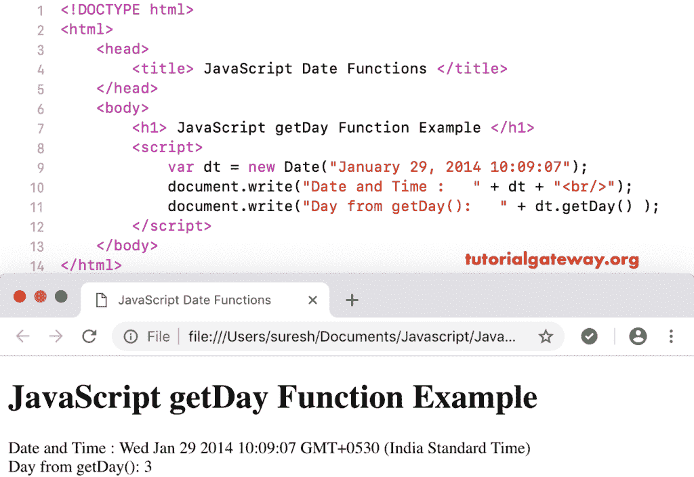

# JavaScript `getDay()`函数

> 原文：<https://www.tutorialgateway.org/javascript-getday-function/>

函数是日期函数的一种，用于返回给定日期的日数。这个 getDay 数字返回的值将是:0 是星期日，1 是星期一，2 是星期二，等等。

## 函数示例

以下示例帮助您理解 JavaScript 获取日函数。这里，我们使用 getDay 从当前日期和时间返回日号(星期几)。

```js
<!DOCTYPE html>
<html>
<head>
    <title> JavaScript Date Functions </title>
</head>
<body>
    <h1> Example </h1>
<script>
  var dt = Date();  
  document.write("Date and Time :  " + dt);
  document.write("Day : " + dt.getDay());
</script>
</body>
</html>
```

```js
Example

Date and Time: Sat Nov 03 2018 16:34:32 GMT+0530 (Indian Standard Time)
Day : 6
```

## JavaScript 获取日示例

在这个 [JavaScript](https://www.tutorialgateway.org/javascript/)`getDay()`函数示例中，我们从自定义日期中提取日数

```js
<!DOCTYPE html>
<html>
<head>
    <title> JavaScript Date Functions </title>
</head>
<body>
    <h1> JavaScript get Day Function Example </h1>
<script>
  var dt = Date("January 22, 2014 10:09:07");
  document.write("Date and Time : " + dt);
  document.write("Day from getDay(): " + dt.getDay());
</script>
</body>
</html>
```

