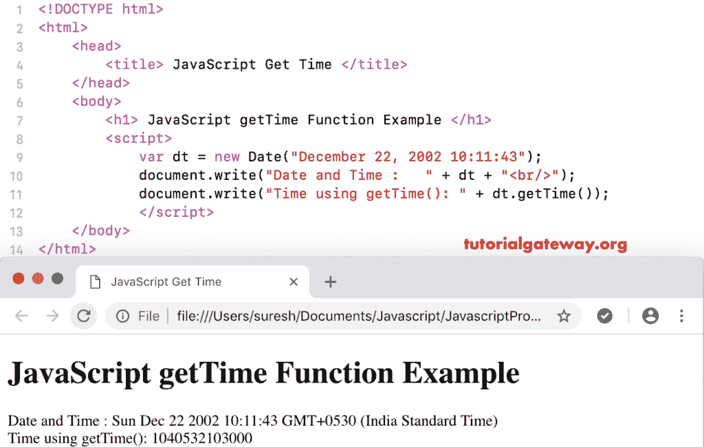

# JavaScript `getTime()`函数

> 原文：<https://www.tutorialgateway.org/javascript-gettime-function/>

`getTime()`函数是一个日期函数，它返回给定日期的时间。这个 JavaScript `getTime()`函数返回从 1970 年 1 月 1 日到给定日期时间的总毫秒数。我们使用 JavaScript getTime 来返回从默认日期到当前日期时间的毫秒数。

```js
<!DOCTYPE html>
<html>
<head>
    <title> JavaScript Get Time Function </title>
</head>
<body>
    <h1> Example </h1>
<script>
  var dt = Date();  
  document.write("Date and Time : " + dt);
  document.write("Time : " + dt.getTime());
</script>
</body>
</html>
```

```js
Example

Date and Time: Sun Nov 04 2018 15:48:43 GMT+0530 (Indian Standard Time)
Time : 1541326723757
```

## JavaScript 获取时间函数示例

在这个例子中，我们使用 [JavaScrip](https://www.tutorialgateway.org/javascript/) 获取自定义日期的时间函数

```js
<!DOCTYPE html>
<html>
<head>
    <title> JavaScript Get Time Function </title>
</head>
<body>
    <h1> JavaScript getTime Function Example </h1>
<script>
  var dt = Date("December 22, 2002 10:11:43");
  document.write("Date and Time : " + dt);
  document.write("Time using getTime(): " + dt.getTime());
</script>
</body>
</html>
```



在这个例子中，我们使用 JavaScript 在自定义日期获取时间，而没有时间。该函数将时间视为 00:00:00，并返回从默认时间(1970 年 1 月 1 日)到指定日期的毫秒数。

```js
<!DOCTYPE html>
<html>
<head>
    <title> JavaScript Get Time Function </title>
</head>
<body>
    <h1> Example </h1>
<script>
  var dt = Date("December 22, 1972");
  document.write("DateTime : " + dt);
  document.write("Time : " + dt.getTime());
</script>
</body>
</html>
```

```js
Example

DateTime: Fri Dec 22 1972 00:00:00 GMT+0530 (Indian Standard Time)
Time : 93810600000
```