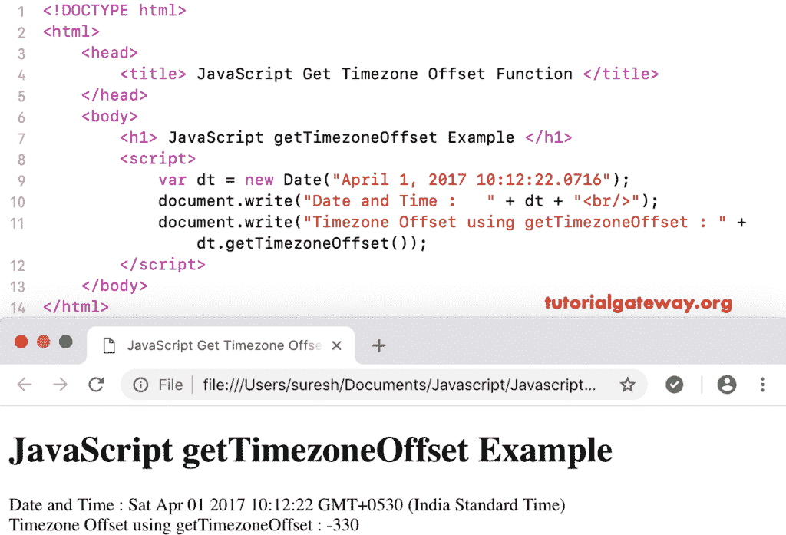

# JavaScript `getTimezoneOffset()`

JavaScript getTimezoneOffset 是日期函数之一，它以分钟为单位返回给定日期的时区偏移量。该函数的语法是:

```
 Date.getTimezoneOffset()
```

这个 [JavaScript](https://www.tutorialgateway.org/javascript/) 获取时区偏移量的例子返回了以分钟为单位的本地时区偏移量。

```
<!DOCTYPE html>
<html>
<head>
    <title> JavaScript Get Timezone Offset Function </title>
</head>
<body>
    <h1> JavaScript get Timezone Offset Example </h1>
<script>
  var dt = Date("April 1, 2017 10:12:22.0716");  
  document.write("Date and Time : " + dt);
  document.write("Timezone Offset using getTimezoneOffset : " + dt.getTimezoneOffset());
</script>
</body>
</html>
```

