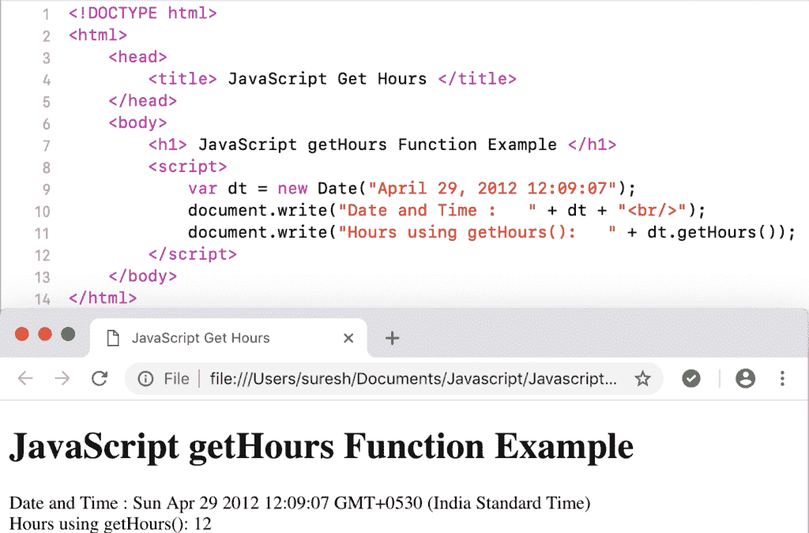

# JavaScript`getHours()`函数

> 原文：<https://www.tutorialgateway.org/javascript-gethours-function/>

JavaScript`getHours()`函数是`Date()`函数的一种，它返回给定日期的小时数。这里，我们使用 JavaScript getHours 返回当前日期和时间的小时数。

```
<!DOCTYPE html>
<html>
<head>
    <title> JavaScript Get Hours Function </title>
</head>
<body>
    <h1> Example </h1>
<script>
  var dt = Date();  
  document.write("Date and Time : " + dt);
  document.write("Hours :   " + dt.getHours());
</script>
</body>
</html>
```

```
Example

Date and Time: Sat Nov 03 2018 18:11:34 GMT+0530 (Indian Standard Time)
Hours : 18
```

## JavaScript 获取小时函数示例

在这个 JavaScript get`Hours()`函数示例中，我们从自定义日期中提取小时

```
<!DOCTYPE html>
<html>
<head>
    <title> JavaScript Get Hours Function </title>
</head>
<body>
    <h1> JavaScript getHours Function Example </h1>
<script>
  var dt = Date("April 29, 2012 12:09:07");
  document.write("Date and Time : " + dt);
  document.write("Hours using getHours():   " + dt.getHours());
</script>
</body>
</html>
```



## JavaScript 获取小时函数示例

这个 [JavaScript](https://www.tutorialgateway.org/javascript/) 获取小时示例从自定义日期中提取小时，没有小时，返回 0 小时。

```
<!DOCTYPE html>
<html>
<head>
    <title> JavaScript Get Hours Function </title>
</head>
<body>
    <h1> Example </h1>
<script>
  var dt = Date("April 29, 2012");
  document.write("DateTime : " + dt);
  document.write("Hours :   " + dt.getHours());
</script>
</body>
</html>
```

```
Example

DateTime: Sun Apr 29 2012 00:00:00 GMT+0530 (Indian Standard Time)
Hours : 0
```