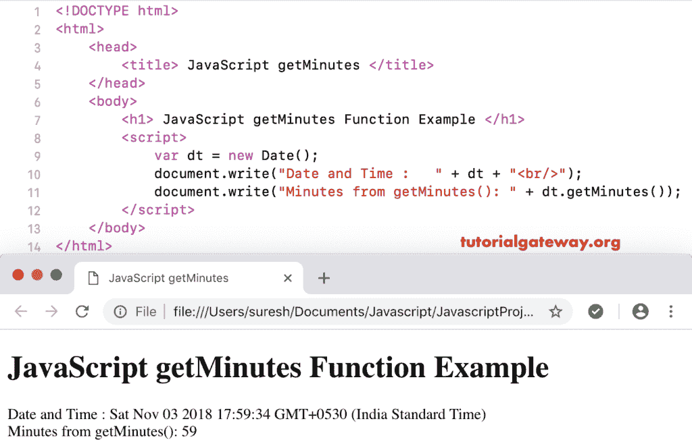

# JavaScript `getMinutes()`函数

> 原文：<https://www.tutorialgateway.org/javascript-getminutes-function/>

函数是日期函数的一种，它返回给定日期的分钟数。

## 函数示例

下面的 JavaScript `getMinutes()`函数返回当前日期和时间的总分钟数。

```
<!DOCTYPE html>
<html>
<head>
    <title> JavaScript Get Minutes Function </title>
</head>
<body>
    <h1> JavaScript getMnutes Function Example </h1>
<script>
  var dt = Date();  
  document.write("Date and Time : " + dt);
  document.write("Minutes from getMinutes(): " + dt.getMinutes());
</script>
</body>
</html>
```



在这个 JavaScript getMinutes 示例中，我们从自定义日期中提取分钟

```
<!DOCTYPE html>
<html>
<head>
    <title> JavaScript Get Minutes Function </title>
</head>
<body>
    <h1> Example </h1>
<script>
  var dt = Date("April 31, 2012 12:09:07");
  document.write("Date and Time : " + dt);
  document.write("Minutes : " + dt.getMinutes());
</script>
</body>
</html>
```

```
Example

Date and Time: Tue May 01 2012 12:09:07 GMT+0530 (Indian Standard Time)
Minutes : 9
```

## JavaScript 获取分钟函数示例

在这个 [JavaScript](https://www.tutorialgateway.org/javascript/) 获取分钟的例子中，我们从自定义日期中提取了没有时间(分钟)的分钟。这将返回 0 分钟。

```
<!DOCTYPE html>
<html>
<head>
    <title> JavaScript Get Minutes Function </title>
</head>
<body>
    <h1> Example </h1>
<script>
  var dt = Date("April 31, 2012");
  document.write("DateTime : " + dt);
  document.write("Minutes : " + dt.getMinutes());
</script>
</body>
</html>
```

```
Example

DateTime: Tue May 01 2012 00:00:00 GMT+0530 (Indian Standard Time)
Minutes : 0
```