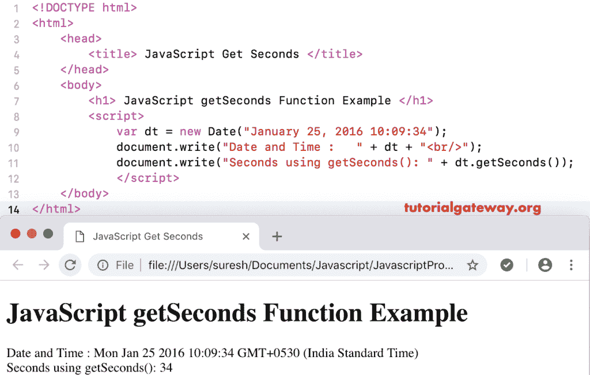

# JavaScript getSeconds 函数

> 原文：<https://www.tutorialgateway.org/javascript-getseconds-function/>

JavaScript getSeconds 函数是 Date 函数之一，它返回给定日期的总秒数。下面的 JavaScript getSeconds 函数返回当前日期和时间的秒数。

```
<!DOCTYPE html>
<html>
<head>
    <title> JavaScript Get Seconds Function </title>
</head>
<body>
    <h1> Example </h1>
<script>
  var dt = Date();  
  document.write("Date and Time : " + dt);
  document.write("Seconds : " + dt.getSeconds());
</script>
</body>
</html>
```

```
Example

Date and Time: Sun Nov 04 2018 15:59:15 GMT+0530 (Indian Standard Time)
Seconds : 15
```

## 函数示例

在这个 JavaScript getSeconds 函数示例中，我们从自定义日期中提取总秒数

```
<!DOCTYPE html>
<html>
<head>
    <title> JavaScript Get Seconds Function </title>
</head>
<body>
    <h1> JavaScript getSeconds Function Example </h1>
<script>
  var dt = Date("January 25, 2016 10:09:34");
  document.write("Date and Time : " + dt);
  document.write("Seconds using getSeconds(): " + dt.getSeconds());
</script>
</body>
</html>
```



在这个 [JavaScript](https://www.tutorialgateway.org/javascript/) 获取秒的例子中，我们从自定义日期中提取秒，没有秒(时间)。这将返回 0 秒。

```
<!DOCTYPE html>
<html>
<head>
    <title> JavaScript Get Seconds Function </title>
</head>
<body>
    <h1> Example </h1>
<script>
  var dt = Date("January 25, 2016");
  document.write("DateTime : " + dt);
  document.write("Seconds : " + dt.getSeconds());
</script>
</body>
</html>
```

```
Example

DateTime: Mon Jan 25 2016 00:00:00 GMT+0530 (Indian Standard Time)
Seconds : 0
```