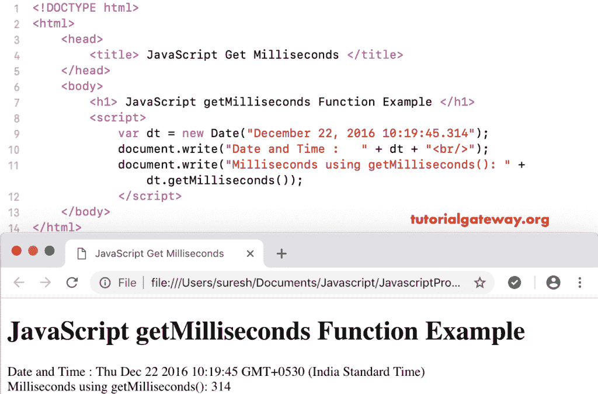

# 函数

> 原文:[https://www . tutorialgateway . org/JavaScript-get 毫秒-function/](https://www.tutorialgateway.org/javascript-getmilliseconds-function/)

函数是日期函数之一，它返回给定日期的毫秒数。

## 函数示例

使用 JavaScript get 毫秒返回当前日期和时间的总毫秒数。

```
<!DOCTYPE html>
<html>
<head>
    <title> JavaScript Get Milliseconds Function </title>
</head>
<body>
    <h1> Example </h1>
<script>
  var dt = Date();  
  document.write("Date and Time : " + dt);
  document.write("Milliseconds : " + dt.getMilliseconds());
</script>
</body>
</html>
```

```
Example

Date and Time: Sun Nov 04 2018 16:08:08 GMT+0530 (Indian Standard Time)
Milliseconds : 650
```

## JavaScript 获取毫秒函数示例

在这个 getMilliseconds 函数示例中，我们找到了自定义日期的毫秒数

```
<!DOCTYPE html>
<html>
<head>
    <title> JavaScript Get Milliseconds Function </title>
</head>
<body>
    <h1> JavaScript getMilliseconds Function Example </h1>
<script>
  var dt = Date("December 22, 2016 10:19:45.314");
  document.write("Date and Time : " + dt);
  document.write("Milliseconds using getMilliseconds(): " + dt.getMilliseconds());
</script>
</body>
</html>
```



这个 [JavaScript](https://www.tutorialgateway.org/javascript/) 示例返回自定义日期的毫秒数，不带(时间)。它返回 0 毫秒。

```
<!DOCTYPE html>
<html>
<head>
    <title> JavaScript Get Milliseconds Function </title>
</head>
<body>
    <h1> Example </h1>
<script>
  var dt = Date("December 22, 1972");
  document.write("DateTime : " + dt);
  document.write("Milliseconds : " + dt.getMilliseconds());
</script>
</body>
</html>
```

```
Example

DateTime: Fri Dec 22 1972 00:00:00 GMT+0530 (Indian Standard Time)
Milliseconds : 0
```