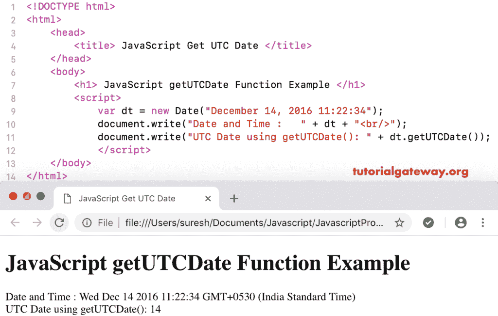

# JavaScript `getUTCDate()`函数

> 原文：<https://www.tutorialgateway.org/javascript-getutcdate-function/>

JavaScript `getUTCDate()`函数是日期函数中的一个，它根据世界时返回给定日期的一个月中的某一天。

## 函数示例

在本例中，我们使用 getUTCDate 返回当前日期和时间中的月日数。

```js
<!DOCTYPE html>
<html>
<head>
    <title> JavaScript Get UTC Date Function </title>
</head>
<body>
    <h1> Example </h1>
<script>
  var dt = Date();  
  document.write("Date and Time : " + dt);
  document.write("UTC Date : " + dt.getUTCDate());
</script>
</body>
</html>
```

```js
Example

Date and Time: Sun Nov 04 2018 16:30:02 GMT+0530 (Indian Standard Time)
UTC Date : 4
```

## 获取世界协调时日期函数示例

在这个[JavaScript](https://www.tutorialgateway.org/javascript/)`getutchdate()`函数中，我们显示的是自定义日期的日数

```js
<!DOCTYPE html>
<html>
<head>
    <title> JavaScript Get UTC Date Function </title>
</head>
<body>
    <h1> JavaScript get UTC Date Function Example </h1>
<script>
  var dt = Date("December 14, 2016 11:22:34");
  document.write("Date and Time : " + dt);
  document.write("UTC Date using getUTCDate(): " + dt.getUTCDate());
</script>
</body>
</html>
```

