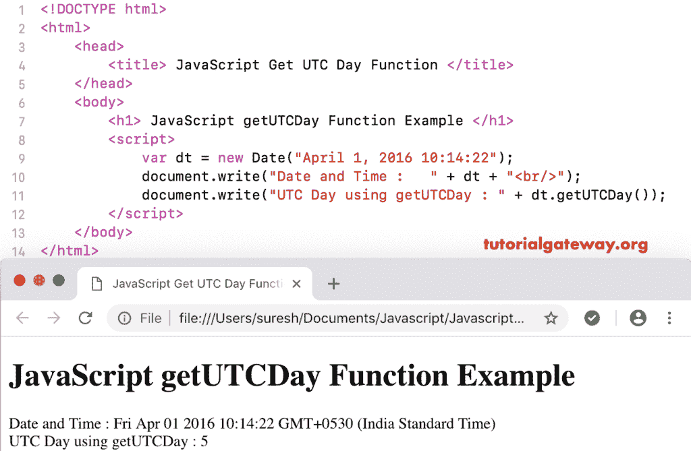

# 函数

> 原文：<https://www.tutorialgateway.org/javascript-getutcday-function/>

JavaScript `getUTCDay()`函数是`Date()`函数的一种，它根据世界时返回给定日期的日数。日数从 0 开始，到 6 结束，其中 0 表示周日，6 表示周六。JavaScript `getUTCDay()`函数的语法是:

```
 Date.getUTCDay()
```

## 函数示例

这里，我们使用 getUTCDay 从当前日期和时间返回日数。

```
<!DOCTYPE html>
<html>
<head>
    <title> JavaScript Get UTC Day Function </title>
</head>
<body>
    <h1> Example </h1>
<script>
  var dt = Date();  
  document.write("Date and Time : " + dt);
  document.write("UTC Day : " + dt.getUTCDay());
</script>
</body>
</html>
```

```
Example

Date and Time: Mon Nov 05 2018 10:37:44 GMT+0530 (Indian Standard Time)
UTC Day : 1
```

## 获取世界协调时日示例

在这个[JavaScript](https://www.tutorialgateway.org/javascript/)`getutchday()`函数示例中，我们显示的是自定义日期的日数

```
<!DOCTYPE html>
<html>
<head>
    <title> JavaScript Get UTC Day Function </title>
</head>
<body>
    <h1> JavaScript get UTC Day Function Example </h1>
<script>
  var dt = Date("April 1, 2016 10:14:22");
  document.write("Date and Time : " + dt);
  document.write("UTC Day using getUTCDay : " + dt.getUTCDay());
</script>
</body>
</html>
```

