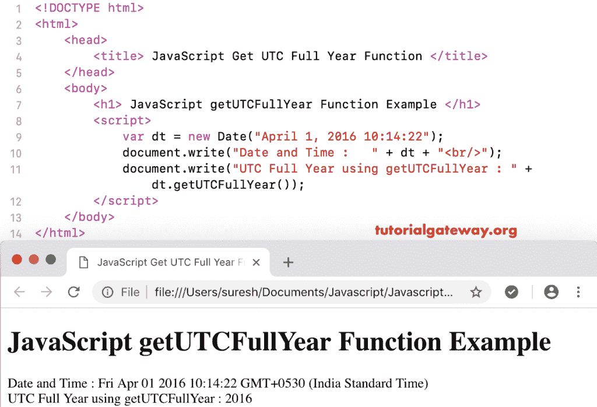

# JavaScript `getUTCFullYear()`函数

> 原文：<https://www.tutorialgateway.org/javascript-getutcfullyear-function/>

函数是一个日期函数，它根据世界时返回给定日期的年份。JavaScript `getUTCFullYear()`函数的语法是:

```js
 Date.getUTCFullYear()
```

## 函数示例

我们使用 getUTCFulYear 从当前日期和时间返回年份。

```js
<!DOCTYPE html>
<html>
<head>
    <title> JavaScript Get UTC Full Year Function </title>
</head>
<body>
    <h1> Example </h1>
<script>
  var dt = Date();  
  document.write("Date and Time : " + dt);
  document.write("UTC Full Year : " + dt.getUTCFullYear());
</script>
</body>
</html>
```

```js
Example

Date and Time: Mon Nov 05 2018 10:52:54 GMT+0530 (Indian Standard Time)
UTC Full Year : 2018
```

## 获得世界协调时全年示例 2

在这个 [JavaScript](https://www.tutorialgateway.org/javascript/) 例子中，我们显示的是自定义日期的年份

```js
<!DOCTYPE html>
<html>
<head>
    <title> JavaScript Get UTC Full Year Function </title>
</head>
<body>
    <h1> JavaScript getUTCFullYear Function Example </h1>
<script>
  var dt = Date("April 1, 2016 10:14:22");
  document.write("Date and Time : " + dt);
  document.write("UTC Full Year using getUTCFullYear : " + dt.getUTCFullYear());
</script>
</body>
</html>
```



在这个 JavaScript getUTCFullYear 示例中，我们显示的是自定义日期的年份，而不是年份。这将返回默认年份作为输出。

```js
<!DOCTYPE html>
<html>
<head>
    <title> JavaScript Get UTC Full Year Function </title>
</head>
<body>
    <h1> Example </h1>
<script>
  var dt = Date("April 1 10:14:22");
  document.write("DateTime : " + dt);
  document.write("UTC Full Year : " + dt.getUTCFullYear());
</script>
</body>
</html>
```

```js
Example

DateTime: Sun Apr 01 2001 10:14:22 GMT+0530 (Indian Standard Time)
UTC Full Year : 2001
```