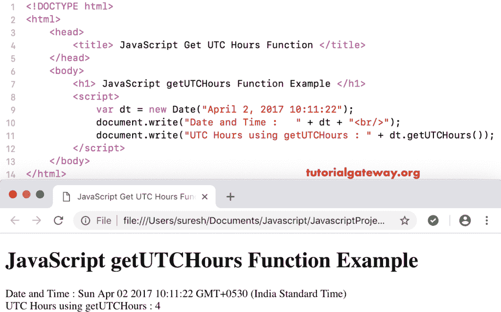

# JavaScript `getUTCHours()`函数

> 原文：<https://www.tutorialgateway.org/javascript-getutchours-function/>

函数是日期函数的一种，它根据世界时返回给定日期的总小时数。JavaScript `getUTCHours()`函数的语法是:

```
 Date.getUTCHours()
```

## 函数示例

我正在使用 getUTCHours 从当前日期和时间返回按照世界时的总小时数。

```
<!DOCTYPE html>
<html>
<head>
    <title> JavaScript Get UTC Hours Function </title>
</head>
<body>
    <h1> Example </h1>
<script>
  var dt = Date();  
  document.write("Date and Time : " + dt);
  document.write("UTC Hours : " + dt.getUTCHours());
</script>
</body>
</html>
```

```
Example

Date and Time: Mon Nov 05 2018 10:54:43 GMT+0530 (Indian Standard Time)
UTC Hours : 5
```

## 获取世界协调时小时数函数示例 2

在这个 [JavaScript](https://www.tutorialgateway.org/javascript/) 获取 UTC 小时数的例子中，我们显示的是自定义日期的通用时间小时数

```
<!DOCTYPE html>
<html>
<head>
    <title> JavaScript Get UTC Hours Function </title>
</head>
<body>
    <h1> JavaScript getUTCHours Function Example </h1>
<script>
  var dt = Date("April 2, 2017 10:11:22");
  document.write("Date and Time : " + dt);
  document.write("UTC Hours using getUTCHours : " + dt.getUTCHours());
</script>
</body>
</html>
```

