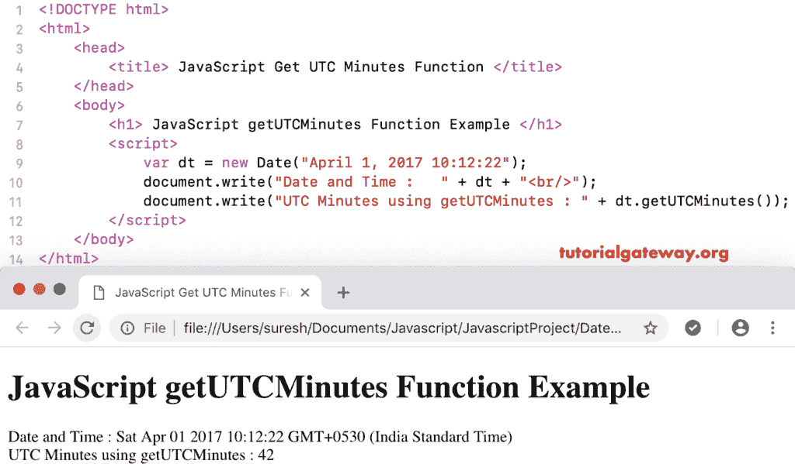

# 函数

> 原文：<https://www.tutorialgateway.org/javascript-getutcminutes-function/>

函数是`Date()`函数的一种，它根据世界时返回给定日期的总分钟数。JavaScript `getUTCMinutes()`函数的语法是:

```
 Date.getUTCMinutes()
```

## 函数示例

我们使用 getUTCMinutes 从当前日期和时间返回按照世界时的总分钟数。

```
<!DOCTYPE html>
<html>
<head>
    <title> JavaScript Get UTC Minutes Function </title>
</head>
<body>
    <h1> Example </h1>
<script>
  var dt = Date();  
  document.write("Date and Time : " + dt);
  document.write("UTC Minutes : " + dt.getUTCMinutes());
</script>
</body>
</html>
```

```
Example

Date and Time: Mon Nov 05 2018 11:17:31 GMT+0530 (Indian Standard Time)
UTC Minutes : 47
```

## 获取世界协调时分钟函数示例 2

在这个 [JavaScript](https://www.tutorialgateway.org/javascript/) 获取 UTC 分钟的例子中，我们按照世界时显示自定义日期和时间的分钟。

```
<!DOCTYPE html>
<html>
<head>
    <title> JavaScript Get UTC Minutes Function </title>
</head>
<body>
    <h1> JavaScript get UTC Minutes Function Example </h1>
<script>
  var dt = Date("April 1, 2017 10:12:22");
  document.write("Date and Time : " + dt);
  document.write("UTC Minutes using getUTCMinutes : " + dt.getUTCMinutes());
</script>
</body>
</html>
```

