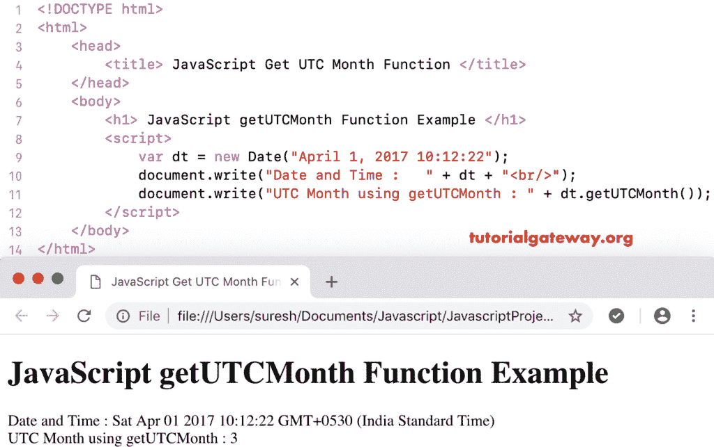

# JavaScript `getUTCMonth()`函数

> 原文：<https://www.tutorialgateway.org/javascript-getutcmonth-function/>

函数是日期函数中的一个，它根据世界时返回给定日期的月数。月号从 0(1 月)开始，到 11(12 月)结束。JavaScript `getUTCMonth()`函数的语法是:

```js
 Date.getUTCMonth()
```

## 函数示例

这里，我们使用`getUTCMonth()`函数从当前日期和时间按照世界时返回月号。

```js
<!DOCTYPE html>
<html>
<head>
    <title> JavaScript Get UTC Month Function </title>
</head>
<body>
    <h1> Example </h1>
<script>
  var dt = Date();  
  document.write("Date and Time : " + dt);
  document.write("UTC Month : " + dt.getUTCMonth());
</script>
</body>
</html>
```

```js
Example

Date and Time: Mon Nov 05 2018 11:13:24 GMT+0530 (Indian Standard Time)
UTC Month : 10
```

### 获取世界协调时月份示例 2

在这个 [JavaScript](https://www.tutorialgateway.org/javascript/) 获取 UTC 月的例子中，我们按照世界时显示自定义日期和时间的月号。

```js
<!DOCTYPE html>
<html>
<head>
    <title> JavaScript Get UTC Month Function </title>
</head>
<body>
    <h1> JavaScript getUTCMonth Function Example </h1>
<script>
  var dt = Date("April 1, 2017 10:12:22");
  document.write("Date and Time : " + dt);
  document.write("UTC Month using getUTCMonth : " + dt.getUTCMonth());
</script>
</body>
</html>
```

