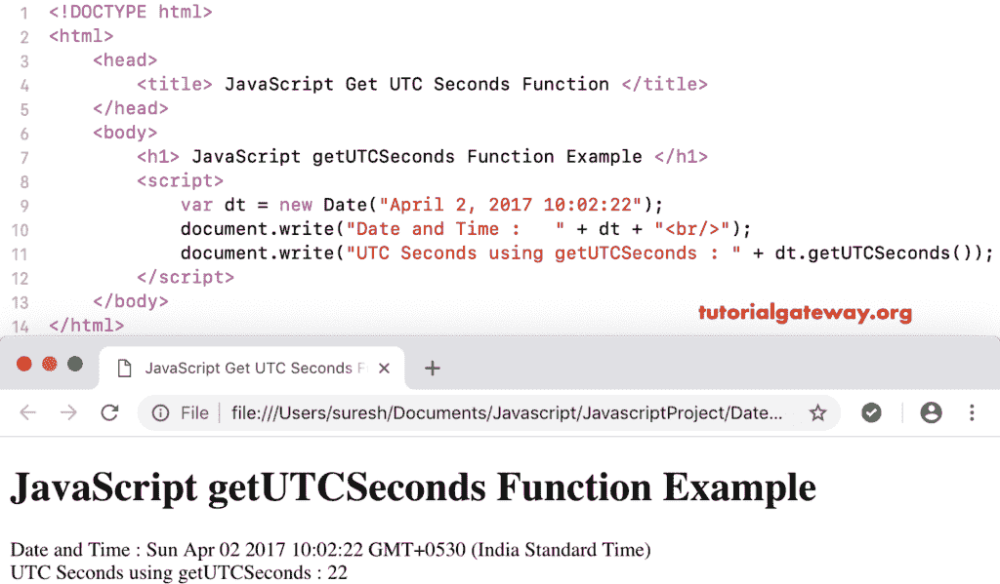

# JavaScript `getUTCSeconds()`函数

> 原文：<https://www.tutorialgateway.org/javascript-getutcseconds/>

函数是日期函数的一种，它根据世界时返回给定日期的总秒数。JavaScript `getUTCSeconds()`函数的语法是:

```js
 Date.getUTCSeconds()
```

## 函数示例

我们使用 getUTCSeconds 从当前日期和时间按照世界时返回总秒数。

```js
<!DOCTYPE html>
<html>
<head>
    <title> JavaScript Get UTC Seconds Function </title>
</head>
<body>
    <h1> Example </h1>
<script>
  var dt = Date();  
  document.write("Date and Time : " + dt);
  document.write("UTC Seconds : " + dt.getUTCSeconds());
</script>
</body>
</html>
```

```js
Example

Date and Time: Mon Nov 05 2018 11:11:38 GMT+0530 (Indian Standard Time)
UTC Seconds : 38
```

## 获得世界协调时秒示例 2

在这个 getUTCSeconds 的 [JavaScript](https://www.tutorialgateway.org/javascript/) 示例中，我们按照世界时显示自定义日期和时间的秒数。

```js
<!DOCTYPE html>
<html>
<head>
    <title> JavaScript Get UTC Seconds Function </title>
</head>
<body>
    <h1> JavaScript getUTCSeconds Function Example </h1>
<script>
  var dt = Date("April 2, 2017 10:02:22");
  document.write("Date and Time : " + dt);
  document.write("UTC Seconds using getUTCSeconds : " + dt.getUTCSeconds());
</script>
</body>
</html>
```

