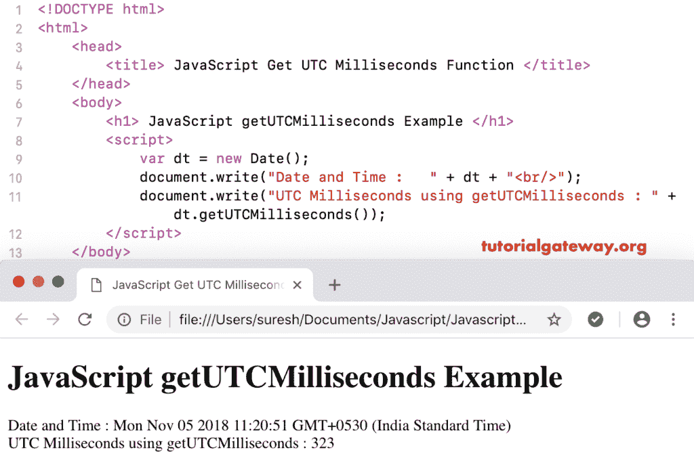

# JavaScript getUTCMilliseconds

> 原文：<https://www.tutorialgateway.org/javascript-getutcmilliseconds/>

函数的作用是:根据世界时，返回给定日期的毫秒数。JavaScript `getutcmails()`函数的语法是:

```
 Date.getUTCMilliseconds()
```

## 函数示例

我们使用`getutcmails()`函数从当前日期和时间按照世界时返回总毫秒数。

```
<!DOCTYPE html>
<html>
<head>
    <title> JavaScript Get UTC Milliseconds Function </title>
</head>
<body>
    <h1> JavaScript get UTC Milliseconds Function Example </h1>
<script>
  var dt = Date();  
  document.write("Date and Time : " + dt);
  document.write("UTC Milliseconds using getUTCMilliseconds : " + dt.getUTCMilliseconds());
</script>
</body>
</html>
```



在这个例子中，对于 [JavaScript](https://www.tutorialgateway.org/javascript/) 获取 UTC 毫秒，我们按照世界时显示自定义日期和时间的毫秒。

```
<!DOCTYPE html>
<html>
<head>
    <title> JavaScript Get UTC Milliseconds Function </title>
</head>
<body>
    <h1> Example </h1>
<script>
  var dt = Date("April 1, 2017 10:12:22.0716");
  document.write("Date and Time : " + dt);
  document.write("UTC Milliseconds : " + dt.getUTCMilliseconds());
</script>
</body>
</html>
```

```
Example

Date and Time: Sat Apr 01 2017 10:12:22 GMT+0530 (Indian Standard Time)
UTC Milliseconds : 71
```