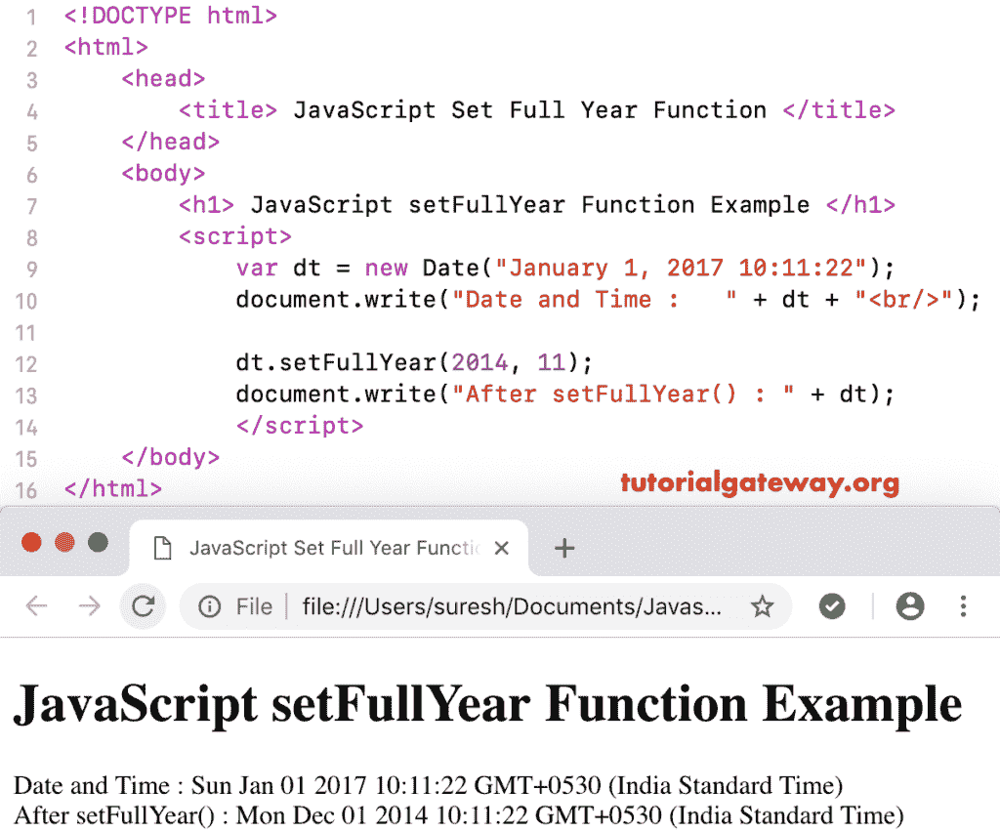

# 设置整年函数

> 原文：<https://www.tutorialgateway.org/javascript-setfullyear-function/>

函数的作用是:根据当地时间设置给定日期的年、月、日。setFullYear 函数的语法是:

```
 Date.setFullYear(Year, Month_Number, Day_Number)
```

在这个函数中，月数和日数都是可选的。

## JavaScript setFullYear 函数示例

这里，我们使用 setFullYear 将当前年份设置为 2014 年。

```
<!DOCTYPE html>
<html>
<head>
    <title> JavaScript Set Full Year Functions </title>
</head>
<body>
    <h1> Example </h1>
<script>
  var dt = Date();  
  document.write("Date and Time : " + dt + "<br/>");

  dt.setFullYear(2014);
  document.write("After : " + dt);
</script>
</body>
</html>
```

```
Example

Date and Time: Tue Nov 06 2018 12:20:54 GMT+0530 (Indian Standard Time)
After : Thu Nov 06 2014 12:20:54 GMT+0530 (Indian Standard Time)
```

## JavaScript 设置全年功能示例 2

在这个 JavaScript setFullYear 示例中，我们将自定义日期的整年设置为 2014 年，将月份设置为 12 月。

```
<!DOCTYPE html>
<html>
<head>
    <title> JavaScript Set Full Year Functions </title>
</head>
<body>
    <h1> JavaScript setFullYear Function Example </h1>
<script>
  var dt = Date("January 1, 2017 10:11:22");
  document.write("Date and Time : " + dt + "<br/>");

  dt.setFullYear(2014, 11);
  document.write("After setFullYear() : " + dt);
</script>
</body>
</html>
```



在这个 [JavaScript](https://www.tutorialgateway.org/javascript/) 设置整年的例子中，我们将年设置为 2014 年，月设置为 12 月，日设置为 31

```
<!DOCTYPE html>
<html>
<head>
    <title> JavaScript Set Full Year Functions </title>
</head>
<body>
    <h1> Example </h1>
<script>
  var dt = Date("January 1, 2017 10:11:22");
  document.write("Date and Time : " + dt + "<br/>");

  dt.setFullYear(2014, 11, 31);
  document.write("After : " + dt);
</script>
</body>
</html>
```

```
Example

Date and Time: Sun Jan 01 2017 10:11:22 GMT+0530 (Indian Standard Time)
After : Wed Dec 31 2014 10:11:22 GMT+0530 (Indian Standard Time)
```