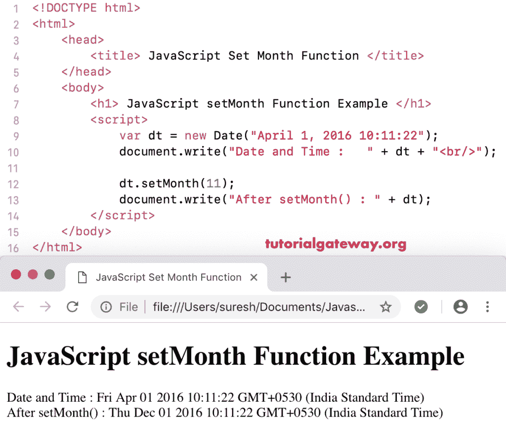

# 设置月份函数

> 原文:[https://www . tutorialgateway . org/JavaScript-set month-function/](https://www.tutorialgateway.org/javascript-setmonth-function/)

JavaScript setMonth 函数是 Date 函数的一种，用于根据当地时间设置给定日期的月数和日数。JavaScript setMonth 函数的语法是:

```
 Date.setMonth(Month_Number, Day_Number)
```

在 JavaScript setMonth 函数中，日数是一个可选参数。请记住，月数应该在 0 和 11 之间，其中 0 是 1 月，12 月是 11 月

## JavaScript 设置月份函数示例

我们使用 setMonth 函数将当前月份设置为 4 月。

```
<!DOCTYPE html>
<html>
<head>
    <title> JavaScript Set Month Functions </title>
</head>
<body>
    <h1> Example </h1>
<script>
  var dt = Date();  
  document.write("Date and Time : " + dt + "<br/>");

  dt.setMonth(3);
  document.write("After : " + dt);
</script>
</body>
</html>
```

```
Example

Date and Time: Mon Nov 05 2018 12:00:57 GMT+0530 (Indian Standard Time)
After : Thu Apr 05 2018 12:00:57 GMT+0530 (Indian Standard Time)
```

如果您想将日期更新为 4 月 1 日，请使用 dt.setMonth(3，1)

## JavaScript 设置月份示例 2

在本例中，对于 [JavaScript](https://www.tutorialgateway.org/javascript/) 设置月份，我们将自定义日期的月号设置为 11(12 月)

```
<!DOCTYPE html>
<html>
<head>
    <title> JavaScript Set Month Functions </title>
</head>
<body>
    <h1> JavaScript setMonth Function Example </h1>
<script>
  var dt = Date("April 1, 2016 10:11:22");
  document.write("Date and Time : " + dt + "<br/>");

  dt.setMonth(11);
  document.write("After setMonth() : " + dt);
</script>
</body>
</html>
```



在这个 JavaScript setMonth 示例中，我们将自定义日期的月号(没有月或日)设置为六月。这将采用默认月份 1 月 01 日，然后将该值设置为 6 月。

```
<!DOCTYPE html>
<html>
<head>
    <title> JavaScript Set Month Functions </title>
</head>
<body>
    <h1> Example </h1>
<script>
  var dt = Date("2016 10:11:22");
  document.write("DateTime : " + dt + "<br/>");

  dt.setMonth(5);
  document.write("After  : " + dt);
</script>
</body>
</html>
```

```
Example

DateTime: Fri Jan 01 2016 10:11:22 GMT+0530 (Indian Standard Time)
After : Wed Jun 01 2016 10:11:22 GMT+0530 (Indian Standard Time)
```