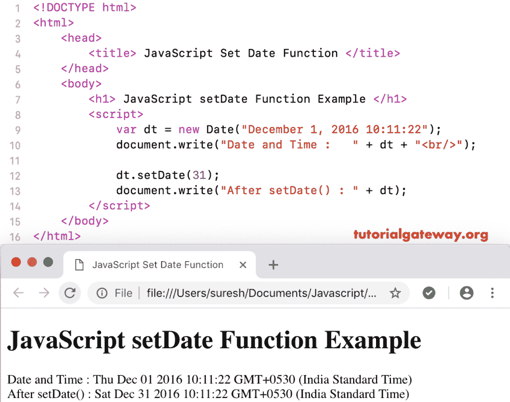

# 设置日期函数

> 原文：<https://www.tutorialgateway.org/javascript-setdate-function/>

函数是日期函数的一种，用于根据当地时间设置给定日期的日期。JavaScript `setDate()`函数的语法是:

```
 Date.setDate(Day_Number)
```

## JavaScript 设置日期函数示例

这里，我们使用了`setDate()`函数将当前日期设置为 25 日。

```
<!DOCTYPE html>
<html>
<head>
    <title> JavaScript Set Date Functions </title>
</head>
<body>
    <h1> Example </h1>
<script>
  var dt = Date();  
  document.write("Date and Time : " + dt + "<br/>");

  dt.setDate(25);
  document.write("After : " + dt);
</script>
</body>
</html>
```

```
Example

Date and Time: Mon Nov 05 2018 11:45:07 GMT+0530 (Indian Standard Time)
After : Sun Nov 25 2018 11:45:07 GMT+0530 (Indian Standard Time)
```

## JavaScript 设置日期示例 2

在这个 JavaScript `setDate()`函数示例中，我们将自定义日期的天数设置为 31

```
<!DOCTYPE html>
<html>
<head>
    <title> JavaScript Set Date Functions </title>
</head>
<body>
    <h1> JavaScript setDate Function Example </h1>
<script>
  var dt = Date("December 1, 2016 10:11:22"); 
  document.write("Date and Time : " + dt + "<br/>");

  dt.setDate(31);
  document.write("After setDate() : " + dt);
</script>
</body>
</html>
```



在这个 [JavaScript](https://www.tutorialgateway.org/javascript/) 设置日期的例子中，我们将自定义日期的天数(不带日或月)设置为 31。

```
<!DOCTYPE html>
<html>
<head>
    <title> JavaScript Set Date Functions </title>
</head>
<body>
    <h1> Example3 </h1>
<script>
  var dt = Date("2016 10:11:22"); 
  document.write("DateTime : " + dt + "<br/>");

  dt.setDate(31);
  document.write("After : " + dt);
</script>
</body>
</html>
```

```
Example3

DateTime: Fri Jan 01 2016 10:11:22 GMT+0530 (Indian Standard Time)
After: Sun Jan 31 2016 10:11:22 GMT+0530 (Indian Standard Time)
```