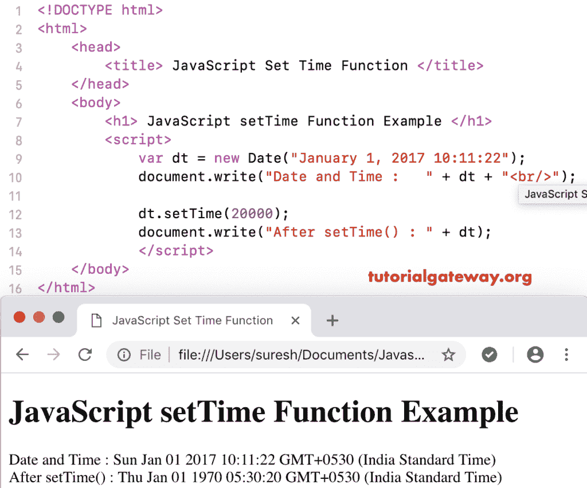

# JavaScript 设置时间函数

> 原文:[https://www . tutorialgateway . org/JavaScript-settime-function/](https://www.tutorialgateway.org/javascript-settime-function/)

JavaScript setTime 函数是一个日期函数，用于通过将用户指定的毫秒添加到默认日期 1970 年 1 月 1 日 00:00:00 来设置时间。在这里，您必须以毫秒为单位指定时间，这是一个可选参数。JavaScript setTime 函数的语法是:

```
 Date.setTime(Milliseconds)
```

## JavaScript 设置时间函数示例

这里，我们使用这个设置时间函数来设置毫秒数为 20000000。

```
<!DOCTYPE html>
<html>
<head>
    <title> JavaScript Set Time Functions </title>
</head>
<body>
    <h1> Example </h1>
<script>
  var dt = Date();  
  document.write("Date and Time : " + dt + "<br/>");

  dt.setTime(20000000);
  document.write("After : " + dt);
</script>
</body>
</html>
```

```
Example

Date and Time: Thu Nov 08 2018 12:06:15 GMT+0530 (Indian Standard Time)
After: Thu Jan 01 1970 11:03:20 GMT+0530 (Indian Standard Time)
```

## JavaScript 设置时间示例 2

在这个 [JavaScript](https://www.tutorialgateway.org/javascript/) 设置时间函数的例子中，我们将一个自定义日期的时间设置为 2000 毫秒。

```
<!DOCTYPE html>
<html>
<head>
    <title> JavaScript Set Time Functions </title>
</head>
<body>
    <h1> JavaScriptsetTime Function Example </h1>
<script>
  var dt = Date("January 1, 2017 23:45:22");
  document.write("Date and Time : " + dt + "<br/>");

  dt.setTime(2000);
  document.write("After setTime() : " + dt);
</script>
</body>
</html>
```

